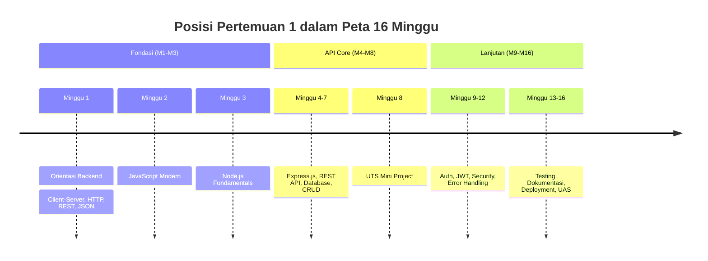
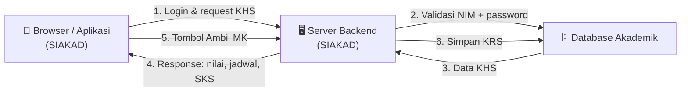
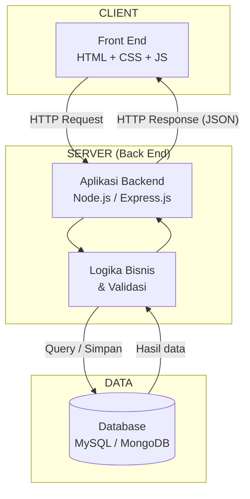
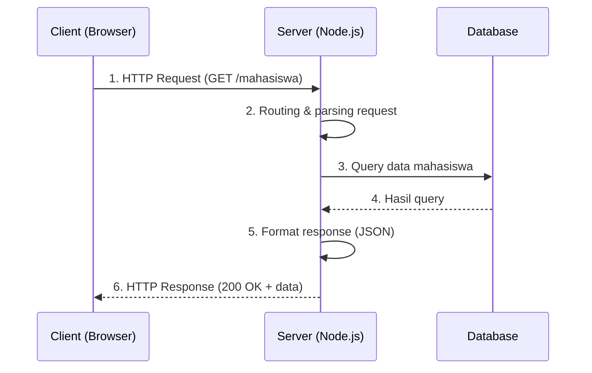
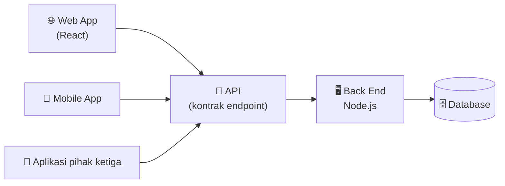
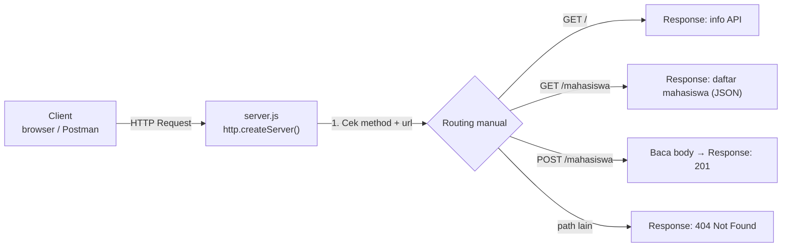
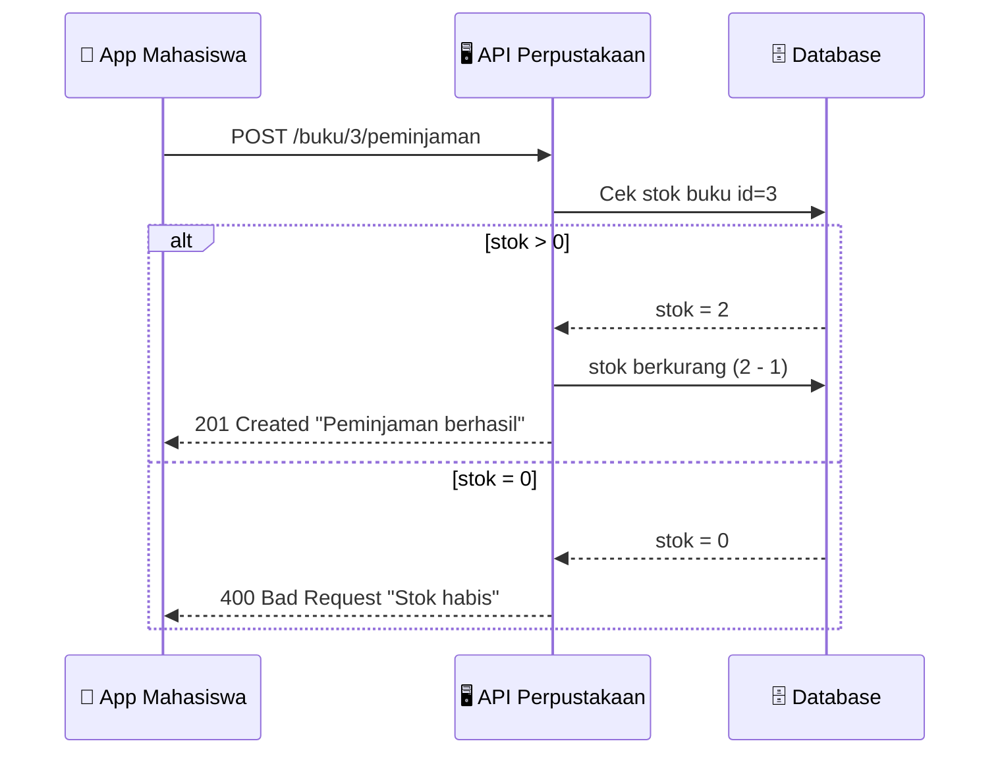
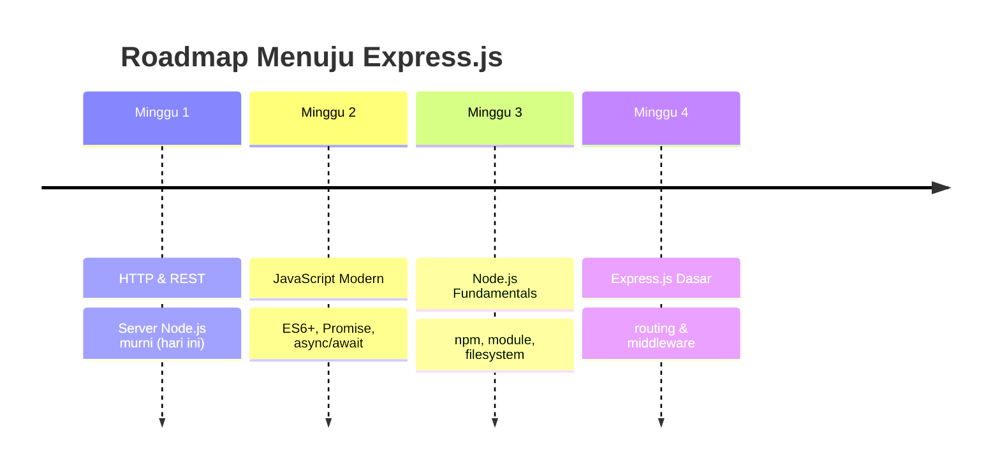

# Pertemuan 1 — Orientasi Backend Web, Client–Server, HTTP, REST & JSON

| | |
|:--|:--|
| **Minggu** | 1 |
| **Tanggal** | Senin, 14 September 2026 (SI-VA) / Selasa, 15 September 2026 (SI-VB) |
| **CPMK** | CPMK115 |
| **Model Pembelajaran** | Case Based Learning / Problem Based Learning |
| **Stack** | JavaScript + Node.js + Express.js |

> **Catatan penting:** Pertemuan 1 sengaja **belum** terlalu masuk Express.js. Kita membangun pemahaman dasar terlebih dahulu tentang alur komunikasi: `Client → HTTP Request → Back End → Data/Logic → HTTP Response → Client`. Setelah fondasi ini kuat, Pertemuan 2 masuk ke JavaScript modern, Pertemuan 3 ke Node.js secara lebih mendalam, dan Pertemuan 4 baru masuk Express.js — sehingga alur 16 pertemuan lebih logis dan OBE-oriented.

---

## Daftar Isi

- [Pertemuan 1 — Orientasi Backend Web, Client–Server, HTTP, REST \& JSON](#pertemuan-1--orientasi-backend-web-clientserver-http-rest--json)
  - [Daftar Isi](#daftar-isi)
  - [1. Keterkaitan Pertemuan dengan RPS OBE](#1-keterkaitan-pertemuan-dengan-rps-obe)
  - [2. Capaian Pembelajaran Pertemuan](#2-capaian-pembelajaran-pertemuan)
  - [3. Pemantik Kasus: Sistem Informasi Akademik](#3-pemantik-kasus-sistem-informasi-akademik)
  - [4. Pengertian dan Peran Back End](#4-pengertian-dan-peran-back-end)
  - [5. Arsitektur Client–Server](#5-arsitektur-clientserver)
  - [6. Konsep Request \& Response](#6-konsep-request--response)
  - [7. HTTP Request](#7-http-request)
  - [8. HTTP Response](#8-http-response)
  - [9. HTTP Methods: GET, POST, PUT, PATCH, DELETE](#9-http-methods-get-post-put-patch-delete)
  - [10. HTTP Status Code](#10-http-status-code)
  - [11. Konsep REST](#11-konsep-rest)
  - [12. Perancangan Resource dan Endpoint](#12-perancangan-resource-dan-endpoint)
  - [13. JSON sebagai Format Pertukaran Data](#13-json-sebagai-format-pertukaran-data)
  - [14. Mengapa API Penting](#14-mengapa-api-penting)
  - [15. Demo: Node.js HTTP Server Sederhana](#15-demo-nodejs-http-server-sederhana)
  - [16. Case Based Learning: API Perpustakaan](#16-case-based-learning-api-perpustakaan)
  - [17. Aktivitas Kelompok](#17-aktivitas-kelompok)
  - [18. Latihan Individu](#18-latihan-individu)
  - [19. Pemanfaatan AI sebagai Coding Assistant](#19-pemanfaatan-ai-sebagai-coding-assistant)
  - [20. Kuis Formatif + Kunci Jawaban](#20-kuis-formatif--kunci-jawaban)
  - [21. Output Pembelajaran — Tugas 1](#21-output-pembelajaran--tugas-1)
    - [Cara Pengumpulan — Push ke Repository GitHub Kelas](#cara-pengumpulan--push-ke-repository-github-kelas)
  - [22. Rubrik Tugas 1](#22-rubrik-tugas-1)
  - [23. Persiapan menuju Pertemuan 2](#23-persiapan-menuju-pertemuan-2)
    - [📎 Lampiran: Kode Praktikum](#-lampiran-kode-praktikum)

---

## 1. Keterkaitan Pertemuan dengan RPS OBE

Pertemuan 1 adalah **gerbang masuk** mata kuliah Pemrograman Berbasis Web Back End. Dalam kerangka OBE (Outcome Based Education), pertemuan ini menyumbang capaian pada **CPMK115**:

> Mahasiswa mampu menjelaskan arsitektur aplikasi web backend serta menganalisis alur komunikasi *client–server* berbasis protokol HTTP dan prinsip REST.

Pertemuan ini juga menjadi fondasi bagi seluruh rangkaian 16 minggu: konsep *request–response* yang dipelajari hari ini akan dipakai ulang pada Express.js (Minggu 4–7), authentication & JWT (Minggu 9–10), hingga deployment (Minggu 15).



---

## 2. Capaian Pembelajaran Pertemuan

Setelah mengikuti pertemuan ini, mahasiswa mampu:

| No. | Kemampuan | Indikator |
| :-: | --------- | --------- |
| 1 | Menjelaskan peran back end dalam aplikasi web | Mahasiswa dapat membedakan tanggung jawab front end vs back end |
| 2 | Menggambarkan arsitektur client–server | Mahasiswa dapat menggambar diagram alur request–response |
| 3 | Menganalisis komponen HTTP request & response | Mahasiswa dapat mengidentifikasi method, path, header, body, dan status code |
| 4 | Memilih HTTP method & status code yang tepat | Mahasiswa dapat memetakan operasi CRUD ke GET/POST/PUT/PATCH/DELETE |
| 5 | Merancang resource & endpoint sederhana | Mahasiswa dapat menyusun tabel endpoint untuk studi kasus perpustakaan |
| 6 | Menjalankan server HTTP sederhana dengan Node.js | Mahasiswa dapat menjalankan demo server dan menguji dengan browser/Postman |

---

## 3. Pemantik Kasus: Sistem Informasi Akademik

Bayangkan Anda membuka **SIAKAD** kampus dari ponsel:

1. Anda login dengan NIM dan password.
2. Halaman menampilkan KHS, jadwal, dan sisa SKS.
3. Anda menekan tombol **"Ambil Mata Kuliah"**.

Pertanyaan pemantik:

- Di mana data nilai, jadwal, dan mata kuliah itu **disimpan**?
- Siapa yang **memutuskan** Anda berhak melihat KHS milik Anda (dan bukan milik orang lain)?
- Apa yang **terjadi di balik layar** ketika tombol "Ambil Mata Kuliah" ditekan — dari jari Anda menyentuh layar sampai data terubah di database?



Semua jawaban dari tiga pertanyaan di atas berada di **back end** — dan itulah yang akan kita kuasai sepanjang semester ini.

---

## 4. Pengertian dan Peran Back End

**Back end** adalah bagian aplikasi yang berjalan di **server**: menerima permintaan dari client, memproses logika bisnis, mengelola data, dan mengembalikan hasilnya.

| Aspek | Front End | Back End |
|:------|:----------|:---------|
| Berjalan di | Browser / perangkat user | Server |
| Fokus | Tampilan & interaksi (UI/UX) | Logika bisnis, keamanan, data |
| Bahasa umum | HTML, CSS, JavaScript | JavaScript (Node.js), Python, PHP, Go, dll. |
| Contoh tugas | Menampilkan form login | Memvalidasi kredensial, membuat session/token |
| Lihat data user? | Ya (sebagian) | Ya (penuh, termasuk yang tidak boleh bocor) |

Empat peran utama back end:

1. **Menerima & merespons permintaan** — menjadi pintu masuk semua operasi client.
2. **Logika bisnis** — aturan main aplikasi (mis. batas SKS 24, tidak boleh menaruh nilai sendiri).
3. **Pengelolaan data** — berkomunikasi dengan database (simpan, ubah, hapus, ambil).
4. **Keamanan** — autentikasi, otorisasi, dan validasi input; *jangan pernah percaya client*.

---

## 5. Arsitektur Client–Server

Model **client–server** memisahkan dua peran:

- **Client** = pihak yang *meminta* layanan (browser, aplikasi mobile, aplikasi desktop, bahkan server lain).
- **Server** = pihak yang *menyediakan* layanan (menyimak permintaan, memproses, mengirim balasan).



Ciri penting model ini:

- **Request–response bersifat searah bergantian**: client meminta, server menjawab. Server **tidak** mengirim apa pun tanpa diminta (untuk HTTP biasa).
- **Client dan server tidak saling mengenal kode internal** — keduanya hanya sepakat pada **kontrak komunikasi** (itu sebabnya front end React dan back end Node.js bisa dikembangkan tim terpisah).
- **Server bersifat umum** (stateless per-request): setiap request dikirim lengkap dengan informasi yang dibutuhkan.

---

## 6. Konsep Request & Response

Satu siklus komunikasi HTTP lengkap:



Analogi sederhana: Anda (client) datang ke loket kampus (server), mengajukan **permintaan** ("saya mau melihat jadwal kelas SI-IIIA"), loket **memproses** (mengecek arsip), lalu memberikan **jawaban** (lembar jadwal, atau penolakan jika Anda tidak membawa kartu mahasiswa).

---

## 7. HTTP Request

**HTTP (HyperText Transfer Protocol)** adalah protokol aturan main komunikasi web. Setiap permintaan client disebut **HTTP request**, dan terdiri dari empat bagian:

| Bagian | Fungsi | Contoh |
|:-------|:-------|:-------|
| **Method** | Niat/aksi yang diminta | `GET`, `POST`, `PUT`, `PATCH`, `DELETE` |
| **URL / Path** | Resource yang dituju | `/mahasiswa`, `/mahasiswa/123` |
| **Headers** | Metadata (format isi, token, dsb.) | `Content-Type: application/json`, `Authorization: Bearer xxx` |
| **Body** | Data yang dikirim (untuk POST/PUT/PATCH) | `{"nim": "123", "nama": "Budi"}` |

Contoh request mentah saat membuka daftar mahasiswa:

```http
GET /mahasiswa HTTP/1.1
Host: api.kampus.ac.id
Accept: application/json
```

Contoh request menyimpan mahasiswa baru:

```http
POST /mahasiswa HTTP/1.1
Host: api.kampus.ac.id
Content-Type: application/json

{
  "nim": "F1D022001",
  "nama": "Jhon Doe",
  "prodi": "Sistem Informasi"
}
```

> **Catatan:** URL dibangun dari beberapa komponen. Pada `http://api.kampus.ac.id/mahasiswa?prodi=SI&page=1` — `http` adalah *scheme*, `api.kampus.ac.id` *host*, `/mahasiswa` *path*, dan `?prodi=SI&page=1` *query string* untuk filter/pagination.

---

## 8. HTTP Response

Server menjawab dengan **HTTP response**, yang terdiri dari:

| Bagian | Fungsi | Contoh |
|:-------|:-------|:-------|
| **Status Code** | Ringkasan hasil proses | `200`, `201`, `404`, `500` |
| **Headers** | Metadata jawaban | `Content-Type: application/json` |
| **Body** | Data hasil (biasanya JSON) | `{"success": true, "data": [...]}` |

Contoh response untuk `GET /mahasiswa`:

```http
HTTP/1.1 200 OK
Content-Type: application/json

{
  "success": true,
  "message": "Data mahasiswa berhasil diambil",
  "data": [
    { "nim": "F1D022001", "nama": "Jhon Doe" },
    { "nim": "F1D022002", "nama": "Ani Lestari" }
  ]
}
```

---

## 9. HTTP Methods: GET, POST, PUT, PATCH, DELETE

Method menyatakan **niat** client terhadap sebuah resource. Pemetaan paling umum ke operasi CRUD:

| Method | Arti | CRUD | Contoh | Punya Body? |
|:-------|:-----|:----:|:-------|:-----------:|
| `GET` | Mengambil data | Read | `GET /buku` | ❌ |
| `POST` | Membuat data baru | Create | `POST /buku` | ✅ |
| `PUT` | Mengganti data **secara utuh** | Update | `PUT /buku/1` | ✅ |
| `PATCH` | Mengubah **sebagian** data | Update | `PATCH /buku/1` | ✅ |
| `DELETE` | Menghapus data | Delete | `DELETE /buku/1` | ❌ |

Sifat penting:

- **GET bersifat *safe*** — tidak boleh mengubah data di server; hanya membaca.
- **Idempotent** = dijalankan berkali-kali hasilnya tetap sama. `PUT` dan `DELETE` idempotent; `POST` tidak (5x submit = 5 data baru!).
- `PUT` vs `PATCH`: `PUT` mengirim **seluruh** field object; `PATCH` cukup field yang berubah saja.

---

## 10. HTTP Status Code

Status code adalah angka 3 digit yang meringkas hasil proses. Lima keluarga besar:

| Kelompok | Makna | Kode yang sering dipakai |
|:---------|:------|:-------------------------|
| **1xx** | Informasi | `100 Continue` (jarak dipakai di praktik) |
| **2xx** | Sukses | `200 OK` · `201 Created` · `204 No Content` |
| **3xx** | Redirect | `301 Moved Permanently` · `304 Not Modified` |
| **4xx** | Kesalahan dari client | `400 Bad Request` · `401 Unauthorized` · `403 Forbidden` · `404 Not Found` |
| **5xx** | Kesalahan di server | `500 Internal Server Error` · `503 Service Unavailable` |

Aturan praktis untuk API semester ini:

```text
Berhasil baca   → 200
Berhasil buat   → 201
Berhasil tapi tanpa isi → 204
Input tidak valid       → 400
Belum login / token invalid → 401
Login tapi tidak berhak → 403
Data tidak ditemukan    → 404
Error di server         → 500
```

---

## 11. Konsep REST

**REST (REpresentational State Transfer)** adalah gaya arsitektur API yang memanfaatkan HTTP apa adanya. Prinsip inti yang kita pegang:

1. **Resource-based** — semua yang bisa diakses adalah *resource* (benda), dinyatakan sebagai **kata benda** di URL: `/buku`, `/mahasiswa` — bukan kata kerja (`/getBuku`, `/ambilDataMahasiswa` ❌).
2. **HTTP method sebagai aksi** — operasi dinyatakan lewat method, bukan lewat URL.
3. **Stateless** — setiap request berdiri sendiri; server tidak menyimpan "ingatan" sesi antar request (state seperti login ditangani lewat token — akan dibahas di Minggu 9–10).
4. **Representasi JSON** — resource direpresentasikan dalam format yang disepakati (JSON).
5. **Uniform interface** — endpoint yang konsisten dapat dipakai client apa pun.

Bandingkan:

| ❌ Bukan REST | ✅ REST |
|:--------------|:--------|
| `GET /getMahasiswa?id=1` | `GET /mahasiswa/1` |
| `GET /createBuku?nama=...` | `POST /buku` |
| `GET /hapusBuku?id=1` | `DELETE /buku/1` |

---

## 12. Perancangan Resource dan Endpoint

Langkah merancang API: **identifikasi resource → petakan operasi → rumuskan endpoint**.

Contoh untuk resource `buku` pada studi kasus perpustakaan:

| Operasi | Method | Endpoint | Status sukses |
|:--------|:-------|:---------|:-------------:|
| Ambil semua buku | `GET` | `/buku` | 200 |
| Ambil satu buku | `GET` | `/buku/:id` | 200 |
| Tambah buku | `POST` | `/buku` | 201 |
| Ganti data buku utuh | `PUT` | `/buku/:id` | 200 |
| Ubah sebagian (mis. stok) | `PATCH` | `/buku/:id` | 200 |
| Hapus buku | `DELETE` | `/buku/:id` | 204 |
| Pinjam buku | `POST` | `/buku/:id/peminjaman` | 201 |

Pola `:id` adalah **path parameter** — angka pada `/buku/3` menunjuk resource spesifik. Operasi yang tidak pas dengan CRUD murni (mis. "pinjam") dimodelkan sebagai **sub-resource**: membuat data `peminjaman` di bawah buku.

---

## 13. JSON sebagai Format Pertukaran Data

**JSON (JavaScript Object Notation)** adalah format pertukaran data yang ringan, mudah dibaca manusia, dan native dipahami JavaScript.

```json
{
  "success": true,
  "message": "Data buku berhasil diambil",
  "data": [
    {
      "id": 1,
      "judul": "Belajar Node.js",
      "penulis": "Andi",
      "tahun": 2024,
      "stok": 5,
      "tersedia": true
    }
  ]
}
```

Aturan sintaks JSON:

- Data berupa pasangan **`"key": value`** — key **wajib** pakai tanda kutip ganda.
- Tipe nilai: `string`, `number`, `boolean`, `null`, `array`, `object` (dapat bersarang).
- Tidak ada komentar, tidak ada koma di akhir.

Di Node.js konversi dua arah cukup dengan dua method bawaan:

```javascript
const obj = { id: 1, judul: "Belajar Node.js" };
const teks = JSON.stringify(obj); // object → string JSON (untuk dikirim)
const balik = JSON.parse(teks);   // string JSON → object (saat diterima)
```

---

## 14. Mengapa API Penting

**API (Application Programming Interface)** adalah kontrak yang memungkinkan dua program berkomunikasi tanpa saling mengetahui isi internal satu sama lain.



Nilai strategis API bagi Sistem Informasi:

1. **Satu backend, banyak client** — web, mobile, dan mitra memakai endpoint yang sama.
2. **Independen** — front end React bisa diganti tanpa menyentuh backend, selama kontrak endpoint tidak berubah.
3. **Integrasi** — pembayaran (Midtrans/Stripe), email, dan layanan kampus lain semuanya lewat API.
4. **Keamanan & kontrol** — akses data terpusat: divalidasi, diautentikasi, dan dicatat di satu tempat.

---

## 15. Demo: Node.js HTTP Server Sederhana

Kita buktikan konsep di atas dengan server **murni Node.js** (tanpa Express). Kode lengkap ada di [`code/pertemuan-01/server.js`](./code/pertemuan-01/server.js).



Inti kode demo:

```javascript
const http = require("http");

const mahasiswa = [
  { nim: "F1D022001", nama: "Jhon Doe" },
  { nim: "F1D022002", nama: "Ani Lestari" },
];

const server = http.createServer((req, res) => {
  // req = HTTP Request masuk, res = HTTP Response keluar
  const { method, url } = req;
  console.log(`${method} ${url}`); // observasi setiap request

  if (method === "GET" && url === "/mahasiswa") {
    res.writeHead(200, { "Content-Type": "application/json" });
    res.end(JSON.stringify({ success: true, data: mahasiswa }));
    return;
  }

  res.writeHead(404, { "Content-Type": "application/json" });
  res.end(JSON.stringify({ success: false, message: "Endpoint tidak ditemukan" }));
});

server.listen(3000, () => {
  console.log("Server berjalan di http://localhost:3000");
});
```

Cara menjalankan:

```bash
cd code/pertemuan-01
node server.js
# buka http://localhost:3000 dan http://localhost:3000/mahasiswa di browser
```

Perhatikan tiga hal saat demo:

1. Setiap akses browser memunculkan log `GET /...` — itu HTTP request yang baru saja dibahas.
2. Response yang tampil adalah **JSON** dengan status code yang bisa diinspeksi (DevTools → Network).
3. Mengubah data lewat GET tidak mungkin; itu sifat *safe* GET.

---

## 16. Case Based Learning: API Perpustakaan

**Skenario:** Perpustakaan kampus ingin sistem yang bisa dipakai dari web admin dan aplikasi peminjaman mahasiswa. Pihak pengelola meminta **API Perpustakaan** dengan ketentuan:

- Dapat menampilkan daftar buku dan detail satu buku.
- Petugas dapat menambah buku baru, memperbarui data buku, dan menghapus buku.
- Mahasiswa dapat meminjam buku (stok berkurang) dan mengembalikan (stok bertambah).
- Buku yang stoknya 0 tidak boleh dipinjam.
- Semua komunikasi memakai JSON.

Rancangan referensi (akan diverifikasi mahasiswa di aktivitas kelompok):

| Operasi | Method | Endpoint | Body / Ketentuan | Status |
|:--------|:-------|:---------|:-----------------|:------:|
| Daftar buku | `GET` | `/buku` | — | 200 |
| Detail buku | `GET` | `/buku/:id` | — | 200 / 404 |
| Tambah buku | `POST` | `/buku` | `judul`, `penulis`, `tahun`, `stok` | 201 / 400 |
| Update utuh | `PUT` | `/buku/:id` | semua field | 200 / 404 |
| Ubah stok saja | `PATCH` | `/buku/:id` | `stok` | 200 / 404 |
| Hapus buku | `DELETE` | `/buku/:id` | — | 204 / 404 |
| Pinjam buku | `POST` | `/buku/:id/peminjaman` | gagal jika `stok = 0` | 201 / 400 |



---

## 17. Aktivitas Kelompok

Bentuk kelompok 3–4 orang, kerjakan di kertas/diagram digital:

1. **Bedah kasus (15 menit)** — Buka aplikasi web yang sering dipakai (Shopee/Tokopedia/YouTube). Identifikasi minimal **5 interaksi** pengguna, lalu tebak: method apa, endpoint apa, data apa yang dikirim/diterima.
2. **Desain API Perpustakaan (20 menit)** — Dari skenario CBL di atas, lengkapi rancangan tabel endpoint: tambahkan resource `anggota` dan `peminjaman`. Tentukan method, endpoint, request body, dan status code untuk setiap operasi.
3. **Presentasi kilat (5 menit/kelompok)** — Satu kelompok terpilih memaparkan rancangannya; kelompok lain menanggapi: adakah URL yang masih kata kerja? Adakah method yang kurang tepat?

**Target:** tiap kelompok menghasilkan minimal 10 baris tabel endpoint yang konsisten dengan prinsip REST.

---

## 18. Latihan Individu

Kerjakan setelah demo; kode latihan terbimbing ada di [`code/pertemuan-01/latihan.js`](./code/pertemuan-01/latihan.js).

1. **Jalankan & amati** — Jalankan `node server.js`, akses `/`, `/mahasiswa`, dan `/tidakada`. Catat method, status code, dan body yang diterima.
2. **Tambah endpoint `GET /about`** — Kembalikan JSON `{ "success": true, "message": "API Pertemuan 1", "author": "<NAMA_ANDA>" }`.
3. **Tambah endpoint `POST /mahasiswa`** — Baca body request, tambahkan ke array `mahasiswa`, balas status `201`. Uji dengan `curl`:
   ```bash
   curl -X POST http://localhost:3000/mahasiswa \
     -H "Content-Type: application/json" \
     -d '{"nim":"F1D022099","nama":"Nama Anda"}'
   ```
4. **Uji pemahaman method** — Tanpa menjalankan dulu, prediksi hasil: `PUT /mahasiswa` dengan body 1 field, `DELETE /mahasiswa/1`, `GET /mahasiswa/99`. Lalu uji dan bandingkan dengan prediksi Anda.
5. **Refleksi singkat** — Tulis 3 kalimat: apa perbedaan mendasar HTTP request dan response, dan mengapa status code penting bagi client?

---

## 19. Pemanfaatan AI sebagai Coding Assistant

**AI assistant (GitHub Copilot, ChatGPT, Claude, Gemini, Cursor) boleh dipakai — dengan cara yang benar:**

**✅ Gunakan AI untuk:**

- Menjelaskan ulang konsep yang belum paham ("apa bedanya `PUT` dan `PATCH`?", "kenapa response-nya 404 padahal endpoint-nya ada?")
- Mencari penyebab error (*debugging partner*) — request hang di Postman, body tidak ter-parse, server tidak mau listen
- Mereview struktur JSON & konsistensi desain endpoint yang sudah kamu buat sendiri
- Membuat contoh perintah `curl` / skenario uji untuk endpoint yang sudah kamu tulis
- Menjelaskan kode `server.js` baris per baris
- Menerjemahkan pesan error HTTP/Node.js ke bahasa yang sederhana

**❌ Jangan gunakan AI untuk:**

- Menuliskan **seluruh** Tugas 1 — pemilihan resource, desain endpoint, dan diagram arsitektur adalah inti yang dinilai dari pemahamanmu
- Menyalin tabel endpoint atau skenario uji tanpa mampu menjelaskan alasannya
- Menjawab kuis formatif — kuis mengukur pemahaman **kamu**, bukan kemampuan AI

**Etika di kelas ini:**

1. **Penjelasan Mandatori**
Setiap mahasiswa wajib mampu menjelaskan `endpoint`, `method`, serta status code yang digunakan dalam tugas maupun praktik.
2. Transparansi Penggunaan AI
Jika menggunakan bantuan AI, cantumkan keterangan eksplisit pada komentar kode. Contoh:

```javascript
// Dibantu ChatGPT — penjelasan struktur JSON untuk request body POST /mahasiswa
const contohRequest = {
  "nim": "F1D022001",
  "nama": "Jhon Doe"
};
```
3. **AI sebagai Asisten, Bukan Pengganti**
Kecerdasan buatan berperan sebagai asisten dalam proses belajar, bukan sebagai pengganti. Struktur pemahaman dasar mengenai alur `Client → HTTP Request → Back End → HTTP Response` harus tertanam dalam kerangka berpikir mahasiswa, bukan sekadar ditampilkan di layar.

> 🧠 Analogi: GPS membantumu menemukan rute — tapi kamu tetap harus tahu cara mengemudi dan mengenali jalannya. Saat GPS salah arah, kamu yang harus bisa mengoreksinya.

---

## 20. Kuis Formatif + Kunci Jawaban

**Kuis (10 menit, tutup catatan):**

1. Sebutkan 4 bagian penyusun HTTP request.
2. Method apa yang tepat untuk: (a) mengambil daftar buku, (b) menambah buku baru, (c) mengubah stok buku saja, (d) menghapus buku?
3. Apa arti status `201`, `404`, dan `500`?
4. Mengapa `GET /hapusBuku?id=1` dianggap tidak REST?
5. Apa fungsi `JSON.stringify()` dan `JSON.parse()` di Node.js?

<details>
<summary><strong>🔑 Kunci Jawaban</strong></summary>

1. **Method, URL/path, headers, body.**
2. (a) `GET /buku` · (b) `POST /buku` · (c) `PATCH /buku/:id` · (d) `DELETE /buku/:id`.
3. `201` = Created (resource baru berhasil dibuat); `404` = Not Found (resource tidak ada); `500` = Internal Server Error (kesalahan di sisi server).
4. Karena aksi (hapus) seharusnya dinyatakan lewat **HTTP method** (`DELETE /buku/1`), bukan lewat kata kerja di URL; selain itu GET harus *safe* (tidak mengubah data).
5. `JSON.stringify()` mengubah **object JavaScript menjadi string JSON** (menyiapkan body response); `JSON.parse()` mengubah **string JSON menjadi object JavaScript** (membaca body request).

</details>

---

## 21. Output Pembelajaran — Tugas 1

**Tugas 1 — Analisis & Desain API** (dikumpulkan sebelum Pertemuan 2).

Pilih **satu** domain Sistem Informasi: perpustakaan, laboratorium, perpustakaan pribadi, e-warung kampus, atau absensi organisasi. Kerjakan:

1. **Deskripsi sistem** — 1 paragraf: siapa penggunanya, apa fitur utamanya.
2. **Diagram arsitektur** — gambarkan alur `Client → HTTP Request → Back End → Database → HTTP Response → Client` menggunakan **tool diagram digital** — disarankan [Excalidraw](https://excalidraw.com/) (gratis, tanpa install); alternatif: [draw.io / diagrams.net](https://app.diagrams.net/) atau [Mermaid Live Editor](https://mermaid.live/). Ekspor sebagai PNG/SVG, dan sertakan juga **file sumbernya** (`.excalidraw` / `.drawio` / kode `.mmd`) agar mudah direvisi.
3. **Tabel resource & endpoint** — minimal **2 resource** dan **8 endpoint**, berisi: operasi, method, endpoint, request body, response body, status code (sukses + gagal).
4. **Contoh JSON** — masing-masing resource: 1 contoh request body dan 1 contoh response body.
5. **Skenario uji** — 3 skenario request–response lengkap (termasuk 1 skenario gagal, mis. data tidak ditemukan → `404`).

### Cara Pengumpulan — Push ke Repository GitHub Kelas

Tugas dikumpulkan dengan **push ke repository GitHub kelas** (sesuai kelas Anda):

| Kelas | Repository |
|:------|:-----------|
| SI-VA | `SI-VA-Backend` |
| SI-VB | `SI-VB-Backend` |

> Alamat lengkap repo (organisasi/URL) akan dibagikan melalui kanal kelas. Gunakan repo kelas Anda sendiri — tugas yang di-push ke kelas lain tidak dinilai.

Langkah pengumpulan:

1. *Clone* repository kelas sesuai kelas Anda, lalu masuk ke folder repository:
  ```bash
  git clone https://github.com/<org-kelas>/<repo-kelas>.git
  cd <repo-kelas>
  ```
2. Buat branch menggunakan NIM Anda, kemudian pindah ke branch tersebut:
  ```bash
  git switch -c <nim>
  ```
3. Buat folder tugas dan simpan berkas tugas ke dalam folder tersebut:
  ```bash
  mkdir -p tugas-1/<nim>-<nama>
  ```
    - `README.md` atau `tugas-1.md` — deskripsi sistem, tabel endpoint, contoh JSON, skenario uji (cantumkan Nama + NIM).
    - `diagram.png` (hasil ekspor) **plus** file sumbernya (`diagram.excalidraw` / `.drawio` / `.mmd`).
4. Commit perubahan dan push branch NIM ke repository kelas:
    ```bash
    git add tugas-1/<nim>-<nama>
    git commit -m "tugas-1: analisis & desain API - <nama> <nim>"
  git push -u origin <nim>
    ```
5. Buka repository di browser, pilih branch NIM Anda, kemudian buat **Pull Request** dari branch NIM menuju branch utama repository kelas. Cantumkan nama, NIM, ringkasan perubahan, dan hasil pemeriksaan pada deskripsi Pull Request.
6. Dosen akan memeriksa desain API, diagram, skenario uji, dan kesesuaian dengan rubrik. Tugas yang sesuai akan di-*merge* oleh dosen ke repository kelas.
7. **Verifikasi** — setelah dosen melakukan merge, buka repository kelas dan pastikan berkas tugas Anda sudah tampil. Keterlambatan dihitung berdasarkan waktu push terakhir ke branch NIM.

---

## 22. Rubrik Tugas 1

| Kriteria | Bobot | 4 (Sangat Baik) | 3 (Baik) | 2 (Cukup) | 1 (Perlu Bimbingan) |
|:---------|:-----:|:----------------|:---------|:----------|:--------------------|
| Ketepatan method & endpoint (REST) | 30% | Semua endpoint RESTful, kata benda, method tepat | 1–2 ketidaktepatan | 3–4 ketidaktepatan | Mayoritas memakai kata kerja di URL |
| Kelengkapan status code | 20% | Sukses **dan** gagal lengkap & tepat | 1 kesalahan kecil | 2–3 kesalahan | Banyak status tidak relevan |
| Kualitas desain JSON | 20% | Struktur konsisten, realistis, valid | Konsisten, 1 ketidaksesuaian | Kurang konsisten | Struktur tidak jelas |
| Diagram arsitektur | 15% | Lengkap, benar, rapi | Lengkap, kurang rapi | Ada komponen salah | Tidak menggambarkan alur |
| Skenario uji & ketepatan waktu | 15% | 3 skenario logis tepat waktu, termasuk kasus gagal | 3 skenario, ada kelemahan kecil | 2 skenario | Kurang dari 2 / terlambat |

**Nilai = Σ(bobot × skor) / 16 × 100.** Pengumpulan terlambat: pengurangan 1 level rubrik per hari.

---


## 23. Persiapan menuju Pertemuan 2

Pada pertemuan ini, kita telah mempelajari **dasar komunikasi dalam aplikasi web**, yaitu bagaimana client mengirim permintaan (*request*) kepada server dan bagaimana server memberikan respons (*response*).

Pada **Pertemuan 2** (**JavaScript Modern untuk Backend**, 21 September 2026), kita akan beralih dari memahami **bagaimana komunikasi web berlangsung** ke mempelajari **bagaimana menuliskan kode JavaScript yang digunakan untuk membangun backend**.

Materi yang akan dipelajari meliputi `let/const`, arrow function, template literal, destructuring, spread operator, module, serta **Promise dan async/await**. Materi tersebut penting karena akan digunakan ketika kita mulai membangun aplikasi backend menggunakan **Node.js pada Pertemuan 3**.

Dengan demikian, proses pembelajaran kita berlangsung secara bertahap:

- **Pertemuan 1:** Memahami dasar komunikasi client–server
- **Pertemuan 2:** Mempelajari JavaScript modern yang diperlukan untuk pengembangan backend


**Persiapan:**

- Pastikan Node.js (v20+) dan VS Code sudah terpasang di laptop — kita mulai banyak menulis kode.
- Selesaikan **Tugas 1** dan *push* ke repo GitHub kelas sebelum pertemuan.
- Opsional: baca ulang demo `server.js`, coba ubah-ubah sendiri (tambah endpoint, ubah response).


- Minggu 1 — Memahami
  Mahasiswa memahami bagaimana HTTP dan REST bekerja serta mencoba membuat server tanpa framework.

- Minggu 2 — Menguasai
  Mahasiswa mempelajari fitur JavaScript yang memang akan digunakan dalam kode backend.

- Minggu 3 — Menggunakan
  Mahasiswa mulai menggunakan kemampuan Node.js seperti npm, module, dan filesystem.

- Minggu 4 — Membangun
  Semua pengetahuan sebelumnya digunakan untuk mulai membangun API menggunakan Express.js.

---

### 📎 Lampiran: Kode Praktikum

| File | Keterangan |
|:-----|:-----------|
| [`code/pertemuan-01/server.js`](./code/pertemuan-01/server.js) | Demo server HTTP sederhana: routing GET/POST, JSON response, 404 |
| [`code/pertemuan-01/latihan.js`](./code/pertemuan-01/latihan.js) | Kerangka latihan individu dengan TODO terbimbing |
| [`code/pertemuan-01/perpustakaan.js`](./code/pertemuan-01/perpustakaan.js) | Implementasi referensi Case Based Learning: API Perpustakaan |
