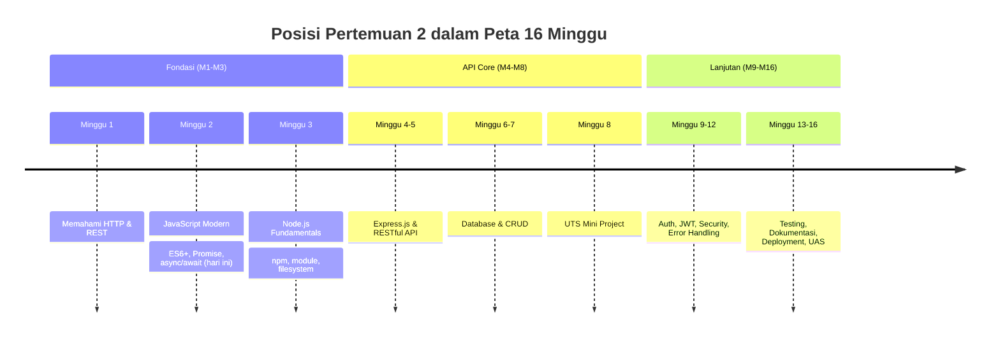
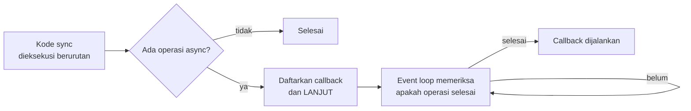
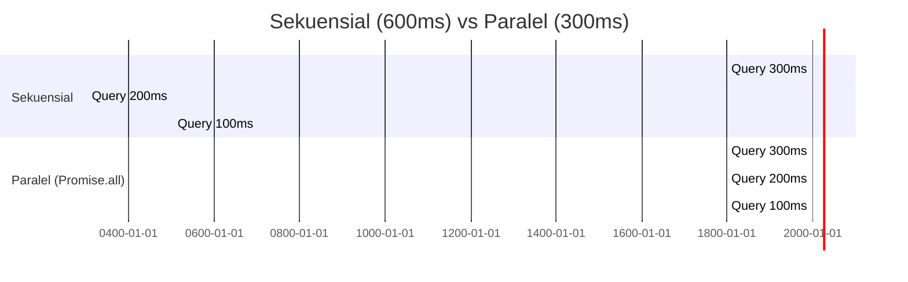
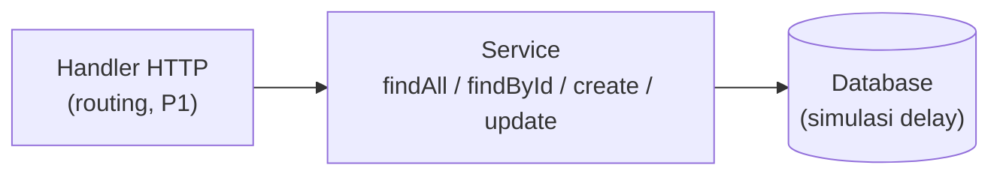
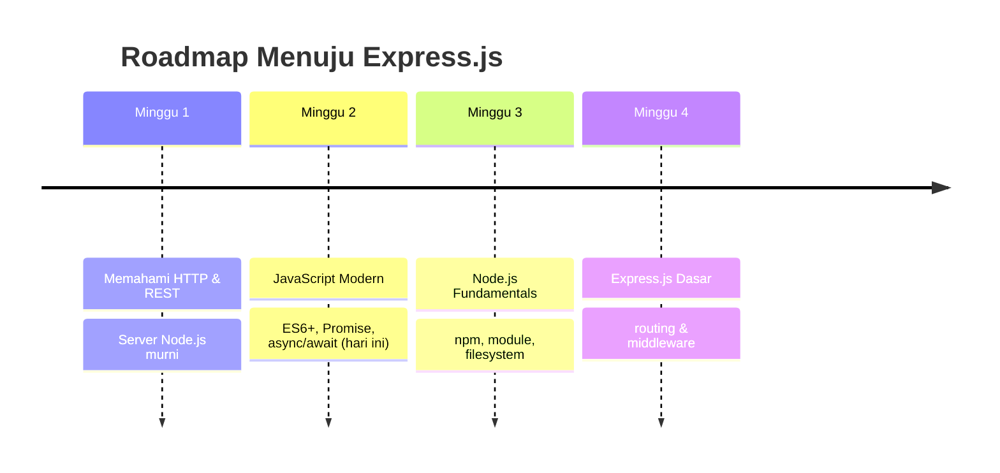

# Pertemuan 2 — JavaScript Modern untuk Backend

| | |
|:--|:--|
| **Minggu** | 2 |
| **Tanggal** | Senin, 21 September 2026 |
| **CPMK** | CPMK115 |
| **Model Pembelajaran** | Case Based Learning / Problem Based Learning |
| **Stack** | JavaScript (Node.js 20+) |

> **Catatan penting:** Pada Pertemuan 1, mahasiswa mempelajari dasar komunikasi dalam aplikasi web melalui alur **Client → Request → Backend → Response**. Pada Pertemuan 2, mahasiswa mempelajari fitur dan sintaks JavaScript modern yang diperlukan untuk menulis kode backend secara lebih terstruktur. Materi meliputi **ES6+**, seperti `let/const`, arrow function, template literal, destructuring, spread operator, dan module, serta pemrograman asynchronous menggunakan **Promise dan async/await**. Fitur-fitur tersebut akan digunakan kembali pada materi berikutnya, termasuk pengembangan server Node.js, routing dan middleware Express.js, serta pengolahan data dan query database. Oleh karena itu, penguasaan JavaScript modern dan konsep asynchronous programming merupakan dasar penting untuk mengikuti pembelajaran backend pada pertemuan-pertemuan berikutnya.

---

## Daftar Isi

- [Pertemuan 2 — JavaScript Modern untuk Backend](#pertemuan-2--javascript-modern-untuk-backend)
  - [Daftar Isi](#daftar-isi)
  - [1. Keterkaitan Pertemuan dengan RPS OBE](#1-keterkaitan-pertemuan-dengan-rps-obe)
  - [2. Capaian Pembelajaran Pertemuan](#2-capaian-pembelajaran-pertemuan)
  - [3. Pemantik Kasus: Log Server yang Berantakan](#3-pemantik-kasus-log-server-yang-berantakan)
  - [4. Review Cepat: let, const, dan Tipe Data](#4-review-cepat-let-const-dan-tipe-data)
  - [5. Function Declaration vs Expression vs Arrow](#5-function-declaration-vs-expression-vs-arrow)
  - [6. Template Literals](#6-template-literals)
  - [7. Destructuring](#7-destructuring)
  - [8. Spread Operator & Rest Parameter](#8-spread-operator--rest-parameter)
  - [9. Array Methods: map, filter, find, reduce](#9-array-methods-map-filter-find-reduce)
  - [10. Optional Chaining & Nullish Coalescing](#10-optional-chaining--nullish-coalescing)
  - [11. Module: CommonJS (require) vs ES Modules (import)](#11-module-commonjs-require-vs-es-modules-import)
  - [12. Synchronous vs Asynchronous: Event Loop](#12-synchronous-vs-asynchronous-event-loop)
  - [13. Callback — dan Callback Hell](#13-callback--dan-callback-hell)
  - [14. Promise: then, catch, finally](#14-promise-then-catch-finally)
  - [15. async/await + try/catch](#15-asyncawait--trycatch)
  - [16. Promise.all: Menjalankan Task Secara Paralel](#16-promiseall-menjalankan-task-secara-paralel)
  - [17. Case Based Learning: Service Buku Perpustakaan](#17-case-based-learning-service-buku-perpustakaan)
  - [18. Aktivitas Kelompok](#18-aktivitas-kelompok)
  - [19. Latihan Individu](#19-latihan-individu)
  - [20. Pemanfaatan AI sebagai Coding Assistant](#20-pemanfaatan-ai-sebagai-coding-assistant)
  - [21. Kuis Formatif + Kunci Jawaban](#21-kuis-formatif--kunci-jawaban)
  - [22. Output Pembelajaran — Tugas 2](#22-output-pembelajaran--tugas-2)
    - [Cara Pengumpulan — Push ke Repository GitHub Kelas](#cara-pengumpulan--push-ke-repository-github-kelas)
  - [23. Rubrik Tugas 2](#23-rubrik-tugas-2)
  - [24. Persiapan menuju Pertemuan 3](#24-persiapan-menuju-pertemuan-3)
    - [📎 Lampiran: Kode Praktikum](#-lampiran-kode-praktikum)

---

## 1. Keterkaitan Pertemuan dengan RPS OBE

Pertemuan 2 melanjutkan capaian **CPMK115** dengan berfokus pada penggunaan sintaks dan fitur JavaScript modern untuk pengembangan backend:

> Mahasiswa mampu menerapkan sintaks JavaScript modern (ES6+) dan pola asynchronous untuk kebutuhan aplikasi back end.

Materi pada Pertemuan 2 berkaitan langsung dengan kode yang telah digunakan pada Pertemuan 1. Callback digunakan pada `http.createServer()`, Promise digunakan pada `readBody()`, dan `async/await` digunakan pada handler server. Pada pertemuan ini, ketiga konsep tersebut akan dipelajari secara lebih sistematis.



---

## 2. Capaian Pembelajaran Pertemuan

Setelah mengikuti pertemuan ini, mahasiswa mampu:

| No. | Kemampuan | Indikator |
| :-: | --------- | --------- |
| 1 | Menggunakan let/const, arrow function, template literal | Menuliskan ulang kode ES5 lama menjadi ES6+ yang lebih ringkas |
| 2 | Memakai destructuring & spread pada data object/array | Mengekstrak field body request; menyalin object tanpa mutasi |
| 3 | Memilih array method yang tepat | Menjelaskan kapan memakai `map` vs `filter` vs `find` vs `reduce` |
| 4 | Membedakan sync vs async & menjelaskan event loop | Memprediksi urutan output kode campuran sync/async |
| 5 | Menulis Promise dan mengonsumsinya dengan async/await | Membungkus operasi lambat menjadi Promise + try/catch |
| 6 | Menjalankan beberapa async task paralel | Memakai `Promise.all` dan mengukur waktu eksekusinya |

---

## 3. Pemantik Kasus: Kode Server yang Perlu Direfactor

Dalam sebuah proyek aplikasi perpustakaan, tim pengembang menemukan kode lama yang masih dapat dijalankan, tetapi memiliki beberapa bagian yang sulit dipelihara. Mahasiswa diminta menganalisis kode tersebut dan mengidentifikasi bagaimana fitur JavaScript modern dapat digunakan untuk meningkatkan keterbacaan dan pemeliharaan kode.

```javascript
// kode lama — masih dapat dijalankan, tetapi sulit dipelihara
function prosesPeminjaman0(req, res) {
  const id = req.body.id;
  var buku = cariBuku(id);
  if (buku == null) {
    res.end('{"success":false,"message":"Buku tidak ditemukan"}');
  } else if (buku.stok == 0) {
    res.end('{"success":false,"message":"Stok habis"}');
  } else {
    // ... 40 baris berikutnya menyusun string JSON manual
  }
}
```

Pertanyaan pemantik:

- Kode di atas **masih dapat dijalankan**. Mengapa kode tersebut perlu direfactor?
- `req.body` dapat diterima tanpa field `id`. Apa konsekuensinya jika `cariBuku()` menerima nilai `undefined`?
- Bagaimana Anda **memastikan** bahwa refactoring tidak mengubah perilaku program? (petunjuk: bandingkan keluaran sebelum dan sesudah; konsep pengujian akan dipelajari lebih lanjut pada Minggu 13.)
- Server mengalami penundaan respons ketika melakukan pemeriksaan stok. Jika operasi database membutuhkan waktu dan JavaScript diproses pada satu thread, apa konsekuensinya terhadap request lain yang masuk?

Pertemuan ini membahas bagaimana fitur ES6+ dapat meningkatkan keterbacaan dan struktur kode, serta bagaimana Promise dan async/await digunakan untuk menangani operasi asynchronous pada aplikasi backend.

---

## 4. Review Cepat: let, const, dan Tipe Data

Pemilihan deklarasi variabel pada JavaScript modern bergantung pada apakah nilai variabel perlu di-assign ulang:

| Keyword | Scope | Re-assign | Kapan dipakai |
|:--------|:------|:---------:|:--------------|
| `const` | block | ❌ | **Default** — 90% kode backend Anda |
| `let`   | block | ✅ | Hanya nilai yang memang berubah (counter, akumulator) |
| `var`   | function | ✅ | **Jangan** — hoisting & scope-nya sumber bug klasik |

```javascript
const PORT = 3000;      // konfigurasi = const
let totalRequest = 0;   // penghitung = let
// var hilang dari semua kode kita mulai hari ini
```

> **Pedoman penggunaan:** gunakan `const` apabila variabel tidak perlu di-assign ulang. Gunakan `let` apabila nilai variabel perlu diubah selama eksekusi program. Pendekatan ini membantu mengurangi perubahan nilai variabel yang tidak diperlukan.

Tipe data yang dipakai terus-menerus di backend: `String`, `Number`, `Boolean`, `null`, `undefined`, `Object`, `Array` — semuanya sudah muncul di JSON Pertemuan 1 (section 13).

---

## 5. Function Declaration vs Expression vs Arrow

Tiga cara mendefinisikan fungsi:

```javascript
// 1. Function declaration — di-hoisting, bisa dipanggil sebelum didefinisikan
function sapa(nama) {
  return `Halo, ${nama}!`;
}

// 2. Function expression
const sapaExp = function (nama) {
  return `Halo, ${nama}!`;
};

// 3. Arrow function — ringkas; implicit return untuk satu ekspresi
const sapaArrow = (nama) => `Halo, ${nama}!`;
```

**Penggunaan arrow function yang umum:** arrow function banyak digunakan sebagai callback karena sintaksnya ringkas.

```javascript
// Pertemuan 1 sudah memakai pola ini di perpustakaan.js:
const found = buku.find((b) => b.id === Number(id));
const index = buku.findIndex((b) => b.id === Number(id));
```

**Perbedaan perilaku `this`** (yang membuat arrow bukan sekadar sintaks manis):

```javascript
const timer = {
  detik: 0,
  mulai() {
    // arrow menangkap `this` dari scope sekitar (method mulai)
    setInterval(() => {
      this.detik++; // `this` = timer. Dengan function() biasa → undefined!
    }, 1000);
  },
};
```

| Aspek | `function` | Arrow |
|:------|:-----------|:------|
| `this` | ditentukan **pemanggil** | ditentukan **scope penulisan** (lexical) |
| Cocok untuk | method object, constructor | callback, helper murni |

---

## 6. Template Literals

Gabungkan string dan ekspresi tanpa `+` yang panjang:

```javascript
const nim = "F1D022001";
const nama = "Jhon Doe";

// ES5: "Log: " + method + " " + url + " (" + status + ")"
// ES6+:
const log = (method, url, status) => `${method} ${url} → ${status}`;
console.log(`Selamat datang, ${nama} (${nim})`);
```

Fitur tambahan: **multi-baris** tanpa `\n`, dan ekspresi di dalam `${}` boleh pemanggilan fungsi, ternary, bahkan template literal lain — persis `console.log` server demo P1:

```javascript
console.log(`[${new Date().toLocaleTimeString()}] ${method} ${url}`);
```

---

## 7. Destructuring

Destructuring digunakan untuk mengambil nilai dari object atau array dan menetapkannya ke variabel. Pola ini banyak digunakan dalam pengembangan backend, termasuk pada Express.js:

```javascript
// Object destructuring + default + rename
const buku = { judul: "Belajar Node.js", tahun: 2024 };
const { judul, penulis = "Anonim", tahun: tahunTerbit } = buku;
// judul = "Belajar Node.js", penulis = "Anonim", tahunTerbit = 2024

// MUNCUL DI PERTEMUAN 1 — sekarang resmi dibedah:
const { method, url } = req;               // server.js
const { nim, nama } = body || {};          // latihan.js

// Array destructuring + skip
const [pertama, , ketiga] = ["apel", "jeruk", "mangga"];
const [hapus] = buku.splice(index, 1);     // ambil elemen pertama hasil splice

// Destructuring PARAMETER — pola handler Express (Minggu 4):
function buatResponse({ success = true, message = "", data = null } = {}) {
  return { success, message, data };
}
buatResponse({ message: "OK" }); // { success: true, message: "OK", data: null }
```

**Manfaat dalam pengembangan backend:** destructuring parameter memungkinkan fungsi menerima nilai berdasarkan nama properti. Default value juga dapat digunakan untuk menyediakan nilai awal ketika properti tidak diberikan.

---

## 8. Spread Operator & Rest Parameter
Operator `...` memiliki dua penggunaan utama dalam JavaScript:

```javascript
// SPREAD — menyalin isi object/array (di sisi kanan / pemanggil)
const defaultBuku = { judul: "-", penulis: "-", tahun: 2024, stok: 0 };
const bukuBaru = { ...defaultBuku, judul: "Belajar Node.js", stok: 3 };
// field yang disebut belakangan MENANG → partial update ala PATCH

const gabung = [...listA, ...listB];        // gabung array tanpa .concat()

// REST — menangkap sisa argumen menjadi array (di parameter function)
function catatLog(...pesan) {
  return pesan.join(" | ");
}
catatLog("GET", "/buku", "200"); // "GET | /buku | 200"
```

Mengapa penting untuk backend:

1. **Immutability ringan** — `{ ...lama, stok: 4 }` membuat object baru tanpa mengubah aslinya; memudahkan pelacakan perubahan data (penting saat state React / cache).
2. **Merge konfigurasi** — menggabungkan *default config* dengan *user config* (`{ ...default, ...env }`) — pola yang dipakai di konfigurasi environment (Minggu 12).
3. `Object.assign(found, data)` di P1 adalah saudara dari spread — keduanya partial update.

---

## 9. Array Methods: map, filter, find, reduce

Metode utama untuk pengolahan data array. Setiap method memiliki tujuan yang berbeda dan menghasilkan nilai sesuai dengan operasi yang dilakukan:

```javascript
const buku = [
  { id: 1, judul: "Belajar Node.js", stok: 3 },
  { id: 2, judul: "Dasar JavaScript", stok: 0 },
  { id: 3, judul: "REST API untuk Pemula", stok: 5 },
];

// map: transformasi 1:1 → array baru
const judulBuku = buku.map((b) => b.judul);

// filter: saring yang lolos kondisi
const tersedia = buku.filter((b) => b.stok > 0);

// find: ambil SATU item pertama yang cocok (undefined jika tidak ada)
const detail = buku.find((b) => b.id === 2);

// findIndex: posisi item (-1 jika tidak ada) → dipakai untuk DELETE di P1
const index = buku.findIndex((b) => b.id === 2);

// reduce: lipat seluruh array menjadi SATU nilai
const totalStok = buku.reduce((acc, b) => acc + b.stok, 0);
```

Ringkasan pemilihan array method:

| Kebutuhan | Method |
|:----------|:-------|
| Ubah tiap elemen | `map` |
| Buang elemen berdasar kondisi | `filter` |
| Cari satu item | `find` |
| Cari posisi (untuk hapus) | `findIndex` |
| Akumulasi (total, agregasi) | `reduce` |
| Sekadar iterasi tanpa hasil | `forEach` |

> **Kesalahan umum:** menggunakan `map` hanya untuk menjalankan efek samping, misalnya `console.log()`. Gunakan `forEach()` apabila tidak memerlukan array hasil. `map()` digunakan ketika diperlukan array baru hasil transformasi.

---

## 10. Optional Chaining & Nullish Coalescing

Dua fitur untuk menangani data yang mungkin tidak memiliki properti tertentu:

```javascript
const body = { mahasiswa: { nama: "Ani" } };

// ?. → berhenti aman saat property tidak ada (hasil undefined, BUKAN error)
const nama = body.mahasiswa?.nama;       // "Ani"
const kosong = body.dosen?.nama;         // undefined — tidak error

// ?? → nilai default HANYA untuk null/undefined
const penulis = body.penulis ?? "Anonim";

// BEDAKAN dengan || : || menganggap 0, "", false sebagai "kosong"
const stok = 0;
const pakaiAtau = stok || 10;    // 10  ← salah: stok 0 dianggap kosong oleh ||
const pakaiNullish = stok ?? 10; // 0  ← benar: ?? hanya null/undefined
```

> **Perbedaan `??` dan `||`:** operator `||` menganggap `0`, `""`, dan `false` sebagai nilai kosong, sehingga mengembalikan nilai alternatif. Operator `??` hanya mengembalikan nilai alternatif untuk `null`/`undefined`.

Pola kombinasi yang dipakai di seluruh kode backend modern:

```javascript
const { nim, nama } = body || {};            // P1 latihan.js
const tahun = body?.tahun ?? new Date().getFullYear();
```

---

## 11. Module: CommonJS (require) vs ES Modules (import)

Satu file = satu module. Ini cara memecah aplikasi backend agar tidak jadi satu file raksasa:

```javascript
// modul-02.js — mengekspor (mengirim keluar)
function formatRupiah(angka) {
  return "Rp" + new Intl.NumberFormat("id-ID").format(angka);
}
module.exports = { formatRupiah, hitungDiskon };

// latihan.js — mengimpor (memasukkan)
const { formatRupiah, hitungDiskon } = require("./modul-02");
```

| | CommonJS | ES Modules (ESM) |
|:--|:---------|:-----------------|
| Sintaks | `require` / `module.exports` | `import` / `export` |
| Berlaku | default di Node.js tanpa konfigurasi | wajib `"type": "module"` di package.json / ekstensi `.mjs` |
| Posisi kita | **dipakai sepanjang praktikum ini** | dikenal, dipakai saat boilerplate modern menuntut |

Preview Pertemuan 3: `require("node:http")` = module **bawaan**; `require("./modul-02")` = module **lokal**; dan `npm install express` = module **pihak ketiga** yang dikelola npm.

---

## 12. Synchronous vs Asynchronous: Event Loop

Pada aplikasi backend, beberapa operasi membutuhkan waktu relatif lebih lama dibandingkan operasi komputasi sederhana, misalnya membaca file, mengakses database, atau memanggil API eksternal. Node.js menggunakan model eksekusi berbasis event loop untuk menangani operasi asynchronous tanpa menghentikan pemrosesan JavaScript secara keseluruhan.



Demo pembuktian (dijalankan di kelas):

```javascript
console.log("1. mulai");
setTimeout(() => console.log("3. [async 0ms]"), 0); // delay 0 pun tetap belakangan!
console.log("2. selesai");
// Output: 1 → 2 → 3  (bukan 1 → 3 → 2)
```

Konsekuensi desain penting:

- **Hindari operasi blocking** — operasi synchronous yang membutuhkan waktu eksekusi panjang dapat menunda pemrosesan request lainnya.
- Operasi asynchronous tidak menunda eksekusi kode setelahnya. Promise dan async/await digunakan untuk mengatur urutan eksekusi logika.

---

## 13. Callback — dan Callback Hell

Salah satu pola awal yang digunakan Node.js untuk menangani operasi asynchronous adalah callback, yaitu fungsi yang dipanggil ketika operasi selesai. Salah satu konvensi yang umum digunakan adalah *error-first callback*:

```javascript
fs.readFile("data.txt", "utf8", (err, data) => {
  if (err) return console.log("gagal:", err.message);
  console.log("sukses:", data);
});
```

Ketika beberapa operasi asynchronous saling bergantung, callback dapat menjadi bersarang dan menghasilkan struktur kode yang sulit dibaca dan dipelihara. Pola ini dikenal sebagai **callback hell**:

```javascript
// ambil user → ambil buku yang dipinjam → kurangi stok → catat log
getUser(id, (err, user) => {
  if (err) return gagal(err);
  getBorrowed(user, (err, books) => {
    if (err) return gagal(err);
    updateStock(books, (err, result) => {
      if (err) return gagal(err);
      writeLog(result, (err) => {
        if (err) return gagal(err); // callback bersarang — kode miring ke kanan
      });
    });
  });
});
```

Callback masih digunakan pada dua bagian kode yang telah dipelajari, yaitu callback `createServer` dan event `req.on("end")` pada `readBody()` Pertemuan 1. Untuk rangkaian operasi asynchronous yang lebih kompleks, Promise dan async/await menyediakan struktur kode yang lebih mudah dibaca dan dipelihara.

---

## 14. Promise: then, catch, finally

**Promise** merupakan object yang merepresentasikan hasil dari suatu operasi asynchronous yang dapat tersedia pada masa mendatang. Promise memiliki tiga keadaan: `pending` → `fulfilled` / `rejected`.

```javascript
function ambilBuku(delayMs = 300) {
  return new Promise((resolve, reject) => {
    setTimeout(() => {
      const sukses = true; // bayangkan: hasil query database
      if (sukses) resolve([{ id: 1, judul: "Belajar Node.js" }]);
      else reject(new Error("Database tidak merespons"));
    }, delayMs);
  });
}

ambilBuku()
  .then((buku) => console.log("sukses:", buku))
  .catch((err) => console.log("gagal:", err.message))
  .finally(() => console.log("selesai — dijalankan apapun hasilnya"));
```

Sudah pernah Anda lihat: `readBody()` di P1 **adalah** Promise buatan sendiri — `req.on("end")` memanggil `resolve()`. `Promise.reject` → rantai lompat ke `.catch` terdekat.

> **Promisifikasi:** callback lama bisa dibungkus jadi Promise — `fs/promises` dan `util.promisify` melakukan ini untuk semua API bawaan Node.

---

## 15. async/await + try/catch

`async/await` menyediakan sintaks yang lebih mudah dibaca untuk bekerja dengan Promise. `await` digunakan untuk menunggu penyelesaian sebuah Promise di dalam fungsi `async`.

```javascript
async function main() {
  try {
    const buku = await ambilBuku(200);          // await hanya di dalam async
    console.log(buku.map((b) => b.judul));     // map langsung dipakai

    await Promise.reject(new Error("DB terputus"));
  } catch (err) {
    console.log("tertangkap:", err.message);    // padanan .catch
  }
}
```

Ketentuan penggunaan:

1. `await` digunakan di dalam fungsi `async`, atau pada konteks top-level yang mendukungnya seperti ESM.
2. Fungsi `async` **selalu** mengembalikan Promise.
3. Kesalahan yang terjadi pada operasi yang ditunggu dengan `await` dapat ditangani menggunakan `try/catch`.
4. Salah satu pola handler asynchronous yang akan digunakan pada Express.js adalah `async (req, res) => { try { ... } catch { ... } }`.

---

## 16. Promise.all: Menjalankan Task Secara Paralel

Jika operasi asynchronous dijalankan secara berurutan, waktu eksekusinya dapat terakumulasi. Untuk operasi yang **saling independen**, operasi dapat dijalankan secara konkuren menggunakan `Promise.all()`:

```javascript
const tunda = (ms, nilai) =>
  new Promise((resolve) => setTimeout(() => resolve(nilai), ms));

const mulai = Date.now();
const [buku, anggota, peminjaman] = await Promise.all([
  tunda(300, "data buku"),      // query 1
  tunda(200, "data anggota"),   // query 2
  tunda(100, "data peminjaman"),// query 3
]);
console.log(Date.now() - mulai); // ±300ms (yang terlama), BUKAN 600ms
```



**Ketentuan:** jika satu Promise dalam `Promise.all()` mengalami rejection, keseluruhan `Promise.all()` akan mengalami rejection. Jika setiap hasil operasi perlu diproses secara terpisah, termasuk hasil yang berhasil maupun gagal, dapat digunakan `Promise.allSettled()`; fitur tersebut berada di luar target pembelajaran pertemuan ini.

**Contoh penggunaan:** dashboard atau statistik yang menggabungkan data dari beberapa resource, proses preload, dan agregasi query Prisma (Minggu 7).

---

## 17. Case Based Learning: Service Buku Perpustakaan

**Skenario:** Melanjutkan API Perpustakaan pada Pertemuan 1. Sebelum menggunakan Express.js, logika bisnis dipisahkan dari mekanisme HTTP melalui lapisan *service*. Endpoint pada Pertemuan 1 (`/buku/:id`, `PATCH` stok) ditulis ulang sebagai fungsi-fungsi murni dengan simulasi query database yang memiliki waktu tunda.



Kode referensi: [`code/pertemuan-02/service-buku.js`](./code/pertemuan-02/service-buku.js) — memakai seluruh materi hari ini: destructuring parameter di `create({ judul, penulis, tahun, stok = 0 })`, `?? null` di `findById`, spread-style update di `Object.assign`, `Promise.all` untuk statistik, dan `async/await` di setiap akses data.

Sistem yang tersedia untuk diuji:

| Operasi | Method service | Fitur P2 yang dipakai |
|:--------|:---------------|:----------------------|
| Daftar semua | `await findAll()` | async/await + delay |
| Detail satu | `await findById(id)` | `?? null` (mengembalikan null, bukan error, saat data tidak ditemukan) |
| Tambah | `await create({...})` | destructuring + default |
| Ubah sebagian | `await update(id, data)` | partial update ala PATCH |
| Statistik | `Promise.all([...])` | paralel, bukan berurutan |

Diskusi CBL: apa yang terjadi bila `findById` tidak memakai `?? null` dan client meminta id 999? (petunjuk: bandingkan dengan `cariBuku()` P1 dan pikirkan status code 404).

---

## 18. Aktivitas Kelompok

Bentuk kelompok 3–4 orang:

1. **Refactoring kode (15 menit)** — Dosen membagikan contoh kode lama:

   ```javascript
   function buatPesan(l) { var t = "Total: " + l.reduce(function(a, i) { return a + i.harga * i.jumlah; }, 0); return t; }
   ```

   Tulis ulang menggunakan arrow function, template literal, destructuring, dan default value. Setiap perubahan harus dapat dijelaskan berdasarkan alasan teknis dan manfaatnya terhadap keterbacaan atau pemeliharaan kode.
2. **Prediksi output (10 menit)** — Dosen menayangkan potongan kode campuran sync/async; tiap kelompok menuliskan urutan output **tanpa menjalankan**. Setelahnya jalankan — skor prediksi dibandingkan antar kelompok.
3. **Paralel vs sekuensial (15 menit)** — Berikan 3 "query" ber-delay berbeda; tiap kelompok menghitung estimasi waktu sekuensial vs `Promise.all` pada berbagai kombinasi, lalu diverifikasi dengan `Date.now()`.

**Tujuan aktivitas:** setiap kelompok mampu menjelaskan kapan suatu fitur JavaScript digunakan dan memberikan alasan teknis atas pemilihannya.

---

## 19. Latihan Individu

Kerjakan setelah demo; kerangka TODO terbimbing ada di [`code/pertemuan-02/latihan.js`](./code/pertemuan-02/latihan.js). Kasus: **struk e-warung kampus**.

1. **TODO 1** — destructuring + template literal: cetak `"Item pertama: Kopi Hitam (Rp15.000)"` memakai `formatRupiah` dari `modul-02.js`.
2. **TODO 2** — `map` + `reduce`: subtotal tiap item (harga × jumlah) dan total struk.
3. **TODO 3** — `filter` + spread: array nama item dengan harga > 10000.
4. **TODO 4** — Promise + async/await: `prosesPembayaran(total, delayMs)` → resolve `{ status: "lunas", total, kembali }`; diskon 10% jika total > 100000 (pakai `hitungDiskon`).
5. **TODO 5** — `Promise.all`: 3 laporan cabang (delay 200/300/100ms, nilai 50/80/70) dijumlahkan; buktikan paralel dengan `Date.now()`.
6. **TODO 6 (bonus)** — cetak struk rapi multi-baris memakai map + `padEnd(20)` + template literal.

Setelah selesai, jalankan `node latihan.js`. Pastikan setiap TODO menghasilkan keluaran yang sesuai dengan spesifikasi latihan sebagai persiapan mengikuti materi Node.js Fundamentals.

---

## 20. Pemanfaatan AI sebagai Coding Assistant

**✅ Gunakan AI untuk:**

- Meminta bantuan untuk memahami pesan error `TypeError: Cannot read properties of undefined` dan stack trace
- Meminta penjelasan konsep, misalnya mengapa `await` di luar fungsi `async` menghasilkan error atau kapan `??` berbeda dengan `||`
- Men-review refactor Anda: "mana yang lebih mudah dibaca, arrow atau function biasa?"
- Membuat soal prediksi output synchronous/asynchronous untuk latihan mandiri

**❌ Jangan gunakan AI untuk:**

- Menghasilkan seluruh Tugas 2 (refactor + demo) tanpa proses pengerjaan dan pemahaman oleh mahasiswa
- Menyalin solusi latihan tanpa mencoba menyelesaikan permasalahan secara mandiri terlebih dahulu

**Etika di kelas ini:**

1. Mahasiswa harus dapat menjelaskan setiap perubahan pada kode refactoring yang dikumpulkan
2. Cantumkan penggunaan bantuan AI, misalnya: `// Bantuan: ChatGPT — penjelasan Promise.all`
3. AI digunakan sebagai alat bantu pembelajaran. Mahasiswa tetap bertanggung jawab memahami, menjelaskan, dan menguji kode yang digunakan dalam tugas. Penggunaan AI tidak menggantikan proses memahami konsep synchronous dan asynchronous programming.

---

## 21. Kuis Formatif + Kunci Jawaban

**Kuis formatif (10 menit, tanpa menggunakan catatan):**

1. Mengapa `const` menjadi pilihan default, dan kapan `let` diperlukan?
2. Apa beda `map`, `filter`, dan `find`? Berikan satu contoh kebutuhan untuk masing-masing.
3. Prediksi output dan jelaskan urutannya:

   ```javascript
   console.log("A");
   setTimeout(() => console.log("B"), 0);
   Promise.resolve().then(() => console.log("C"));
   console.log("D");
   ```

4. Apa yang dikembalikan `async` function? Apa fungsi `try/catch` di sana?
5. Tiga query independen masing-masing 100ms. Berapa total waktu berurutan vs `Promise.all`, dan kapan sebaiknya TIDAK memakai `Promise.all`?

<details>
<summary><strong>🔑 Kunci Jawaban</strong></summary>

1. `const` mencegah re-assign tak sengaja → kode lebih mudah dilacak; `let` hanya saat nilainya memang berubah (counter, akumulator).
2. `map` = transformasi tiap elemen → array baru (mis. daftar judul dari daftar buku); `filter` = saring kondisi (mis. buku stok > 0); `find` = ambil satu item pertama yang cocok (mis. detail buku by id).
3. **A → D → C → B.** Sync dulu (A, D); microtask (C) dieksekusi sebelum macrotask/timer (B) walau delay-nya 0.
4. Selalu mengembalikan **Promise** (nilai return dibungkus). `try/catch` menangkap error dari `await` — padanan `.catch()` agar handler dapat mengirim status 500, bukan menghentikan server.
5. Berurutan: ±300ms; `Promise.all`: ±100ms (yang terlama). Jangan dipakai jika task **saling bergantung** (butuh hasil sebelumnya) atau gagal satu = gagal semua tidak diinginkan.

</details>

---

## 22. Output Pembelajaran — Tugas 2

**Tugas 2 — Refactor & Mini-Service (Tugas 1 minggu), dikumpulkan sebelum Pertemuan 3.**

Tugas 1 berisi rancangan endpoint dalam bentuk dokumen. Tugas 2 bertujuan mengevaluasi kemampuan mahasiswa dalam menerapkan rancangan tersebut ke dalam bentuk logika JavaScript:

1. **Ambil resource dari Tugas 1 Anda** (perpustakaan / lab / e-warung / absensi).
2. **Buat file service** (Node.js murni, tanpa Express) berisi "database" in-memory + fungsi async: `findAll`, `findById`, `create`, `update`, `delete` — masing-masing mengembalikan hasil atau `null` untuk "tidak ditemukan". Sertakan simulasi delay (100–300ms).
3. **Refactor kode warisan** (dibagikan di kelas) memakai minimal: arrow function, template literal, destructuring, satu array method (`map`/`filter`/`reduce`), dan satu default value. Lampirkan **versi sebelum & sesudah**.
4. **Demo script** (`demo.js`) yang menjalankan minimal 4 operasi service + satu `Promise.all` berisi 2 query paralel, lengkap dengan `try/catch` untuk kasus id tidak ditemukan.
5. **Refleksi** (maks. 1 halaman): tiga fitur P2 yang paling mengubah cara Anda menulis kode, dan satu hal yang masih membingungkan.

### Cara Pengumpulan — Push ke Repository GitHub Kelas

| Kelas | Repository | Folder |
|:------|:-----------|:-------|
| SI-VA | `SI-VA-Backend` | `tugas-2/<nim>-<nama>/` |
| SI-VB | `SI-VB-Backend` | `tugas-2/<nim>-<nama>/` |

```bash
git add tugas-2/<nim>-<nama>
git commit -m "tugas-2: service + refactor ES6 - <nama> <nim>"
git push origin main
```

Struktur folder tugas:

```text
tugas-2/<nim>-<nama>/
├── service.js      # database in-memory + 5 fungsi async
├── refactor.js     # versi sebelum & sesudah
├── demo.js         # menjalankan operasi + Promise.all
└── refleksi.md     # 3 fitur + 1 kebingungan
```

> Pastikan `node demo.js` berjalan tanpa error di Node 20+ — asisten akan menjalankan langsung.

---

## 23. Rubrik Tugas 2

| Kriteria | Bobot | 4 (Sangat Baik) | 3 (Baik) | 2 (Cukup) | 1 (Perlu Bimbingan) |
|:---------|:-----:|:----------------|:---------|:----------|:--------------------|
| Kebenaran service (async, null-handling) | 30% | 5 fungsi async benar, `null` saat tak ditemukan, dapat dijalankan tanpa error pada skenario pengujian | 4 fungsi benar, terdapat kesalahan minor | 3 fungsi, penanganan belum konsisten | Mayoritas error / tidak dapat dijalankan |
| Penerapan ES6+ pada refactor | 25% | ≥ 5 fitur dipakai tepat & meningkatkan keterbacaan | 3–4 fitur tepat | 1–2 fitur, sebagian kurang tepat | Tanpa perubahan bermakna |
| Promise.all & error handling | 20% | Paralel benar + try/catch lengkap, kasus gagal teruji | Paralel benar, try/catch sebagian | Ada percobaan, hasil belum konsisten | Tidak ada |
| Struktur & kerapian kode | 15% | Konsisten, nama jelas, tanpa kode mati | Rapi, sedikit ketidakkonsistenan | Cukup, beberapa bagian sulit dibaca | Berantakan |
| Refleksi + ketepatan waktu | 10% | Jujur, spesifik, tepat waktu | Jujur, singkat, tepat waktu | Generik / 1 hari terlambat | Tidak ada / > 2 hari terlambat |

**Nilai = Σ(bobot × skor) / 16 × 100.** Terlambat: -1 level rubrik per hari.

---

## 24. Persiapan menuju Pertemuan 3

**Pertemuan 1** membahas dasar komunikasi antara client dan server. **Pertemuan 2** membahas sintaks dan fitur JavaScript modern yang digunakan untuk menulis kode backend. **Pertemuan 3 (28 September 2026) — Node.js Fundamentals** membahas runtime dan lingkungan eksekusi aplikasi JavaScript di sisi server, meliputi npm, `package.json`, module system secara lebih mendalam, filesystem, environment variable, dan server HTTP yang lebih terstruktur. Materi tersebut menjadi dasar sebelum mempelajari Express.js pada Pertemuan 4.

**Persiapan:**

- Selesaikan latihan individu + Tugas 2, push sebelum pertemuan.
- Pastikan Node.js v20+ terpasang (`node --version`) — npm akan mulai dipakai intensif.
- Baca ulang `demo-async.js`; coba ubah delay pada `Promise.all` dan prediksi total waktunya.



---

### 📎 Lampiran: Kode Praktikum

| File | Keterangan |
|:-----|:-----------|
| [`code/pertemuan-02/demo-es6.js`](./code/pertemuan-02/demo-es6.js) | Demo live: let/const, arrow, template literal, destructuring, spread, array methods, optional chaining, module |
| [`code/pertemuan-02/demo-async.js`](./code/pertemuan-02/demo-async.js) | Demo live: sync vs async, callback→Promise, then/catch/finally, async/await, Promise.all, fs/promises |
| [`code/pertemuan-02/service-buku.js`](./code/pertemuan-02/service-buku.js) | Implementasi referensi CBL: service layer API Perpustakaan |
| [`code/pertemuan-02/latihan.js`](./code/pertemuan-02/latihan.js) | Kerangka latihan individu dengan TODO terbimbing (kasus e-warung) |
| [`code/pertemuan-02/modul-02.js`](./code/pertemuan-02/modul-02.js) | Contoh module: formatRupiah & hitungDiskon |
| [`code/pertemuan-02/data.txt`](./code/pertemuan-02/data.txt) | Data untuk demo baca file async |
