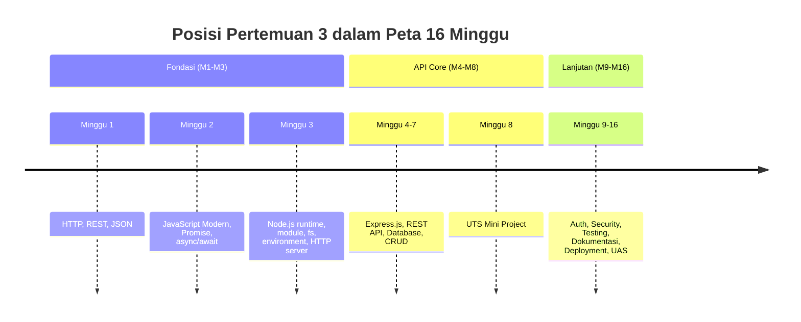
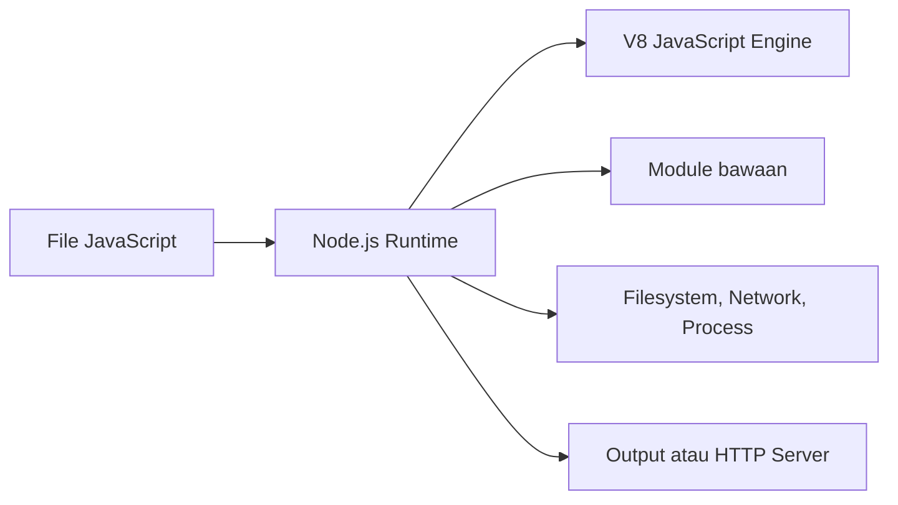
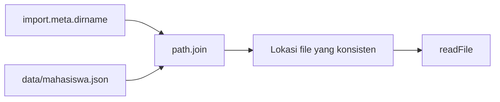
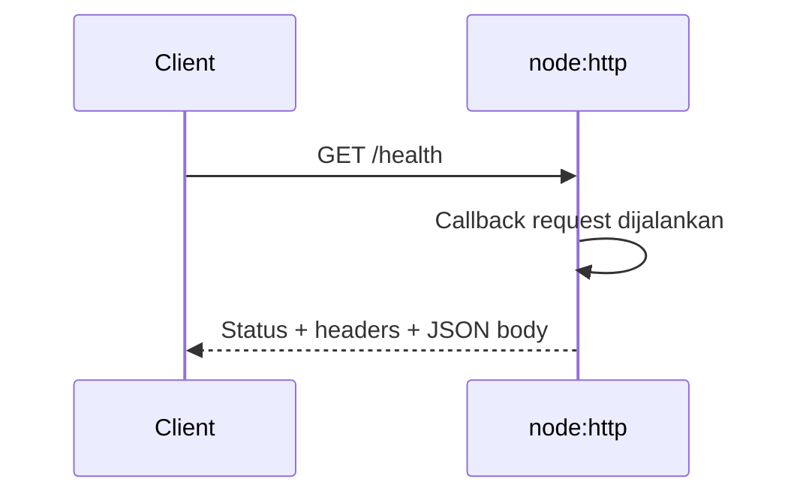
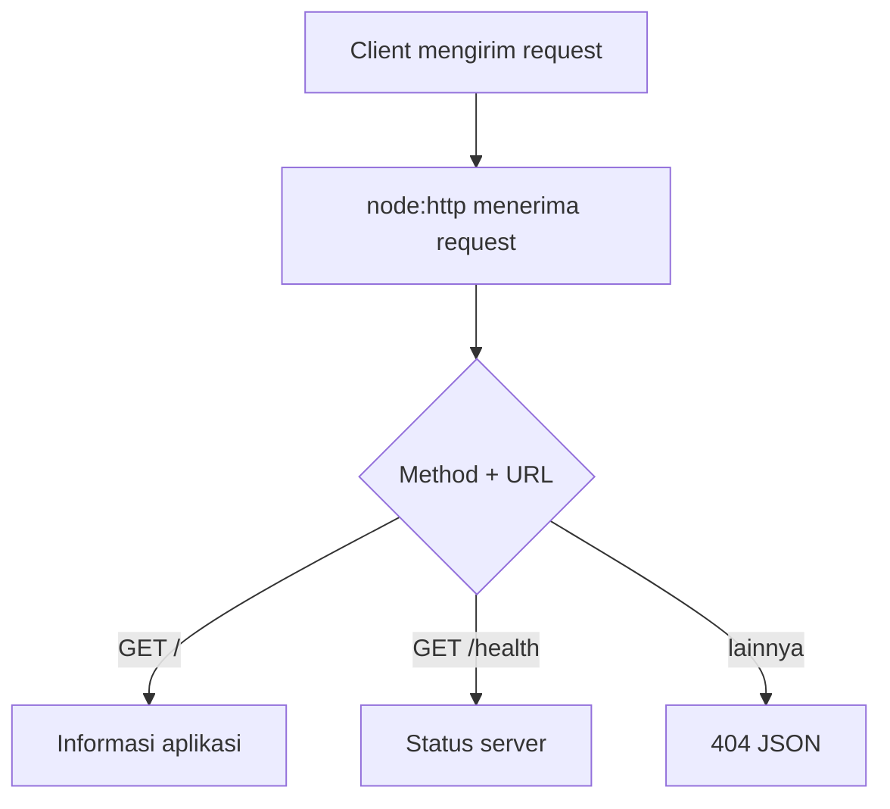

# Pertemuan 3 — Node.js Fundamentals

| | |
|:--|:--|
| **Minggu** | 3 |
| **Tanggal** | Senin, 28 September 2026 (SI-VA) / Selasa, 29 September 2026 (SI-VB) |
| **CPMK** | CPMK115 |
| **Model Pembelajaran** | Case Based Learning / Problem Based Learning |
| **Stack** | Node.js 20+ tanpa dependency eksternal (Node.js 24 LTS direkomendasikan) |

> **Catatan penting:** Pertemuan 3 membahas Node.js sebagai runtime JavaScript untuk backend. Anda akan mempelajari cara menjalankan file JavaScript di luar browser, menggunakan module bawaan, membaca konfigurasi melalui environment variable, mengelola file dengan `node:fs/promises`, dan membuat HTTP server sederhana. Express.js belum digunakan pada pertemuan ini agar mekanisme dasar Node.js dapat dipahami terlebih dahulu.

---

## Daftar Isi

- [Pertemuan 3 — Node.js Fundamentals](#pertemuan-3--nodejs-fundamentals)
  - [Daftar Isi](#daftar-isi)
  - [1. Keterkaitan Pertemuan dengan RPS OBE](#1-keterkaitan-pertemuan-dengan-rps-obe)
  - [2. Capaian Pembelajaran Pertemuan](#2-capaian-pembelajaran-pertemuan)
  - [3. Pemantik Kasus: Menyiapkan Backend yang Dapat Dijalankan](#3-pemantik-kasus-menyiapkan-backend-yang-dapat-dijalankan)
  - [4. Node.js sebagai Runtime](#4-nodejs-sebagai-runtime)
  - [5. Menjalankan Program Node.js](#5-menjalankan-program-nodejs)
  - [6. Module dan Sistem ESM](#6-module-dan-sistem-esm)
  - [7. Module Bawaan Node.js](#7-module-bawaan-nodejs)
  - [8. npm dan package.json](#8-npm-dan-packagejson)
  - [9. Environment Variable dan Konfigurasi](#9-environment-variable-dan-konfigurasi)
  - [10. Filesystem dengan node:fs/promises](#10-filesystem-dengan-nodefspromises)
  - [11. Path dan Lokasi File](#11-path-dan-lokasi-file)
  - [12. HTTP Server dengan node:http](#12-http-server-dengan-nodehttp)
  - [13. Routing Manual dan Response JSON](#13-routing-manual-dan-response-json)
  - [14. Penanganan Error pada Program Node.js](#14-penanganan-error-pada-program-nodejs)
  - [15. Case Based Learning: Server Informasi Kelas](#15-case-based-learning-server-informasi-kelas)
  - [16. Aktivitas Kelompok](#16-aktivitas-kelompok)
  - [17. Latihan Individu](#17-latihan-individu)
  - [18. Pemanfaatan AI sebagai Coding Assistant](#18-pemanfaatan-ai-sebagai-coding-assistant)
  - [19. Kuis Formatif](#19-kuis-formatif)
  - [20. Output Pembelajaran — Tugas 2](#20-output-pembelajaran--tugas-2)
    - [Cara Pengumpulan — Push ke Repository GitHub Kelas](#cara-pengumpulan--push-ke-repository-github-kelas)
  - [21. Rubrik Tugas 2](#21-rubrik-tugas-2)
  - [22. Persiapan menuju Pertemuan 4](#22-persiapan-menuju-pertemuan-4)
  - [Lampiran: Kode Praktikum](#lampiran-kode-praktikum)

---

## 1. Keterkaitan Pertemuan dengan RPS OBE

Pertemuan 3 menyelesaikan fase Fondasi Backend pada **CPMK115**:

> Mahasiswa mampu menerapkan dasar runtime Node.js, module, filesystem, konfigurasi environment, dan HTTP server sederhana untuk membangun program backend.

Materi ini mengikuti Timeline dan Milestone mata kuliah. Setelah memahami HTTP pada Pertemuan 1 dan JavaScript modern pada Pertemuan 2, Anda akan melihat bagaimana fitur tersebut dijalankan oleh runtime Node.js. Pemahaman ini digunakan kembali saat Express.js diperkenalkan pada Pertemuan 4.



---

## 2. Capaian Pembelajaran Pertemuan

Setelah mengikuti pertemuan ini, mahasiswa mampu:

| No. | Kemampuan | Indikator |
| :-: | --------- | --------- |
| 1 | Menjelaskan peran Node.js sebagai runtime | Membedakan JavaScript di browser dan JavaScript yang dijalankan oleh Node.js |
| 2 | Menggunakan module ESM dan module bawaan | Menulis `import`/`export` dan memilih module bawaan sesuai kebutuhan |
| 3 | Mengelola konfigurasi melalui environment variable | Menjalankan aplikasi dengan nama aplikasi dan port yang dapat diubah tanpa mengedit kode |
| 4 | Membaca dan menulis file secara asynchronous | Menggunakan `node:fs/promises` dengan `async/await` dan `try/catch` |
| 5 | Membuat HTTP server sederhana | Menangani request, memilih routing berdasarkan method dan URL, serta mengirim JSON response |
| 6 | Menyusun project Node.js yang dapat dijalankan | Menghasilkan struktur file yang jelas dan mendokumentasikan perintah eksekusinya |

---

## 3. Pemantik Kasus: Menyiapkan Backend yang Dapat Dijalankan

Tim mahasiswa telah memiliki rancangan endpoint pada Pertemuan 1 dan service asynchronous pada Pertemuan 2. Namun, kode tersebut belum memiliki struktur project yang jelas. Beberapa konfigurasi masih ditulis langsung di banyak file, dan server belum dapat menyediakan endpoint pemeriksaan status aplikasi.

Analisis kasus berikut:

- Bagaimana Node.js menjalankan kode JavaScript tanpa browser?
- Mengapa konfigurasi port sebaiknya dapat diubah melalui environment variable?
- Apa perbedaan module lokal seperti `./config.js` dan module bawaan seperti `node:http`?
- Bagaimana server membedakan endpoint `/` dan `/health`?
- Apa yang harus dilakukan jika file yang dibaca tidak tersedia?

Pada akhir pertemuan, Anda akan membuat server sederhana yang dapat dijalankan dengan `node server.js`, menerima konfigurasi dari environment, dan mengembalikan response JSON.

---

## 4. Node.js sebagai Runtime

Node.js adalah runtime yang menjalankan JavaScript menggunakan engine V8 di luar browser. Browser menyediakan API seperti DOM dan `window`, sedangkan Node.js menyediakan API untuk kebutuhan server, misalnya filesystem, proses, jaringan, dan sistem operasi.



Contoh perbedaan lingkungan:

| Kebutuhan | Browser | Node.js |
|:----------|:--------|:--------|
| Menampilkan halaman | DOM dan `document` | Tidak tersedia secara default |
| Membaca file lokal | Dibatasi oleh keamanan browser | `node:fs/promises` |
| Membuat HTTP server | Bukan tugas utama | `node:http` |
| Informasi proses | Terbatas | `process` |
| Module | ESM dan bundler | ESM serta module bawaan Node.js |

Node.js bukan bahasa pemrograman baru. Bahasa yang digunakan tetap JavaScript, sedangkan Node.js menyediakan runtime dan API tambahan.

---

## 5. Menjalankan Program Node.js

File JavaScript dapat dijalankan langsung dari terminal:

```bash
node nama-file.js
```

Perintah yang berguna:

```bash
node --version
node --help
node --watch server.js
```

`node --watch` menjalankan ulang program ketika file berubah. Fitur ini membantu saat pengembangan, tetapi proses tersebut perlu dihentikan dengan `Ctrl+C` ketika tidak digunakan.

Sebuah project sebaiknya memiliki struktur yang dapat dipahami:

```text
project-backend/
├── config.js
├── server.js
├── package.json
└── src/
    └── services/
```

Pada Pertemuan 3, kode praktikum sengaja menggunakan module bawaan dan belum membutuhkan dependency pihak ketiga.

---

## 6. Module dan Sistem ESM

Module membagi kode menjadi file-file dengan tanggung jawab yang jelas. Pada materi ini digunakan ECMAScript Modules (ESM):

```javascript
// config.js
export const PORT = 3003;

// server.js
import { PORT } from "./config.js";
```

Perhatikan hal berikut:

1. Gunakan `./` atau `../` untuk module lokal.
2. Tulis ekstensi `.js` pada import lokal.
3. Gunakan `export` untuk menyediakan nilai atau fungsi.
4. Gunakan `import` untuk memakai nilai atau fungsi dari file lain.
5. Top-level `await` dapat digunakan pada file yang diperlakukan sebagai ESM.

Contoh named export:

```javascript
export const APP_NAME = "API Kelas";
export const getConfig = () => ({ appName: APP_NAME });
```

```javascript
import { APP_NAME, getConfig } from "./config.js";
```

`import.meta.dirname` digunakan untuk mendapatkan direktori file saat menggunakan Node.js 20.11 atau versi yang lebih baru. Pendekatan ini membantu menentukan lokasi file secara konsisten.

---

## 7. Module Bawaan Node.js

Node.js menyediakan module bawaan sehingga kebutuhan umum dapat dipenuhi tanpa instalasi package tambahan.

| Module | Kegunaan |
|:-------|:---------|
| `node:fs/promises` | Membaca, menulis, dan menghapus file dengan Promise |
| `node:path` | Menyusun lokasi file secara lintas sistem operasi |
| `node:http` | Membuat HTTP server dan client sederhana |
| `node:os` | Membaca informasi sistem operasi |
| `node:timers/promises` | Membuat penundaan berbasis Promise |
| `node:url` | Mengolah URL |

Gunakan awalan `node:` agar module bawaan terlihat jelas:

```javascript
import path from "node:path";
import { readFile } from "node:fs/promises";
```

Pemilihan module harus mengikuti kebutuhan program. Jangan menambahkan package eksternal apabila module bawaan sudah cukup untuk tujuan pembelajaran atau kebutuhan sederhana.

---

## 8. npm dan package.json

`npm` adalah package manager yang digunakan untuk mengelola project dan dependency Node.js. Beberapa perintah penting:

```bash
npm init -y
npm install nama-package
npm install --save-dev nama-package
npm uninstall nama-package
npm run nama-script
```

`package.json` menyimpan metadata project, script, dan dependency. Contoh sederhana:

```json
{
  "name": "backend-kelas",
  "version": "1.0.0",
  "type": "module",
  "scripts": {
    "start": "node server.js",
    "dev": "node --watch server.js"
  }
}
```

Pada praktikum ini, `package.json` belum dibuat karena kode hanya memakai module bawaan Node.js. Pada pertemuan berikutnya, `npm` akan digunakan saat Express.js dipasang sebagai dependency.

---

## 9. Environment Variable dan Konfigurasi

Environment variable menyimpan nilai konfigurasi di luar source code. Node.js membacanya melalui `process.env`:

```javascript
const port = Number(process.env.PORT ?? 3003);
const environment = process.env.NODE_ENV ?? "development";
```

Cara menjalankan:

```bash
PORT=3050 NODE_ENV=development node server.js
```

Manfaat pendekatan ini:

- port dapat disesuaikan dengan lingkungan kerja;
- konfigurasi tidak perlu diubah setiap kali program dipindahkan;
- nilai sensitif dapat dikelola di luar source code;
- konfigurasi dapat dipusatkan dalam satu module.

Environment variable bukan tempat untuk menyimpan password atau token di repository. Nilai sensitif harus dikelola dengan mekanisme konfigurasi yang sesuai dan tidak di-commit ke Git.

---

## 10. Filesystem dengan node:fs/promises

Module `node:fs/promises` menyediakan API asynchronous untuk filesystem:

```javascript
import { readFile, writeFile } from "node:fs/promises";

await writeFile("catatan.txt", "Belajar Node.js", "utf8");
const isi = await readFile("catatan.txt", "utf8");
console.log(isi);
```

Operasi file dapat gagal, misalnya ketika file tidak ditemukan atau proses tidak memiliki izin. Tangani error pada batas operasi:

```javascript
try {
  const isi = await readFile("data.txt", "utf8");
  console.log(isi);
} catch (error) {
  console.error("File gagal dibaca:", error.message);
}
```

Gunakan `readFile` ketika memerlukan seluruh isi file. Untuk file besar atau aliran data berkelanjutan, teknik stream akan dibahas sesuai kebutuhan pada materi lanjutan.

---

## 11. Path dan Lokasi File

String path yang ditulis langsung dapat menimbulkan masalah ketika program dijalankan pada sistem operasi berbeda. Gunakan `node:path`:

```javascript
import path from "node:path";
import { readFile } from "node:fs/promises";

const lokasiData = path.join(import.meta.dirname, "data", "mahasiswa.json");
const data = await readFile(lokasiData, "utf8");
```

`path.join()` menyusun separator path sesuai sistem operasi. `import.meta.dirname` merujuk pada direktori file module yang sedang dijalankan.



Lokasi file yang jelas membantu menghindari ketergantungan pada current working directory terminal.

---

## 12. HTTP Server dengan node:http

Module `node:http` dapat digunakan untuk membuat server dasar:

```javascript
import http from "node:http";

const server = http.createServer((request, response) => {
  response.writeHead(200, { "Content-Type": "text/plain" });
  response.end("Halo dari Node.js");
});

server.listen(3003, () => {
  console.log("Server berjalan di http://localhost:3003");
});
```

Callback `createServer` dijalankan setiap kali server menerima request. Object `request` berisi informasi dari client, sedangkan `response` digunakan untuk mengirim hasil.



Server berjalan terus sampai proses dihentikan. Gunakan `Ctrl+C` pada terminal untuk menghentikannya.

---

## 13. Routing Manual dan Response JSON

Sebelum menggunakan Express.js, routing dapat dibuat dengan memeriksa method dan URL:

```javascript
const { method, url } = request;

if (method === "GET" && url === "/health") {
  return sendJSON(response, 200, { success: true, status: "up" });
}

return sendJSON(response, 404, {
  success: false,
  message: `Endpoint ${method} ${url} tidak ditemukan`,
});
```

Helper response menjaga format JSON tetap konsisten:

```javascript
const sendJSON = (response, statusCode, payload) => {
  response.writeHead(statusCode, {
    "Content-Type": "application/json; charset=utf-8",
  });
  response.end(JSON.stringify(payload, null, 2));
};
```

Status code harus sesuai dengan hasil pemrosesan. Gunakan `200` untuk request berhasil, `404` untuk resource atau endpoint yang tidak ditemukan, dan status lain sesuai konteks.

---

## 14. Penanganan Error pada Program Node.js

Error perlu ditangani pada lokasi yang dapat mengambil keputusan. Untuk operasi asynchronous, gunakan `try/catch`:

```javascript
try {
  const data = await readFile(lokasiFile, "utf8");
  return data;
} catch (error) {
  console.error("Kesalahan filesystem:", error.message);
  return null;
}
```

Bedakan beberapa kondisi berikut:

| Kondisi | Tindakan |
|:--------|:---------|
| Input environment tidak valid | Gunakan validasi atau nilai default yang jelas |
| File tidak ditemukan | Berikan pesan error dan response yang sesuai |
| Endpoint tidak tersedia | Kirim status `404` |
| Server gagal bind ke port | Periksa port yang sedang digunakan |
| Error tidak terduga | Catat informasi yang diperlukan tanpa membocorkan data sensitif |

Jangan mengosongkan error tanpa alasan. Pesan error perlu membantu proses diagnosis, tetapi tidak boleh menampilkan rahasia atau detail internal kepada client.

---

## 15. Case Based Learning: Server Informasi Kelas

**Skenario:** Anda diminta menyediakan server informasi sederhana untuk membantu client memeriksa status aplikasi dan daftar endpoint yang tersedia. Server harus memiliki konfigurasi terpisah, response JSON yang konsisten, serta endpoint yang tidak dikenal harus menghasilkan status `404`.



Implementasi tersedia pada [`code/pertemuan-03/server.js`](../code/pertemuan-03/server.js). Module konfigurasi berada pada [`code/pertemuan-03/config.js`](../code/pertemuan-03/config.js).

Uji server:

```bash
node code/pertemuan-03/server.js
curl http://localhost:3003/
curl http://localhost:3003/health
curl http://localhost:3003/tidak-ada
```

Diskusi CBL:

1. Mengapa `PORT` diletakkan pada module konfigurasi?
2. Apa response yang diterima client ketika URL tidak cocok?
3. Apa konsekuensi jika `response.end()` tidak pernah dipanggil?
4. Bagaimana cara menambahkan endpoint `GET /info` tanpa menyalin helper `sendJSON`?

---

## 16. Aktivitas Kelompok

Bentuk kelompok 3–4 orang:

1. **Analisis runtime (10 menit)** — identifikasi API browser dan API Node.js dari beberapa potongan kode.
2. **Perancangan module (15 menit)** — pisahkan konfigurasi, helper response, dan routing dari satu file server.
3. **Uji endpoint (15 menit)** — jalankan server dan catat method, URL, status code, serta body untuk tiga request.
4. **Diskusi error (10 menit)** — ubah nama file yang dibaca, kemudian jelaskan informasi error dan strategi penanganannya.

Setiap kelompok menyampaikan alasan teknis atas pembagian file dan status code yang digunakan.

---

## 17. Latihan Individu

Gunakan kerangka pada [`code/pertemuan-03/latihan.js`](../code/pertemuan-03/latihan.js), lalu kerjakan pengembangan berikut:

1. Tambahkan endpoint `GET /students` pada `server.js` yang mengembalikan array data mahasiswa.
2. Tambahkan environment variable `COURSE_CODE` dengan nilai default `CPMK115`.
3. Buat function `bacaJSON(namaFile)` yang membaca file JSON dan mengembalikan object hasil parsing.
4. Tangani file yang tidak ditemukan menggunakan `try/catch`.
5. Uji minimal tiga kondisi: endpoint tersedia, endpoint tidak tersedia, dan environment variable diubah.

Perintah pengujian:

```bash
COURSE_CODE=CPMK115 node server.js
curl -i http://localhost:3003/
curl -i http://localhost:3003/students
curl -i http://localhost:3003/tidak-ada
```

---

## 18. Pemanfaatan AI sebagai Coding Assistant

**AI assistant (GitHub Copilot, ChatGPT, Claude, Gemini, Cursor) boleh dipakai — dengan cara yang benar:**

**✅ Gunakan AI untuk:**

- Menjelaskan perbedaan module lokal dan module bawaan, misalnya mengapa `./config.js` berbeda dari `node:http`.
- Mencari penyebab error (*debugging partner*) seperti `EADDRINUSE`, `ENOENT`, atau module tidak ditemukan.
- Membuat contoh perintah `curl` dan skenario uji untuk endpoint yang sudah Anda tulis.
- Menjelaskan kode `server.js`, konfigurasi environment, atau operasi `node:fs/promises` baris demi baris.
- Mereview pemisahan konfigurasi, helper response, dan routing berdasarkan alasan teknis.

**❌ Jangan gunakan AI untuk:**

- Menghasilkan seluruh Tugas 2 dan menyerahkannya tanpa memahami module, filesystem, dan routing.
- Menyalin server atau konfigurasi tanpa mampu menjelaskan alur request dan response.
- Mengabaikan pengujian karena kode terlihat benar.
- Menyalin konfigurasi yang memuat token atau password nyata.

**Etika di kelas:**

1. Anda wajib dapat menjelaskan setiap module, environment variable, endpoint, dan status code yang diserahkan.
2. Jika memakai AI, cantumkan pada refleksi atau komentar kode. Contoh yang sesuai dengan materi module dan filesystem:

  ```javascript
  // Bantuan: GitHub Copilot — penjelasan import.meta.dirname dan readFile
  const isi = await readFile(path.join(import.meta.dirname, "data.txt"), "utf8");
  ```

3. AI digunakan sebagai asisten, bukan pengganti. Anda tetap bertanggung jawab memahami, menjalankan, dan menguji kode yang digunakan dalam tugas.

Catat penggunaan AI pada refleksi tugas, termasuk pertanyaan yang diajukan dan bagian yang Anda verifikasi sendiri.

---

## 19. Kuis Formatif

1. Apa perbedaan JavaScript di browser dan JavaScript yang dijalankan Node.js?
2. Mengapa import module lokal perlu menggunakan `./` dan ekstensi `.js`?
3. Apa manfaat environment variable pada konfigurasi port?
4. Apa fungsi `path.join()`?
5. Mengapa response HTTP perlu memanggil `response.end()`?
6. Apa status code yang tepat untuk endpoint yang tidak tersedia?

Kunci jawaban pengajar tersedia pada berkas lokal [`kunci-jawaban-kuis.md`](./kunci-jawaban-kuis.md) yang tidak dilacak oleh Git.

---

## 20. Output Pembelajaran — Tugas 2

**Tugas 2 — Project Node.js dan HTTP Server Sederhana.**

Buat project Node.js tanpa Express.js yang memiliki:

1. module konfigurasi ESM untuk nama aplikasi, port, dan environment;
2. helper untuk mengirim JSON response;
3. minimal tiga endpoint `GET`;
4. response `404` untuk endpoint yang tidak tersedia;
5. minimal satu operasi baca atau tulis file asynchronous;
6. README singkat berisi struktur file, cara menjalankan, dan contoh `curl`;
7. bukti pengujian untuk endpoint berhasil dan endpoint tidak tersedia.

### Cara Pengumpulan — Push ke Repository GitHub Kelas

Tugas diserahkan dengan **push ke repository GitHub kelas** sesuai kelas Anda:

| Kelas | Repository | Folder |
|:------|:-----------|:-------|
| SI-VA | `SI-VA-Backend` | `tugas-2/<nim>-<nama>/` |
| SI-VB | `SI-VB-Backend` | `tugas-2/<nim>-<nama>/` |

> Alamat lengkap repo akan dibagikan melalui kanal kelas. Gunakan repository kelas Anda sendiri.

Langkah pengumpulan:

1. *Clone* repository kelas sesuai kelas Anda, lalu masuk ke folder repository:
  ```bash
  git clone https://github.com/<org-kelas>/<repo-kelas>.git
  cd <repo-kelas>
  ```
2. Buat branch menggunakan NIM Anda, kemudian pindah ke branch tersebut:
  ```bash
  git switch -c <nim>
  ```
3. Buat folder tugas dan simpan berkas tugas ke dalam folder tersebut:
  ```bash
  mkdir -p tugas-2/<nim>-<nama>
  ```
  - `README.md` — struktur project, cara menjalankan, endpoint, dan hasil pengujian.
  - `config.js` — konfigurasi aplikasi melalui environment variable.
  - `server.js` — HTTP server dan routing.
  - `data/` atau berkas pendukung filesystem jika digunakan.
  - `refleksi.md` — penggunaan AI, hasil pengujian, dan hal yang masih perlu dipahami.
4. Pastikan struktur folder minimal sebagai berikut:
  ```text
  tugas-2/<nim>-<nama>/
  ├── README.md
  ├── config.js
  ├── server.js
  ├── data/
  └── refleksi.md
  ```
5. Jalankan pengujian sebelum commit:
  ```bash
  node server.js
  curl -i http://localhost:3003/
  curl -i http://localhost:3003/health
  curl -i http://localhost:3003/tidak-ada
  ```
6. Commit perubahan dan push branch NIM ke repository kelas:
  ```bash
  git add tugas-2/<nim>-<nama>
  git commit -m "tugas-2: Node.js fundamentals - <nama> <nim>"
  git push -u origin <nim>
  ```
7. Buka repository di browser, pilih branch NIM Anda, kemudian buat **Pull Request** dari branch NIM menuju branch utama repository kelas. Pada deskripsi Pull Request, cantumkan nama, NIM, ringkasan perubahan, dan hasil pengujian.
8. Dosen akan memeriksa isi tugas, struktur project, hasil pengujian, dan kesesuaian dengan rubrik. Tugas yang sesuai akan di-*merge* oleh dosen ke repository kelas.

Pastikan tidak menyertakan `node_modules`, token, password, atau file konfigurasi rahasia.

---

## 21. Rubrik Tugas 2

| Komponen | Bobot |
|:---------|------:|
| Struktur module dan konfigurasi | 20% |
| Implementasi HTTP server dan routing | 30% |
| Penggunaan filesystem asynchronous | 15% |
| Penanganan status code dan error | 15% |
| Dokumentasi dan bukti pengujian | 10% |
| Kerapian kode serta etika penggunaan AI | 10% |
| **Total** | **100%** |

Nilai akhir dihitung dengan rumus:

$$
\text{Nilai} = \frac{\sum(\text{bobot} \times \text{skor})}{16} \times 100
$$

Skor setiap komponen menggunakan rentang 0–16 sesuai kriteria penilaian yang dijelaskan dosen.

---

## 22. Persiapan menuju Pertemuan 4

Pada Pertemuan 4, server Node.js akan dikembangkan menggunakan Express.js. Pelajari kembali:

- perbedaan module bawaan dan dependency pihak ketiga;
- method, URL, header, body, dan status code pada HTTP;
- routing manual pada `node:http`;
- penggunaan `async/await` dan `try/catch`;
- cara menjalankan project melalui script `npm`.

---

## Lampiran: Kode Praktikum

- [`code/pertemuan-03/config.js`](../code/pertemuan-03/config.js) — konfigurasi aplikasi melalui environment variable.
- [`code/pertemuan-03/demo-node.js`](../code/pertemuan-03/demo-node.js) — runtime, module bawaan, dan filesystem.
- [`code/pertemuan-03/server.js`](../code/pertemuan-03/server.js) — HTTP server dengan routing manual.
- [`code/pertemuan-03/latihan.js`](../code/pertemuan-03/latihan.js) — latihan module, environment, dan filesystem.
