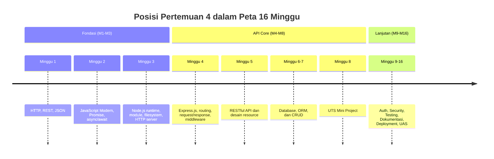
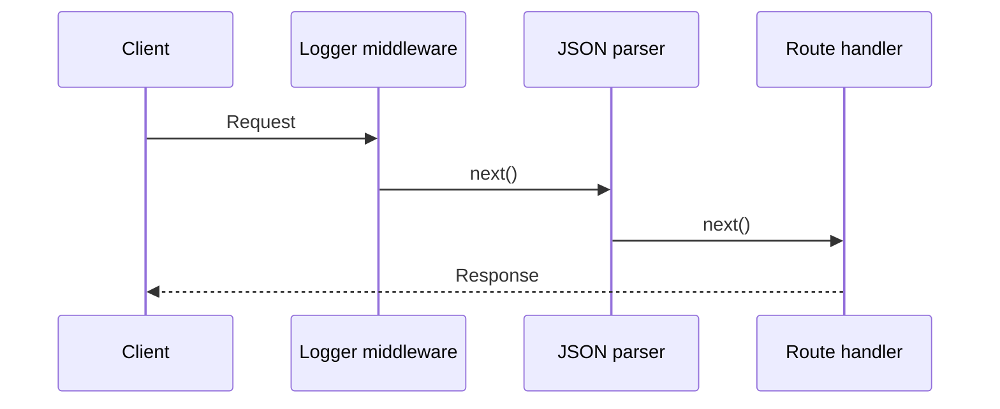
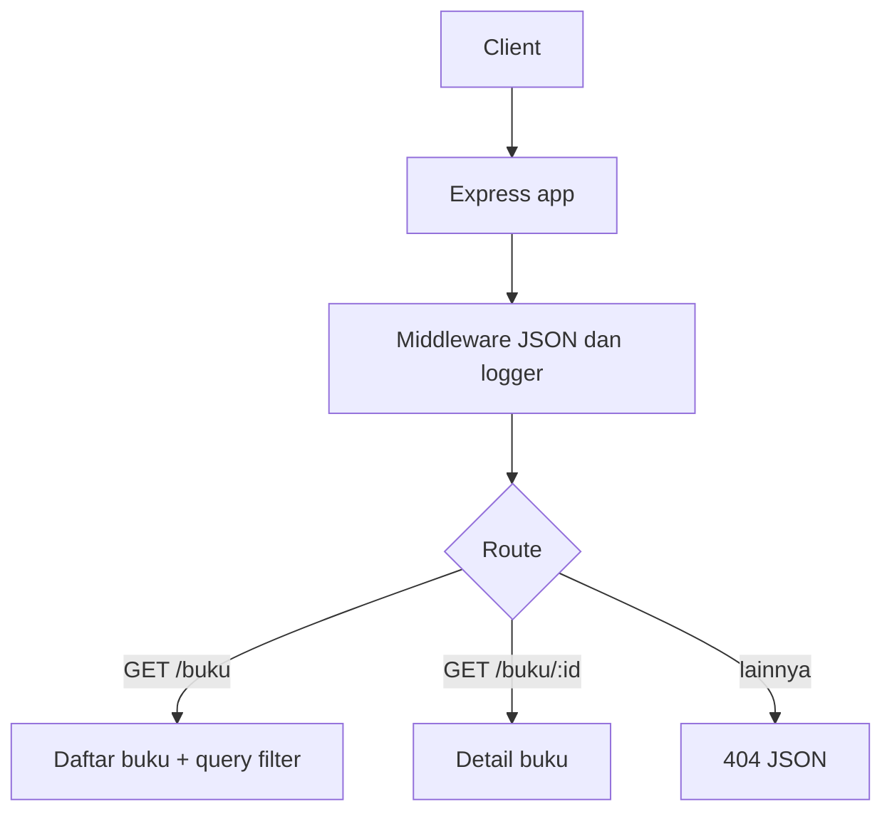

# Pertemuan 4 — Express.js Dasar

| | |
|:--|:--|
| **Minggu** | 4 |
| **Tanggal** | Senin, 5 Oktober 2026 (SI-VA) / Selasa, 6 Oktober 2026 (SI-VB) |
| **CPMK** | CPMK117 |
| **Model Pembelajaran** | Case Based Learning / Problem Based Learning |
| **Stack** | Node.js 20+ dan Express.js 5 (Node.js 24 LTS direkomendasikan) |

> **Catatan penting:** Pertemuan 4 memperkenalkan Express.js sebagai framework untuk menyusun HTTP server Node.js dengan routing dan middleware. Anda akan mengubah server `node:http` pada Pertemuan 3 menjadi aplikasi Express yang lebih terstruktur. Database dan autentikasi belum dibahas pada pertemuan ini.

---

## Daftar Isi

- [Pertemuan 4 — Express.js Dasar](#pertemuan-4--expressjs-dasar)
  - [Daftar Isi](#daftar-isi)
  - [1. Keterkaitan Pertemuan dengan RPS OBE](#1-keterkaitan-pertemuan-dengan-rps-obe)
  - [2. Capaian Pembelajaran Pertemuan](#2-capaian-pembelajaran-pertemuan)
  - [3. Pemantik Kasus: Server yang Perlu Ditata](#3-pemantik-kasus-server-yang-perlu-ditata)
  - [4. Express.js dan Struktur Aplikasi](#4-expressjs-dan-struktur-aplikasi)
  - [5. Instalasi dan package.json](#5-instalasi-dan-packagejson)
  - [6. Membuat Express Application](#6-membuat-express-application)
  - [7. Routing dengan Method HTTP](#7-routing-dengan-method-http)
  - [8. Request dan Response](#8-request-dan-response)
  - [9. Middleware](#9-middleware)
  - [10. Middleware JSON dan Request Body](#10-middleware-json-dan-request-body)
  - [11. Route Parameter dan Query Parameter](#11-route-parameter-dan-query-parameter)
  - [12. Static File dan Pemisahan App-Server](#12-static-file-dan-pemisahan-app-server)
  - [13. Penanganan 404 dan Error](#13-penanganan-404-dan-error)
  - [14. Case Based Learning: API Perpustakaan](#14-case-based-learning-api-perpustakaan)
  - [15. Aktivitas Kelompok](#15-aktivitas-kelompok)
  - [16. Latihan Individu](#16-latihan-individu)
  - [17. Pemanfaatan AI sebagai Coding Assistant](#17-pemanfaatan-ai-sebagai-coding-assistant)
  - [18. Kuis Formatif](#18-kuis-formatif)
  - [19. Output Pembelajaran — Tugas 2](#19-output-pembelajaran--tugas-2)
    - [Cara Pengumpulan — Push ke Repository GitHub Kelas](#cara-pengumpulan--push-ke-repository-github-kelas)
  - [20. Rubrik Tugas 2](#20-rubrik-tugas-2)
  - [21. Persiapan menuju Pertemuan 5](#21-persiapan-menuju-pertemuan-5)
  - [Lampiran: Kode Praktikum](#lampiran-kode-praktikum)

---

## 1. Keterkaitan Pertemuan dengan RPS OBE

Pertemuan 4 memulai fase API Core pada **CPMK117**:

> Mahasiswa mampu menerapkan framework Express.js untuk membangun endpoint HTTP dengan routing, request/response, middleware, dan penanganan error dasar.

Node.js menyediakan runtime dan module HTTP, sedangkan Express.js menyediakan abstraksi aplikasi web di atasnya. Anda tetap perlu memahami method, URL, status code, dan JSON dari Pertemuan 1 karena Express.js tidak menggantikan konsep HTTP tersebut.



---

## 2. Capaian Pembelajaran Pertemuan

Setelah mengikuti pertemuan ini, mahasiswa mampu:

| No. | Kemampuan | Indikator |
| :-: | --------- | --------- |
| 1 | Menjelaskan peran Express.js di atas Node.js | Membedakan tanggung jawab runtime Node.js dan framework Express.js |
| 2 | Membuat aplikasi Express.js | Menyusun app, server, script npm, dan konfigurasi port |
| 3 | Menerapkan routing berdasarkan method dan URL | Membuat endpoint `GET` dan `POST` dengan response yang sesuai |
| 4 | Menggunakan request dan response | Membaca `params`, `query`, `body`, serta mengirim status dan JSON |
| 5 | Menggunakan middleware | Menjelaskan urutan middleware dan menerapkan logger serta parser JSON |
| 6 | Menangani endpoint yang tidak tersedia dan error dasar | Mengirim response `404` dan response error `500` secara konsisten |

---

## 3. Pemantik Kasus: Server yang Perlu Ditata

Server pada Pertemuan 3 sudah dapat menerima request, tetapi routing masih ditulis dengan banyak pemeriksaan `if`. Tim pengembang ingin menambah endpoint tanpa membuat satu file semakin sulit dibaca.

Analisis kasus berikut:

- Apa tanggung jawab Node.js dan apa tanggung jawab Express.js?
- Bagaimana Express.js memilih handler berdasarkan method dan path?
- Mengapa parser JSON harus didaftarkan sebelum route `POST` membaca `request.body`?
- Apa yang terjadi apabila middleware tidak memanggil `next()` atau tidak mengirim response?
- Bagaimana membedakan route parameter seperti `/buku/:id` dari query parameter seperti `/buku?tersedia=true`?

Pada akhir pertemuan, Anda akan membuat aplikasi Express dengan endpoint informasi, pemeriksaan kesehatan, daftar mahasiswa, route parameter, query parameter, middleware logger, dan penanganan 404.

---

## 4. Express.js dan Struktur Aplikasi

Express.js adalah framework web untuk Node.js. Express.js tidak menggantikan Node.js; aplikasi tetap dijalankan oleh runtime Node.js dan tetap menggunakan konsep HTTP.


Perbandingan sederhana:

| Kebutuhan | `node:http` | Express.js |
|:----------|:------------|:-----------|
| Membuat server | `http.createServer()` | `app.listen()` |
| Routing | Pemeriksaan manual method dan URL | `app.get()`, `app.post()`, dan method lain |
| JSON body | Membaca stream request sendiri | `express.json()` |
| Middleware | Disusun manual | `app.use()` dan function middleware |
| Response JSON | `JSON.stringify()` dan `response.end()` | `response.json()` |

Express.js mengurangi kode berulang, tetapi pemahaman terhadap request, response, status code, dan alur middleware tetap diperlukan.

---

## 5. Instalasi dan package.json

Express.js dipasang sebagai dependency project setelah fase Node.js murni:

```bash
mkdir backend-express
cd backend-express
npm init -y
npm install express
```

`package.json` mendokumentasikan dependency dan script:

```json
{
  "name": "backend-express",
  "version": "1.0.0",
  "type": "module",
  "scripts": {
    "start": "node server.js",
    "dev": "node --watch server.js"
  },
  "dependencies": {
    "express": "^5.1.0"
  }
}
```

Setelah instalasi, `package-lock.json` perlu disimpan agar versi dependency dapat direproduksi. Folder `node_modules` tidak perlu di-commit.

Perintah praktikum pada folder `code/pertemuan-04`:

```bash
npm install
npm start
```

---

## 6. Membuat Express Application

Pisahkan pembuatan app dari proses membuka port:

```javascript
// app.js
import express from "express";

const app = express();
app.use(express.json());

app.get("/health", (request, response) => {
  response.json({ success: true, status: "up" });
});

export default app;
```

```javascript
// server.js
import app from "./app.js";

const port = Number(process.env.PORT ?? 3004);
app.listen(port, () => {
  console.log(`Server berjalan di http://localhost:${port}`);
});
```

Pemisahan ini memudahkan pengujian app tanpa selalu membuka port dan membuat tanggung jawab file lebih jelas.

---

## 7. Routing dengan Method HTTP

Routing menghubungkan kombinasi method dan path dengan handler:

```javascript
app.get("/mahasiswa", (request, response) => {
  response.json({ success: true, data: mahasiswa });
});

app.post("/mahasiswa", (request, response) => {
  response.status(201).json({ success: true, data: request.body });
});
```

Method route harus sesuai dengan tujuan endpoint. `GET` digunakan untuk membaca data dan `POST` digunakan untuk membuat resource baru. Pembahasan lengkap prinsip REST akan dilanjutkan pada Pertemuan 5.

Urutan deklarasi route perlu diperhatikan. Route yang lebih spesifik sebaiknya ditulis sebelum handler umum apabila pola path dapat saling beririsan.

---

## 8. Request dan Response

Express menyediakan object request dan response dengan properti serta method yang membantu pengolahan HTTP:

| Bagian | Express | Contoh |
|:-------|:--------|:--------|
| Method | `request.method` | `GET`, `POST` |
| URL asli | `request.originalUrl` | `/mahasiswa?angkatan=2024` |
| Body JSON | `request.body` | `{ "nim": "F1D022001" }` |
| Route parameter | `request.params.id` | `/mahasiswa/:id` |
| Query parameter | `request.query.angkatan` | `?angkatan=2024` |
| Status | `response.status()` | `response.status(201)` |
| JSON body | `response.json()` | `response.json({ data })` |

Response dapat dirangkai:

```javascript
return response.status(201).json({
  success: true,
  message: "Mahasiswa berhasil ditambahkan",
  data: mahasiswaBaru,
});
```

Gunakan `return` ketika handler tidak perlu melanjutkan ke statement berikutnya setelah response dikirim.

---

## 9. Middleware

Middleware adalah function yang menerima `request`, `response`, dan `next`. Middleware dapat membaca atau mengubah request, menjalankan pemeriksaan, mencatat aktivitas, atau meneruskan proses ke middleware/handler berikutnya.

```javascript
const logger = (request, response, next) => {
  console.log(request.method, request.originalUrl);
  next();
};

app.use(logger);
```



Ada tiga hasil utama middleware:

1. memanggil `next()` untuk meneruskan request;
2. mengirim response dan menghentikan alur;
3. meneruskan error dengan `next(error)`.

Jika middleware tidak melakukan salah satu dari tiga hal tersebut, request dapat menunggu tanpa response.

---

## 10. Middleware JSON dan Request Body

`express.json()` membaca body dengan `Content-Type: application/json` dan menempatkan hasil parsing pada `request.body`:

```javascript
app.use(express.json());

app.post("/mahasiswa", (request, response) => {
  const { nim, nama } = request.body;
  return response.status(201).json({ data: { nim, nama } });
});
```

Uji dengan `curl`:

```bash
curl -X POST http://localhost:3004/mahasiswa \
  -H "Content-Type: application/json" \
  -d '{"nim":"F1D022099","nama":"Nama Anda"}'
```

Tanpa `express.json()`, `request.body` dapat bernilai `undefined` untuk request JSON. Parser harus didaftarkan sebelum route yang menggunakannya.

Validasi input tetap menjadi tanggung jawab aplikasi. Parser hanya mengubah format JSON menjadi object; parser tidak menentukan apakah field wajib sudah benar.

---

## 11. Route Parameter dan Query Parameter

Route parameter menjadi bagian dari pola path:

```javascript
app.get("/mahasiswa/:nim", (request, response) => {
  const { nim } = request.params;
  response.json({ success: true, nim });
});
```

Request ke `/mahasiswa/F1D022001` menghasilkan `request.params.nim` dengan nilai `F1D022001`.

Query parameter berada setelah tanda `?`:

```javascript
app.get("/mahasiswa", (request, response) => {
  const { angkatan } = request.query;
  response.json({ success: true, filter: { angkatan } });
});
```

Request ke `/mahasiswa?angkatan=2024` menghasilkan `request.query.angkatan` dengan nilai `2024`.

Gunakan route parameter ketika nilai tersebut mengidentifikasi resource. Gunakan query parameter untuk filter, pencarian, pengurutan, atau pagination.

---

## 12. Static File dan Pemisahan App-Server

Express dapat menyajikan file statis menggunakan `express.static()`:

```javascript
app.use(express.static("public"));
```

Namun, API backend sebaiknya tetap memisahkan route data dari file statis agar tanggung jawab aplikasi mudah dipahami.

Struktur project yang disarankan:

```text
backend-express/
├── package.json
├── package-lock.json
├── app.js
├── server.js
├── routes/
│   └── mahasiswa.routes.js
└── public/
```

Pada pertemuan ini, route masih berada di `app.js` agar konsep dasar terlihat jelas. Pemisahan router dan controller akan dikembangkan pada materi berikutnya.

---

## 13. Penanganan 404 dan Error

Handler 404 ditulis setelah semua route yang valid:

```javascript
app.use((request, response) => {
  response.status(404).json({
    success: false,
    message: "Endpoint tidak ditemukan",
  });
});
```

Error middleware Express memiliki empat parameter dan diletakkan setelah route serta handler 404:

```javascript
app.use((error, request, response, next) => {
  console.error(error.message);
  response.status(500).json({
    success: false,
    message: "Terjadi kesalahan pada server",
  });
});
```

Parameter `next` tetap ditulis pada signature error middleware agar Express mengenalinya sebagai middleware error. Pesan internal tidak perlu dikirim seluruhnya kepada client.

---

## 14. Case Based Learning: API Perpustakaan

**Skenario:** Tim memiliki data buku sederhana dan ingin menyediakan endpoint daftar buku, detail buku berdasarkan id, serta filter ketersediaan. API harus mengirim status `404` ketika buku tidak ditemukan.



Implementasi latihan tersedia pada [`code/pertemuan-04/latihan.js`](../code/pertemuan-04/latihan.js).

Uji ketika server latihan berjalan:

```bash
node code/pertemuan-04/latihan.js
curl -i http://localhost:3005/buku
curl -i http://localhost:3005/buku?tersedia=true
curl -i http://localhost:3005/buku/1
curl -i http://localhost:3005/buku/99
```

Diskusi CBL:

1. Mengapa `express.json()` harus didaftarkan sebelum route `POST`?
2. Kapan `id` lebih tepat ditempatkan sebagai route parameter?
3. Apa status code dan response yang tepat untuk id yang tidak ditemukan?
4. Bagaimana menambahkan endpoint `POST /buku` dengan validasi field `judul`?

---

## 15. Aktivitas Kelompok

Bentuk kelompok 3–4 orang:

1. **Pemetaan alur (10 menit)** — ubah satu route `node:http` dari Pertemuan 3 menjadi route Express.
2. **Susunan middleware (15 menit)** — tentukan urutan logger, parser JSON, route, 404, dan error handler.
3. **Uji request (15 menit)** — gunakan `curl` untuk menguji route valid, body tidak lengkap, parameter tidak ditemukan, dan endpoint yang tidak tersedia.
4. **Review kode (10 menit)** — setiap kelompok menjelaskan alasan penggunaan status code dan penempatan middleware.

Setiap kelompok menuliskan hasil pengujian berupa method, URL, status code, dan response JSON.

---

## 16. Latihan Individu

Gunakan [`code/pertemuan-04/latihan.js`](../code/pertemuan-04/latihan.js), lalu kembangkan aplikasi berikut:

1. Tambahkan middleware logger yang mencatat waktu, method, dan URL.
2. Tambahkan endpoint `GET /buku/:id` dengan response `404` jika data tidak ditemukan.
3. Tambahkan query `?tersedia=true` atau `?tersedia=false` untuk filter data.
4. Tambahkan endpoint `POST /buku` dengan field wajib `judul` dan `penulis`.
5. Tambahkan handler 404 untuk endpoint yang tidak tersedia.
6. Uji seluruh endpoint menggunakan `curl` dan catat hasilnya pada `README.md`.

Perintah awal:

```bash
npm install
node latihan.js
```

---

## 17. Pemanfaatan AI sebagai Coding Assistant

**AI assistant (GitHub Copilot, ChatGPT, Claude, Gemini, Cursor) boleh dipakai — dengan cara yang benar:**

**✅ Gunakan AI untuk:**

- Menjelaskan perbedaan `app.use()`, `app.get()`, dan `app.post()`.
- Mencari penyebab error `EADDRINUSE`, `Cannot find package`, atau `request.body` bernilai `undefined`.
- Membuat contoh perintah `curl` untuk endpoint yang sudah Anda tulis.
- Meninjau urutan middleware dan kesesuaian status code.
- Menjelaskan perbedaan route parameter dan query parameter.

**❌ Jangan gunakan AI untuk:**

- Menghasilkan seluruh Tugas 2 tanpa memahami routing dan middleware.
- Menyalin aplikasi Express.js tanpa menguji setiap endpoint.
- Mengabaikan error hanya karena server berhasil membuka port.
- Memasukkan token, password, atau data pribadi ke dalam prompt.

**Etika di kelas:**

1. Anda wajib dapat menjelaskan setiap route, middleware, status code, dan response yang diserahkan.
2. Jika memakai AI, cantumkan pada refleksi atau komentar kode. Contoh yang sesuai dengan materi Express.js:

  ```javascript
  // Bantuan: GitHub Copilot — penjelasan express.json sebelum route POST
  app.use(express.json());
  ```

3. AI digunakan sebagai asisten. Anda tetap bertanggung jawab memahami, menjalankan, dan menguji kode.

---

## 18. Kuis Formatif

1. Apa perbedaan Node.js dan Express.js?
2. Apa fungsi `app.use(express.json())`?
3. Apa perbedaan route parameter dan query parameter?
4. Mengapa middleware perlu memanggil `next()`?
5. Di bagian mana handler 404 dan error middleware diletakkan?
6. Status code apa yang digunakan ketika resource berhasil dibuat?

Kunci jawaban pengajar tersedia pada berkas lokal [`kunci-jawaban-kuis.md`](./kunci-jawaban-kuis.md) yang tidak dilacak oleh Git.

---

## 19. Output Pembelajaran — Tugas 2

**Tugas 2 — REST Endpoint dengan Express.js.**

Kembangkan aplikasi Express.js untuk satu resource dari Tugas 1. Aplikasi minimal memiliki:

1. `package.json` dan dependency Express.js;
2. pemisahan `app.js` dan `server.js`;
3. minimal empat endpoint dengan setidaknya `GET` daftar, `GET` detail, dan `POST`;
4. middleware JSON dan logger;
5. route parameter dan query parameter;
6. response JSON dengan status code yang sesuai;
7. handler `404` dan error middleware;
8. README berisi struktur project, cara menjalankan, daftar endpoint, contoh request, dan hasil pengujian.

### Cara Pengumpulan — Push ke Repository GitHub Kelas

Tugas diserahkan dengan **push ke repository GitHub kelas** sesuai kelas Anda:

| Kelas | Repository | Folder |
|:------|:-----------|:-------|
| SI-VA | `SI-VA-Backend` | `tugas-2/<nim>-<nama>/pertemuan-04/` |
| SI-VB | `SI-VB-Backend` | `tugas-2/<nim>-<nama>/pertemuan-04/` |

> Alamat lengkap repo akan dibagikan melalui kanal kelas. Gunakan repository kelas Anda sendiri.

Langkah pengumpulan:

1. *Clone* repository kelas sesuai kelas Anda, lalu masuk ke folder repository.
2. Buat branch menggunakan NIM Anda:
   ```bash
   git switch -c <nim>
   ```
3. Simpan project pada folder tugas sesuai kelas Anda, lalu jalankan:
   ```bash
   npm install
   npm start
   ```
4. Uji endpoint valid, input tidak lengkap, resource tidak ditemukan, dan endpoint tidak tersedia.
5. Commit dan push branch NIM:
   ```bash
   git add tugas-2/<nim>-<nama>/pertemuan-04
   git commit -m "tugas-2: express dasar - <nama> <nim>"
   git push -u origin <nim>
   ```
6. Buat **Pull Request** dari branch NIM menuju branch utama. Cantumkan nama, NIM, ringkasan perubahan, dan hasil pengujian.
7. Dosen memeriksa routing, middleware, response, dan kesesuaian rubrik. Tugas yang sesuai akan di-*merge* oleh dosen ke repository kelas. Jangan melakukan *merge* sendiri kecuali mendapat instruksi.

Pastikan `node_modules`, token, password, dan file konfigurasi rahasia tidak disertakan dalam commit.

---

## 20. Rubrik Tugas 2

| Komponen | Bobot |
|:---------|------:|
| Struktur project dan dependency | 15% |
| Routing dan method HTTP | 25% |
| Request/response dan status code | 20% |
| Middleware dan penanganan 404/error | 20% |
| Dokumentasi dan bukti pengujian | 10% |
| Kerapian kode serta etika penggunaan AI | 10% |
| **Total** | **100%** |

Nilai akhir dihitung dengan rumus:

$$
\text{Nilai} = \frac{\sum(\text{bobot} \times \text{skor})}{16} \times 100
$$

Skor setiap komponen menggunakan rentang 0–16 sesuai kriteria penilaian.

---

## 21. Persiapan menuju Pertemuan 5

Pada Pertemuan 5, Express.js digunakan untuk merancang RESTful API dengan resource, endpoint, method HTTP, status code, parameter, query, dan response JSON yang konsisten. Pelajari kembali:

- routing Express dan urutan route;
- middleware `express.json()`;
- route parameter dan query parameter;
- handler 404 dan error middleware;
- cara menguji endpoint menggunakan `curl`.

---

## Lampiran: Kode Praktikum

- [`code/pertemuan-04/package.json`](../code/pertemuan-04/package.json) — dependency Express.js dan script project.
- [`code/pertemuan-04/app.js`](../code/pertemuan-04/app.js) — Express app, middleware, route, 404, dan error handler.
- [`code/pertemuan-04/server.js`](../code/pertemuan-04/server.js) — proses membuka port aplikasi.
- [`code/pertemuan-04/latihan.js`](../code/pertemuan-04/latihan.js) — latihan route parameter dan query parameter.
