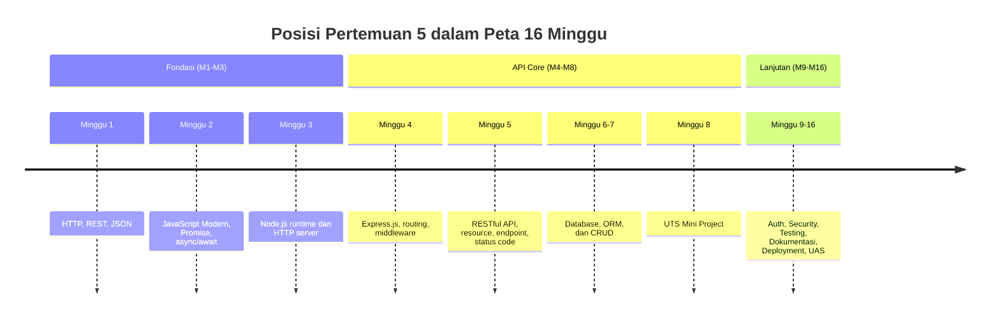
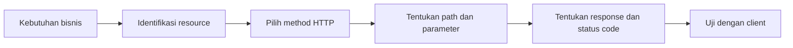
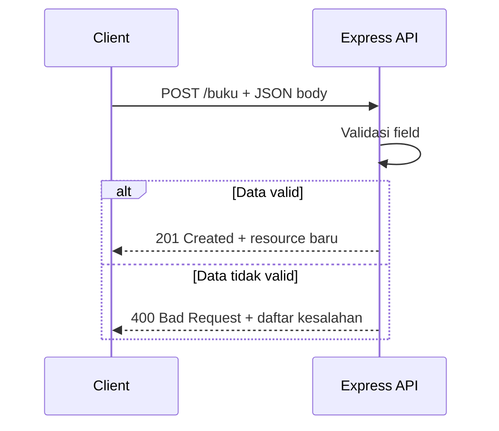
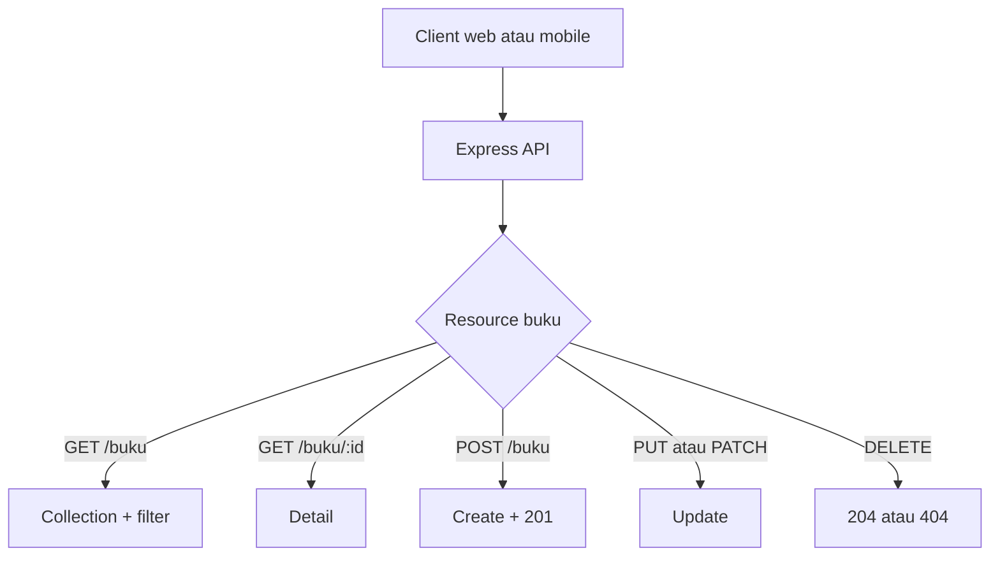

# Pertemuan 5 — RESTful API dengan Express.js

| | |
|:--|:--|
| **Minggu** | 5 |
| **Tanggal** | Senin, 12 Oktober 2026 (SI-VA) / Selasa, 13 Oktober 2026 (SI-VB) |
| **CPMK** | CPMK117 |
| **Model Pembelajaran** | Case Based Learning / Problem Based Learning |
| **Stack** | Node.js 20+ dan Express.js 5 (Node.js 24 LTS direkomendasikan) |

> **Catatan penting:** Pertemuan 5 berfokus pada perancangan RESTful API menggunakan Express.js. Anda akan mengubah kebutuhan bisnis menjadi resource, endpoint, method HTTP, query, parameter, validasi input, status code, dan response JSON yang konsisten. Database belum digunakan; data masih disimpan sementara di memory.

---

## Daftar Isi

- [Pertemuan 5 — RESTful API dengan Express.js](#pertemuan-5--restful-api-dengan-expressjs)
  - [Daftar Isi](#daftar-isi)
  - [1. Keterkaitan Pertemuan dengan RPS OBE](#1-keterkaitan-pertemuan-dengan-rps-obe)
  - [2. Capaian Pembelajaran Pertemuan](#2-capaian-pembelajaran-pertemuan)
  - [3. Pemantik Kasus: Data Buku yang Perlu Diakses Client](#3-pemantik-kasus-data-buku-yang-perlu-diakses-client)
  - [4. REST dan Resource](#4-rest-dan-resource)
  - [5. Merancang Endpoint Collection dan Detail](#5-merancang-endpoint-collection-dan-detail)
  - [6. Method HTTP dan Operasi Resource](#6-method-http-dan-operasi-resource)
  - [7. Query Parameter untuk Filter](#7-query-parameter-untuk-filter)
  - [8. Route Parameter untuk Resource Spesifik](#8-route-parameter-untuk-resource-spesifik)
  - [9. Format Response JSON yang Konsisten](#9-format-response-json-yang-konsisten)
  - [10. Status Code pada RESTful API](#10-status-code-pada-restful-api)
  - [11. Validasi Input Dasar](#11-validasi-input-dasar)
  - [12. PUT dan PATCH](#12-put-dan-patch)
  - [13. DELETE dan Response Tanpa Body](#13-delete-dan-response-tanpa-body)
  - [14. Case Based Learning: API Perpustakaan](#14-case-based-learning-api-perpustakaan)
  - [15. Aktivitas Kelompok](#15-aktivitas-kelompok)
  - [16. Latihan Individu](#16-latihan-individu)
  - [17. Pemanfaatan AI sebagai Coding Assistant](#17-pemanfaatan-ai-sebagai-coding-assistant)
  - [18. Kuis Formatif](#18-kuis-formatif)
  - [19. Output Pembelajaran — Tugas 3](#19-output-pembelajaran--tugas-3)
    - [Cara Pengumpulan — Push ke Repository GitHub Kelas](#cara-pengumpulan--push-ke-repository-github-kelas)
  - [20. Rubrik Tugas 3](#20-rubrik-tugas-3)
  - [21. Persiapan menuju Pertemuan 6](#21-persiapan-menuju-pertemuan-6)
  - [Lampiran: Kode Praktikum](#lampiran-kode-praktikum)

---

## 1. Keterkaitan Pertemuan dengan RPS OBE

Pertemuan 5 melanjutkan fase API Core pada **CPMK117**:

> Mahasiswa mampu merancang dan menerapkan RESTful API dengan resource, endpoint, method HTTP, parameter, query, status code, dan response JSON yang konsisten.

Pada Pertemuan 4, Anda mempelajari cara kerja aplikasi Express.js. Pada pertemuan ini, fokusnya bergeser pada keputusan desain API yang akan digunakan oleh client. Desain ini menjadi acuan ketika database dan ORM diperkenalkan pada Pertemuan 6.



---

## 2. Capaian Pembelajaran Pertemuan

Setelah mengikuti pertemuan ini, mahasiswa mampu:

| No. | Kemampuan | Indikator |
| :-: | --------- | --------- |
| 1 | Mengidentifikasi resource pada domain aplikasi | Menentukan kata benda yang tepat untuk resource API |
| 2 | Merancang endpoint collection dan detail | Membedakan endpoint daftar dan endpoint resource berdasarkan id |
| 3 | Memilih method HTTP sesuai operasi | Memetakan `GET`, `POST`, `PUT`, `PATCH`, dan `DELETE` dengan tepat |
| 4 | Menggunakan route dan query parameter | Menerapkan detail resource, filter, dan pencarian sederhana |
| 5 | Menentukan status code dan response JSON | Menghasilkan response sukses dan error dengan struktur konsisten |
| 6 | Membuat RESTful API Express.js | Menguji minimal operasi baca, tambah, ubah, hapus, dan kasus error |

---

## 3. Pemantik Kasus: Data Buku yang Perlu Diakses Client

Perpustakaan kampus memiliki data buku, tetapi client belum memiliki kontrak endpoint yang jelas. Satu client menggunakan `/ambilSemuaBuku`, client lain menggunakan `/getBook`, dan format error berbeda-beda.

Analisis kasus berikut:

- Apa resource utama pada sistem perpustakaan?
- Mengapa `/buku` lebih tepat daripada `/ambilSemuaBuku`?
- Kapan client memakai `/buku` dan kapan memakai `/buku/:id`?
- Bagaimana client meminta buku dengan stok minimal tertentu?
- Status code apa yang digunakan ketika buku berhasil dibuat, tidak ditemukan, atau input tidak valid?

Pada akhir pertemuan, Anda akan membuat kontrak dan implementasi API `buku` dengan operasi collection, detail, filter, create, update, partial update, dan delete.

---

## 4. REST dan Resource

REST menggunakan resource sebagai pusat desain API. Resource biasanya dinyatakan dengan kata benda jamak pada URL:

| Kurang sesuai | Lebih sesuai | Alasan |
|:--------------|:-------------|:-------|
| `/ambilBuku` | `/buku` | Operasi dinyatakan oleh method HTTP |
| `/buatBuku` | `/buku` | `POST /buku` berarti membuat resource |
| `/hapusBuku/1` | `/buku/1` | `DELETE /buku/1` menyatakan penghapusan |
| `/dataMahasiswa` | `/mahasiswa` | Nama resource lebih ringkas dan konsisten |



Endpoint yang baik membuat client dapat memprediksi pola API. Misalnya, setelah mengetahui `GET /buku`, client dapat memperkirakan bahwa `GET /buku/1` digunakan untuk satu buku.

---

## 5. Merancang Endpoint Collection dan Detail

Collection adalah kumpulan resource, sedangkan detail menunjuk satu resource tertentu:

| Kebutuhan | Method | Endpoint | Hasil |
|:----------|:-------|:---------|:------|
| Daftar semua buku | `GET` | `/buku` | Array buku |
| Satu buku | `GET` | `/buku/:id` | Satu object buku |
| Membuat buku | `POST` | `/buku` | Buku baru |
| Mengubah seluruh buku | `PUT` | `/buku/:id` | Buku yang diganti |
| Mengubah sebagian buku | `PATCH` | `/buku/:id` | Buku yang diperbarui |
| Menghapus buku | `DELETE` | `/buku/:id` | Response tanpa body |

Jangan menempatkan id pada query apabila id berfungsi sebagai identitas utama resource. `GET /buku/7` lebih jelas daripada `GET /buku?id=7`. Query tetap tepat digunakan untuk filter seperti `GET /buku?penulis=Andi`.

---

## 6. Method HTTP dan Operasi Resource

Method menyatakan operasi yang diminta client:

| Method | Operasi | Idempoten | Status umum |
|:-------|:--------|:---------:|:------------|
| `GET` | Membaca resource | Ya | `200` |
| `POST` | Membuat resource baru | Tidak selalu | `201` |
| `PUT` | Mengganti seluruh representasi | Ya | `200` |
| `PATCH` | Mengubah sebagian representasi | Bergantung implementasi | `200` |
| `DELETE` | Menghapus resource | Ya | `204` |

`POST` dapat menghasilkan id baru sehingga pengiriman berulang dapat membuat resource lebih dari satu. `PUT` biasanya mengirim seluruh field yang diwajibkan. `PATCH` mengirim hanya field yang ingin diubah.



---

## 7. Query Parameter untuk Filter

Query parameter berada setelah `?` dan tidak mengubah identitas collection:

```javascript
app.get("/buku", (request, response) => {
  const { penulis, tahun, minStok } = request.query;
  const data = buku.filter((item) => {
    const cocokPenulis = penulis === undefined || item.penulis.toLowerCase() === String(penulis).toLowerCase();
    const cocokTahun = tahun === undefined || item.tahun === Number(tahun);
    const cocokStok = minStok === undefined || item.stok >= Number(minStok);
    return cocokPenulis && cocokTahun && cocokStok;
  });

  return response.json({ success: true, total: data.length, data });
});
```

Contoh request:

```bash
curl "http://localhost:3006/buku?penulis=Andi&minStok=1"
```

Validasi nilai query tetap diperlukan. String `"abc"` tidak boleh dianggap sebagai tahun atau jumlah stok yang valid hanya karena parameter tersedia.

---

## 8. Route Parameter untuk Resource Spesifik

Route parameter digunakan untuk mengidentifikasi resource:

```javascript
app.get("/buku/:id", (request, response) => {
  const id = Number(request.params.id);
  const item = buku.find((data) => data.id === id);

  if (!item) {
    return response.status(404).json({ success: false, message: "Buku tidak ditemukan" });
  }

  return response.json({ success: true, data: item });
});
```

`request.params.id` berasal dari bagian path. Jika id harus berupa bilangan bulat, konversi dan validasi nilai tersebut sebelum mencari data.

---

## 9. Format Response JSON yang Konsisten

Client lebih mudah memproses API jika struktur response konsisten:

```json
{
  "success": true,
  "message": "Daftar buku berhasil diambil",
  "data": {
    "total": 2,
    "data": []
  }
}
```

Contoh error:

```json
{
  "success": false,
  "message": "Data buku tidak valid",
  "details": ["Field judul wajib diisi", "stok harus bilangan bulat minimal 0"]
}
```

Gunakan field `message` untuk penjelasan singkat dan `details` untuk informasi validasi yang lebih rinci. Jangan mengirim detail internal error atau informasi rahasia kepada client.

---

## 10. Status Code pada RESTful API

| Situasi | Status code | Contoh |
|:--------|:-----------:|:-------|
| Request berhasil membaca data | `200 OK` | `GET /buku` |
| Resource baru berhasil dibuat | `201 Created` | `POST /buku` |
| Resource berhasil dihapus tanpa body | `204 No Content` | `DELETE /buku/1` |
| Body atau query tidak valid | `400 Bad Request` | `POST /buku` tanpa judul |
| Resource tidak ditemukan | `404 Not Found` | `GET /buku/99` |
| Error yang tidak tertangani | `500 Internal Server Error` | Error pada server |

Status code dan body harus saling mendukung. Response `204` tidak menyertakan body; response `404` harus menjelaskan resource atau endpoint yang tidak ditemukan.

---

## 11. Validasi Input Dasar

Validasi memastikan data sesuai kontrak sebelum dimasukkan ke penyimpanan:

```javascript
const validateBook = (payload, partial = false) => {
  const errors = [];
  if (!partial && payload.judul === undefined) errors.push("judul wajib diisi");
  if (payload.stok !== undefined && (!Number.isInteger(payload.stok) || payload.stok < 0)) {
    errors.push("stok harus bilangan bulat minimal 0");
  }
  return errors;
};
```

Validasi dasar setidaknya memeriksa:

- field wajib tersedia;
- tipe data sesuai;
- angka berada pada rentang yang masuk akal;
- string tidak kosong;
- field yang tidak diizinkan tidak mengubah data secara tidak sengaja.

Validasi pada pertemuan ini masih ditulis manual. Express Validator akan dipelajari ketika kebutuhan validasi menjadi lebih besar.

---

## 12. PUT dan PATCH

`PUT` dan `PATCH` memiliki kontrak yang berbeda:

```http
PUT /buku/1
Content-Type: application/json

{
  "judul": "Belajar Node.js Lanjutan",
  "penulis": "Andi",
  "tahun": 2026,
  "stok": 4
}
```

```http
PATCH /buku/1
Content-Type: application/json

{
  "stok": 4
}
```

Gunakan `PUT` ketika client mengirim representasi lengkap resource. Gunakan `PATCH` ketika hanya sebagian field yang berubah. Server perlu menentukan apakah field yang tidak disebutkan pada `PUT` dianggap error atau diisi nilai default.

---

## 13. DELETE dan Response Tanpa Body

Endpoint delete menghapus resource berdasarkan id:

```javascript
app.delete("/buku/:id", (request, response) => {
  const index = buku.findIndex(({ id }) => id === Number(request.params.id));
  if (index === -1) {
    return response.status(404).json({ success: false, message: "Buku tidak ditemukan" });
  }

  buku.splice(index, 1);
  return response.status(204).send();
});
```

Status `204 No Content` berarti operasi berhasil dan response tidak memiliki body. Setelah `204`, client tidak perlu mencoba membaca JSON dari response.

---

## 14. Case Based Learning: API Perpustakaan

**Skenario:** Perpustakaan kampus meminta API yang dapat dipakai oleh aplikasi web dan mobile. API harus memiliki kontrak yang sama untuk semua client, mendukung filter daftar buku, validasi input, serta status code yang dapat diprediksi.



Implementasi tersedia pada [`code/pertemuan-05/app.js`](../code/pertemuan-05/app.js). Jalankan melalui [`code/pertemuan-05/server.js`](../code/pertemuan-05/server.js).

Uji API:

```bash
cd code/pertemuan-05
npm install
node server.js
```

Pada terminal lain:

```bash
curl -i http://localhost:3006/buku
curl -i "http://localhost:3006/buku?penulis=Andi&minStok=1"
curl -i http://localhost:3006/buku/1
curl -i http://localhost:3006/buku/99
curl -i -X POST http://localhost:3006/buku \
  -H "Content-Type: application/json" \
  -d '{"judul":"API untuk Pemula","penulis":"Citra","tahun":2026,"stok":2}'
curl -i -X PATCH http://localhost:3006/buku/1 \
  -H "Content-Type: application/json" \
  -d '{"stok":5}'
curl -i -X DELETE http://localhost:3006/buku/2
```

Diskusi CBL:

1. Apakah `/ambilBuku` memenuhi prinsip resource-based? Jelaskan.
2. Mengapa `POST /buku` menghasilkan `201`, sedangkan `GET /buku` menghasilkan `200`?
3. Apa perbedaan body pada `PUT /buku/:id` dan `PATCH /buku/:id`?
4. Mengapa response `204` tidak boleh memiliki body JSON?

---

## 15. Aktivitas Kelompok

Bentuk kelompok 3–4 orang:

1. **Identifikasi resource (10 menit)** — pilih domain dari Tugas 1 dan tentukan minimal tiga resource menggunakan kata benda.
2. **Rancang kontrak (20 menit)** — buat tabel collection, detail, create, update, partial update, dan delete lengkap dengan body serta status code.
3. **Uji konsistensi (15 menit)** — kelompok lain memeriksa apakah URL, method, response, dan status code saling sesuai.
4. **Presentasi (10 menit)** — jelaskan alasan teknis di balik desain endpoint dan struktur JSON.

Setiap kelompok menyimpan tabel rancangan dan minimal lima contoh request-response.

---

## 16. Latihan Individu

Gunakan [`code/pertemuan-05/latihan.js`](../code/pertemuan-05/latihan.js), lalu kembangkan API `mahasiswa`:

1. Tambahkan middleware logger yang mencatat method dan URL.
2. Tambahkan `GET /mahasiswa/:nim` dengan status `404` jika NIM tidak ditemukan.
3. Tambahkan filter `GET /mahasiswa?prodi=Sistem%20Informasi`.
4. Tambahkan endpoint `POST /mahasiswa` dengan validasi `nim`, `nama`, `prodi`, dan `angkatan`.
5. Tambahkan endpoint `PATCH /mahasiswa/:nim` untuk mengubah sebagian data.
6. Uji response `200`, `201`, `400`, `404`, dan `204` sesuai kebutuhan.

Perintah awal:

```bash
cd code/pertemuan-05
npm install
node latihan.js
```

Catat method, URL, status code, dan response JSON pada `README.md` tugas Anda.

---

## 17. Pemanfaatan AI sebagai Coding Assistant

**AI assistant (GitHub Copilot, ChatGPT, Claude, Gemini, Cursor) boleh dipakai — dengan cara yang benar:**

**✅ Gunakan AI untuk:**

- Menjelaskan perbedaan collection endpoint dan detail endpoint.
- Meninjau apakah method `PUT`, `PATCH`, dan `DELETE` sudah sesuai kebutuhan.
- Membuat contoh request `curl` untuk endpoint yang telah Anda rancang.
- Memeriksa konsistensi status code dan struktur response JSON.
- Menjelaskan cara membaca route parameter dan query parameter.

**❌ Jangan gunakan AI untuk:**

- Menghasilkan seluruh Tugas 3 tanpa memahami alasan desain resource dan endpoint.
- Menyalin tabel API tanpa menguji endpoint dan response-nya.
- Mengabaikan validasi karena request berhasil diproses.
- Memasukkan token, password, atau data pribadi ke dalam prompt.

**Etika di kelas:**

1. Anda wajib dapat menjelaskan setiap resource, endpoint, method, status code, dan response yang diserahkan.
2. Jika memakai AI, cantumkan pada refleksi atau komentar kode. Contoh yang sesuai dengan materi RESTful API:

   ```javascript
   // Bantuan: GitHub Copilot — penjelasan perbedaan PUT dan PATCH
   app.patch("/buku/:id", (request, response) => {
     return response.status(200).json({ success: true, data: request.body });
   });
   ```

3. AI digunakan sebagai asisten. Anda tetap bertanggung jawab memahami, menjalankan, dan menguji kode.

---

## 18. Kuis Formatif

1. Apa yang dimaksud dengan resource dalam RESTful API?
2. Kapan menggunakan route parameter dan kapan menggunakan query parameter?
3. Apa perbedaan `PUT` dan `PATCH`?
4. Status code apa yang digunakan untuk create, input tidak valid, resource tidak ditemukan, dan delete tanpa body?
5. Mengapa response JSON perlu memiliki struktur yang konsisten?
6. Mengapa endpoint sebaiknya menggunakan kata benda, bukan kata kerja?

Kunci jawaban pengajar tersedia pada berkas lokal [`kunci-jawaban-kuis.md`](./kunci-jawaban-kuis.md) yang tidak dilacak oleh Git.

---

## 19. Output Pembelajaran — Tugas 3

**Tugas 3 — Perancangan dan Implementasi RESTful API.**

Kembangkan resource dari Tugas 1 atau Tugas 2 menjadi RESTful API Express.js. Project minimal memiliki:

1. tabel kontrak endpoint dengan collection, detail, create, update, partial update, dan delete;
2. minimal enam endpoint yang menggunakan method HTTP secara tepat;
3. route parameter dan minimal dua query parameter untuk filter;
4. validasi input dan response error `400`;
5. response `404` untuk resource yang tidak ditemukan;
6. response `204` untuk delete yang berhasil tanpa body;
7. struktur response JSON yang konsisten;
8. README berisi cara menjalankan, contoh request, status code, dan hasil pengujian.

### Cara Pengumpulan — Push ke Repository GitHub Kelas

Tugas diserahkan dengan **push ke repository GitHub kelas** sesuai kelas Anda:

| Kelas | Repository | Folder |
|:------|:-----------|:-------|
| SI-VA | `SI-VA-Backend` | `tugas-3/<nim>-<nama>/pertemuan-05/` |
| SI-VB | `SI-VB-Backend` | `tugas-3/<nim>-<nama>/pertemuan-05/` |

> Alamat lengkap repo akan dibagikan melalui kanal kelas. Gunakan repository kelas Anda sendiri.

Langkah pengumpulan:

1. *Clone* repository kelas sesuai kelas Anda, lalu masuk ke folder repository.
2. Buat branch menggunakan NIM Anda:
   ```bash
   git switch -c <nim>
   ```
3. Simpan project pada folder tugas sesuai kelas Anda, lalu jalankan:
   ```bash
   npm install
   npm start
   ```
4. Uji endpoint valid, filter, input tidak valid, resource tidak ditemukan, dan delete berhasil.
5. Commit dan push branch NIM:
   ```bash
   git add tugas-3/<nim>-<nama>/pertemuan-05
   git commit -m "tugas-3: RESTful API - <nama> <nim>"
   git push -u origin <nim>
   ```
6. Buat **Pull Request** dari branch NIM menuju branch utama. Cantumkan nama, NIM, ringkasan perubahan, dan hasil pengujian.
7. Dosen memeriksa desain resource, endpoint, status code, validasi, dan kesesuaian rubrik. Tugas yang sesuai akan di-*merge* oleh dosen ke repository kelas.

Pastikan `node_modules`, token, password, dan file konfigurasi rahasia tidak disertakan dalam commit.

---

## 20. Rubrik Tugas 3

| Komponen | Bobot |
|:---------|------:|
| Desain resource dan endpoint | 20% |
| Method HTTP dan parameter | 20% |
| Validasi input dan status code | 20% |
| Implementasi CRUD Express.js | 20% |
| Dokumentasi dan bukti pengujian | 10% |
| Kerapian kode serta etika penggunaan AI | 10% |
| **Total** | **100%** |

Nilai akhir dihitung dengan rumus:

$$
\text{Nilai} = \frac{\sum(\text{bobot} \times \text{skor})}{16} \times 100
$$

Skor setiap komponen menggunakan rentang 0–16 sesuai kriteria penilaian.

---

## 21. Persiapan menuju Pertemuan 6

Pada Pertemuan 6, API akan mulai menggunakan database dan ORM. Pelajari kembali:

- perbedaan data sementara di memory dan data yang disimpan permanen;
- hubungan antara resource API dan model/entity database;
- struktur field yang diperlukan oleh resource;
- validasi tipe data dan nilai sebelum disimpan;
- environment variable untuk konfigurasi koneksi database.

---

## Lampiran: Kode Praktikum

- [`code/pertemuan-05/package.json`](../code/pertemuan-05/package.json) — dependency Express.js dan script project.
- [`code/pertemuan-05/app.js`](../code/pertemuan-05/app.js) — RESTful API resource `buku` dengan filter, validasi, CRUD, dan error handling.
- [`code/pertemuan-05/server.js`](../code/pertemuan-05/server.js) — proses membuka port API.
- [`code/pertemuan-05/latihan.js`](../code/pertemuan-05/latihan.js) — latihan resource `mahasiswa`, route parameter, dan query filter.
