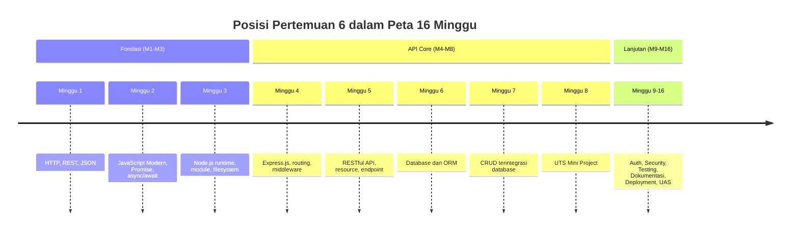
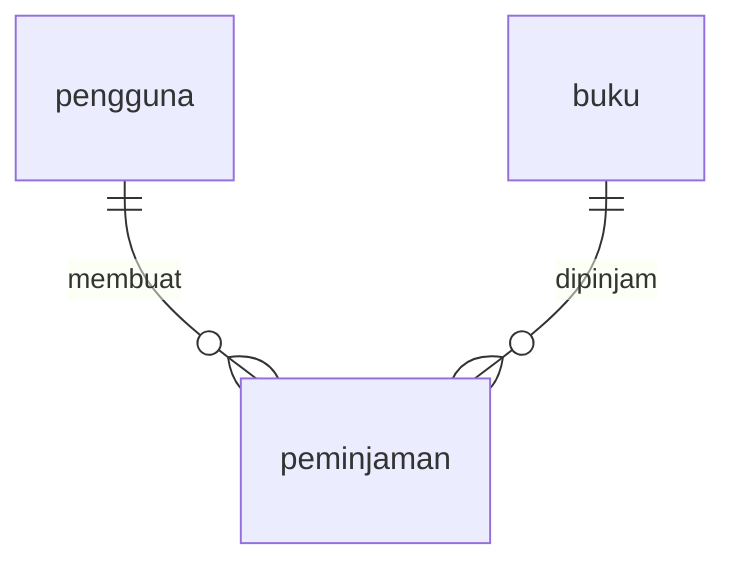
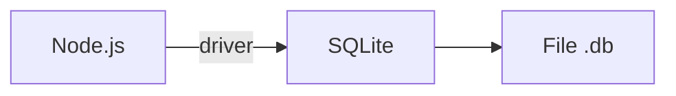
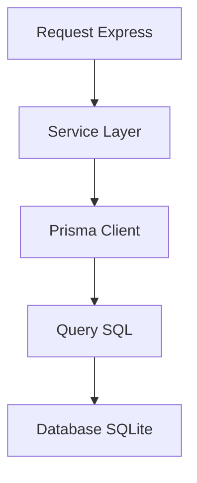
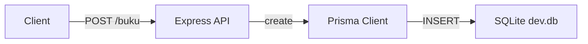

# Pertemuan 6 — Database dan ORM untuk Aplikasi Node.js

| | |
|:--|:--|
| **Minggu** | 6 |
| **Tanggal** | Senin, 19 Oktober 2026 (SI-VA) / Selasa, 20 Oktober 2026 (SI-VB) |
| **CPMK** | CPMK117 |
| **Model Pembelajaran** | Case Based Learning / Problem Based Learning |
| **Stack** | Node.js 20+, Express.js 5, Prisma ORM 7, SQLite |

> **Catatan penting:** Pertemuan 6 memperkenalkan penyimpanan data permanen melalui database dan Prisma ORM. Pada pertemuan sebelumnya, data API masih disimpan di memory dan hilang ketika server berhenti. Pertemuan ini membahas konsep database relasional, model entity, koneksi database, migration, dan konfigurasi environment untuk menyimpan dan mengambil data secara permanen.

---

## Daftar Isi

- [Pertemuan 6 — Database dan ORM untuk Aplikasi Node.js](#pertemuan-6--database-dan-orm-untuk-aplikasi-nodejs)
  - [Daftar Isi](#daftar-isi)
  - [1. Keterkaitan Pertemuan dengan RPS OBE](#1-keterkaitan-pertemuan-dengan-rps-obe)
  - [2. Capaian Pembelajaran Pertemuan](#2-capaian-pembelajaran-pertemuan)
  - [3. Pemantik Kasus: Data yang Hilang Setelah Restart](#3-pemantik-kasus-data-yang-hilang-setelah-restart)
  - [4. Database Relasional dan Konsep Skema](#4-database-relasional-dan-konsep-skema)
  - [5. Koneksi Database pada Node.js](#5-koneksi-database-pada-nodejs)
  - [6. Model dan Entity](#6-model-dan-entity)
  - [7. ORM dan Peran Prisma](#7-orm-dan-peran-prisma)
  - [8. Skema Prisma dan Migration](#8-skema-prisma-dan-migration)
  - [8a. Konfigurasi Client Driver (Driver Adapter)](#8a-konfigurasi-client-driver-driver-adapter)
  - [9. Konfigurasi Environment dan Variabel Lingkungan](#9-konfigurasi-environment-dan-variabel-lingkungan)
  - [10. CRUD dengan Prisma Client](#10-crud-dengan-prisma-client)
  - [11. Keamanan dan Best Practice](#11-keamanan-dan-best-practice)
  - [12. Case Based Learning: API Perpustakaan dengan Database](#12-case-based-learning-api-perpustakaan-dengan-database)
  - [13. Aktivitas Kelompok](#13-aktivitas-kelompok)
  - [14. Latihan Individu](#14-latihan-individu)
  - [15. Pemanfaatan AI sebagai Coding Assistant](#15-pemanfaatan-ai-sebagai-coding-assistant)
  - [16. Kuis Formatif](#16-kuis-formatif)
  - [17. Output Pembelajaran — Tugas 4](#17-output-pembelajaran--tugas-4)
    - [Cara Pengumpulan — Push ke Repository GitHub Kelas](#cara-pengumpulan--push-ke-repository-github-kelas)
  - [18. Rubrik Tugas 4](#18-rubrik-tugas-4)
  - [19. Persiapan menuju Pertemuan 7](#19-persiapan-menuju-pertemuan-7)
  - [Lampiran: Kode Praktikum](#lampiran-kode-praktikum)

---

## 1. Keterkaitan Pertemuan dengan RPS OBE

Pertemuan 6 melanjutkan fase API Core pada **CPMK117**:

> Mahasiswa mampu membangun REST API Express.js yang terintegrasi dengan database menggunakan ORM.

Pada Pertemuan 5, Anda telah merancang API dengan data di memory. Sekarang data tersebut akan disimpan secara permanen melalui database. Pertemuan ini menjadi landasan bagi pertemuan 7 ketika kita mengimplementasikan operasi CRUD lengkap dengan validasi input dan pola service/controller.



---

## 2. Capaian Pembelajaran Pertemuan

Setelah mengikuti pertemuan ini, mahasiswa mampu:

| No. | Kemampuan | Indikator |
| :-: | --------- | --------- |
| 1 | Menjelaskan konsep dasar database relasional | Mengidentifikasi skema, tabel, primary key, dan relasi antar tabel |
| 2 | Menghubungkan Node.js dengan database | Menulis konfigurasi koneksi menggunakan variabel lingkungan |
| 3 | Mendefinisikan model entity dengan Prisma | Menyusun `prisma/schema.prisma` yang sesuai kebutuhan resource |
| 4 | Menjalankan migration database | Membuat dan menerapkan perubahan skema menggunakan perintah `prisma migrate` |
| 5 | Menggunakan Prisma Client untuk operasi data | Menjalankan operasi create, read, update, dan delete melalui instance Prisma |
| 6 | Mengelola konfigurasi environment | Memisahkan konfigurasi development dan produksi melalui file `.env` dan `.env.example` |

---

## 3. Pemantik Kasus: Data yang Hilang Setelah Restart

Perpustakaan kampus menggunakan API Express dari Pertemuan 5. Ketika server diuji di kelas, semua endpoint berjalan dengan baik. Namun setelah server di-restart untuk update, seluruh data buku yang sebelumnya diinput melalui `POST /buku` hilang.

Analisis kasus berikut:

- Mengapa data yang disimpan di array JavaScript hilang ketika proses Node.js dihentikan?
- Apa yang terjadi pada data `buku` saat `npm start` dijalankan ulang?
- Bagaimana cara menyimpan data agar tetap tersedia meskipun server restart?
- Apa bedanya menyimpan data di array memory versus di database?
- Jika aplikasi memiliki ribuan baris buku, mengapa database lebih cocok daripada file JSON sederhana?

Pada akhir pertemuan, Anda akan membangun skema database, menjalankan migration, dan menguji operasi data dengan Prisma Client.

---

## 4. Database Relasional dan Konsep Skema

Database relasional menyimpan data dalam **tabel** yang terhubung melalui relasi. Setiap tabel memiliki:

- **Kolom (field)**: mendefinisikan jenis data, misalnya `judul` string, `tahun` integer.
- **Baris (row)**: representasi satu item data.
- **Primary key**: kolom unik yang mengidentifikasi satu baris.
- **Relasi**: hubungan antar tabel, misalnya satu buku dapat memiliki banyak penulis.

Contoh skema untuk domain perpustakaan:

| Tabel | Kolom utama | Relasi |
|:------|:-----------|:-------|
| `buku` | `id`, `judul`, `penulis`, `tahun`, `stok` | 1 buku dapat dibuat oleh 1 penulis, tetapi 1 penulis dapat menulis banyak buku |
| `pengguna` | `id`, `nim`, `nama`, `role` | 1 pengguna dapat membuat banyak peminjaman |
| `peminjaman` | `id`, `penggunaId`, `bukuId`, `tanggalPinjam`, `tanggalKembali` | 1 peminjaman merujuk ke 1 pengguna dan 1 buku |



---

## 5. Koneksi Database pada Node.js

Node.js dapat terhubung ke berbagai database melalui driver. Pada praktikum ini, menggunakan **SQLite** untuk kemudahan setup di kelas (tanpa instalasi server database terpisah).

Alur koneksi:



Perintah dasar dengan Prisma menggunakan SQLite:

```prisma
datasource db {
  provider = "sqlite"
  url      = "file:./dev.db"
}
```

Untuk database produksi, gunakan PostgreSQL atau MySQL dengan URL dari variabel lingkungan:

```prisma
datasource db {
  provider = "postgresql"
  url      = env("DATABASE_URL")
}
```

---

## 6. Model dan Entity

Model Prisma mendefinisikan struktur entity. Setiap model menghasilkan satu tabel database.

```prisma
model Buku {
  id      Int     @id @default(autoincrement())
  judul   String
  penulis String
  tahun   Int
  stok    Int     @default(0)

  @@map("buku")
}
```

| Bagian | Fungsi |
|:-------|:-------|
| `model Buku` | Nama entity, harus unik dalam skema |
| `@id` | Menandai kolom sebagai primary key |
| `@default(autoincrement())` | Menghasilkan nilai acak otomatis |
| `@@map("buku")` | Memetakan model Prisma ke nama tabel database |

Field `stok` memiliki default `0`. Jika tidak diisi saat create, Prisma akan menggunakan nilai default tersebut.

---

## 7. ORM dan Peran Prisma

ORM (Object-Relational Mapping) adalah lapisan yang menerjemahkan operasi objek JavaScript menjadi query database. Prisma ORM menghasilkan:

- **Prisma Client**: interface JavaScript/TypeScript untuk menjalankan query.
- **Migration**: skrip untuk mengubah struktur tabel sesuai skema.
- **Validasi tipe data**: Prisma memeriksa tipe sebelum eksekusi query.



Keuntungan menggunakan ORM:

1. Kode menjadi lebih bersih tanpa menuliskan SQL langsung.
2. Struktur data terdefinisi dalam satu file skema.
3. Validasi tipe data ditangani oleh Prisma Client.
4. Migrasi dapat dijalankan ulang di lingkungan lain.

---

## 8. Skema Prisma dan Migration

Sebelum menjalankan perintah, pastikan skema memiliki blok `generator` dengan `output` dan `importFileExtension` yang sesuai (wajib pada Prisma ORM 7):

```prisma
generator client {
  provider            = "prisma-client"
  output              = "./prisma/generated"
  importFileExtension = "ts"
}

datasource db {
  provider = "sqlite"
}
```

Opsi `importFileExtension = "ts"` memastikan import antar file hasil generate memakai ekstensi `.ts`, sehingga dapat dijalankan langsung oleh `node --experimental-strip-types` tanpa proses kompilasi.

Konfigurasi koneksi disimpan dalam `prisma.config.ts`, bukan pada blok `datasource`:

```typescript
import "dotenv/config";
import { defineConfig } from "prisma/config";

export default defineConfig({
  schema: "prisma/schema.prisma",
  migrations: {
    path: "prisma/migrations",
  },
  datasource: {
    url: process.env.DATABASE_URL ?? "file:./prisma/dev.db",
  },
});
```

Perintah dasar manajemen Prisma:

```bash
# Buat migration pertama dari skema
npx prisma@7 migrate dev --name init

# Generate Prisma Client (setiap kali skema berubah)
npx prisma@7 generate

# Jalankan migration produksi
npx prisma@7 migrate deploy
```

> Gunakan `npx prisma@7` untuk memastikan CLI memakai Prisma ORM 7, sesuai versi terpasang pada `package.json`. Perintah `npx prisma` tanpa penanda versi akan mengambil CLI Prisma ORM 8, yang tidak mendukung `schema.prisma` maupun perintah `generate`/`migrate` versi 7.

Migration menyimpan perubahan skema sebagai file SQL di `prisma/migrations`. Setiap kali struktur model berubah, jalankan `migrate dev` untuk membuat migration baru.

---

## 8a. Konfigurasi Client Driver (Driver Adapter)

Sejak Prisma ORM 7, Prisma Client tidak lagi memasukkan driver database secara langsung. Anda harus memasang driver adapter yang sesuai dengan database yang dipakai. Untuk SQLite, pakainya adalah `@prisma/adapter-better-sqlite3`:

```bash
npm install @prisma/adapter-better-sqlite3 better-sqlite3
```

Adapter kemudian diinisialisasi dan dilewatkan ke `PrismaClient` melalui `client.ts`:

```typescript
import "dotenv/config";
import { PrismaBetterSqlite3 } from "@prisma/adapter-better-sqlite3";
import { PrismaClient } from "./prisma/generated/client.ts";

const adapter = new PrismaBetterSqlite3({
  url: process.env.DATABASE_URL ?? "file:./prisma/dev.db",
});

const prisma = new PrismaClient({ adapter });

export { prisma };
```

Instans `PrismaClient` disimpan sebagai module tunggal agar seluruh endpoint memakai koneksi yang sama dan menghindari banyak koneksi.

---

## 9. Konfigurasi Environment dan Variabel Lingkungan

Konfigurasi yang berbeda untuk development dan produksi disimpan dalam **environment variable**. Prisma mendukung file `.env`:

```env
# .env (tidak di-commit ke Git)
DATABASE_URL="file:./prisma/dev.db"
PORT=3008
```

File `.env.example` merupakan template yang dapat di-commit:

```env
DATABASE_URL=""
PORT=3008
```

Membaca variabel lingkungan di Node.js:

```javascript
const port = Number(process.env.PORT ?? 3008);
```

Sejak Prisma ORM 7, koneksi database memakai **driver adapter** yang terpisah dari skema. Driver untuk SQLite adalah `@prisma/adapter-better-sqlite3`, dan `DATABASE_URL` dibaca oleh adapter, bukan oleh Prisma CLI. Client dibuat sebagai instance tunggal yang di-share antar endpoint:

```typescript
// client.ts
import { PrismaBetterSqlite3 } from "@prisma/adapter-better-sqlite3";
import { PrismaClient } from "./prisma/generated/client.ts";

const adapter = new PrismaBetterSqlite3({
  url: process.env.DATABASE_URL ?? "file:./prisma/dev.db",
});

const prisma = new PrismaClient({ adapter });

export { prisma };
```

Penting: jangan pernah menyimpan password database atau secret di repository Git. Gunakan environment variable untuk setiap lingkungan.

---

## 10. CRUD dengan Prisma Client

Contoh operasi CRUD menggunakan Prisma Client:

```typescript
import { prisma } from "./client";

// Create
const buku = await prisma.buku.create({
  data: { judul: "Belajar Node.js", penulis: "Andi", tahun: 2024, stok: 3 },
});

// Read all
const semuaBuku = await prisma.buku.findMany({
  where: { stok: { gt: 0 } },
  orderBy: { judul: "asc" },
});

// Update
const diperbarui = await prisma.buku.update({
  where: { id: buku.id },
  data: { stok: 2 },
});

// Delete
await prisma.buku.delete({ where: { id: buku.id } });
```

| Operasi | Method Prisma | Hasil umum |
|:--------|:-------------|:-----------|
| Create | `create` | object baru |
| Read semua | `findMany` | array |
| Read satu | `findFirst` | object atau `null` |
| Update | `update` | object diperbarui |
| Delete | `delete` | object terhapus |

Untuk operasi yang berpotensi tidak ditemukan, gunakan `findFirst` dan cek `null` sebelum mengirim response `404`.

---

## 11. Keamanan dan Best Practice

Berikut praktik yang harus diterapkan:

1. **Jangan commit file `.env`** — simpan hanya `.env.example`.
2. **Gunakan prepared statement** — Prisma menangani ini secara otomatis.
3. **Validasi input sebelum penyimpanan** — jangan percaya data dari client.
4. **Kelola relasi secara eksplisit** — hindari relasi yang tidak konsisten.
5. **Uji migration sebelum produksi** — jalankan `migrate dev` di development.
6. **Tutup koneksi Prisma** — panggil `prisma.$disconnect()` saat shutdown.

---

## 12. Case Based Learning: API Perpustakaan dengan Database

**Skenario:** Perpustakaan kampus ingin memindahkan data buku dari memory ke database SQLite. API harus dapat:

- menyimpan buku secara permanen;
- mengembalikan daftar buku dengan filter stok;
- mengupdate stok tanpa mengubah field lain;
- menampilkan total buku secara real-time.

Implementasi tersedia pada [`code/pertemuan-06/app.ts`](../code/pertemuan-06/app.ts). Jalankan melalui [`code/pertemuan-06/server.ts`](../code/pertemuan-06/server.ts).

Alur kerja:



Perintah menyiapkan dan menjalankan:

```bash
cd code/pertemuan-06
npm install
cp .env.example .env
npx prisma migrate dev --name init
npx prisma generate
npm start
```

> `npm start` menjalankan `node --experimental-strip-types server.ts`, agar dapat mengimpor client TypeScript hasil generate Prisma tanpa konfigurasi transpiler tambahan.

Uji dengan `curl`:

```bash
curl -i http://localhost:3008/buku
curl -i -X POST http://localhost:3008/buku \
  -H "Content-Type: application/json" \
  -d '{"judul":"Database untuk Pemula","penulis":"Budi","tahun":2025,"stok":10}'
curl -i -X PATCH http://localhost:3008/buku/1 -H "Content-Type: application/json" -d '{"stok":8}'
```

Diskusi CBL:

1. Mengapa `findMany` lebih sesuai daripada `findFirst` untuk daftar buku?
2. Apa yang terjadi jika `stok` tidak diisi saat `create`?
3. Bagaimana cara memastikan data yang dikirim client tidak merusak struktur database?
4. Apa bedanya menyimpan data di `prisma/dev.db` dan menjalankan di lingkungan produksi?

---

## 13. Aktivitas Kelompok

Bentuk kelompok 3–4 orang:

1. **Identifikasi skema (10 menit)** — pilih domain dari Tugas 1 dan tentukan entity serta relasi utama.
2. **Susun model Prisma (15 menit)** — tuliskan skema Prisma yang berisi nama model, field, tipe data, default, dan relasi.
3. **Rancang migration (10 menit)** — jelaskan urutan migration yang akan dijalankan.
4. **Presentasi (10 menit)** — jelaskan alasan teknis pemilihan skema dan bagaimana environment variable mengelola koneksi.

---

## 14. Latihan Individu

Gunakan [`code/pertemuan-06/latihan.ts`](../code/pertemuan-06/latihan.ts), kemudian:

1. Model `Pengguna` sudah tersedia pada `prisma/schema.prisma`; jalankan `npx prisma migrate dev` bila belum dilakukan.
2. Tambahkan endpoint `GET /pengguna/:nim` dengan status `404` jika tidak ditemukan.
3. Tambahkan endpoint `POST /pengguna` dengan validasi field `nim`, `nama`, `email`, dan `role`.
4. Tambahkan endpoint `PATCH /pengguna/:nim` untuk mengubah `nama`, `email`, atau `role`.
5. Tambahkan endpoint `DELETE /pengguna/:nim` dengan response `204`.

Perintah:

```bash
cd code/pertemuan-06
node --experimental-strip-types latihan.ts
```

---

## 15. Pemanfaatan AI sebagai Coding Assistant

**✅ Gunakan AI untuk:**

- Menjelaskan perbedaan model dan tabel Prisma.
- Membuat skema Prisma untuk domain yang belum dikuasai.
- Menelusuri error migration dan konflik skema.
- Membandingkan SQLite, PostgreSQL, dan MongoDB untuk kebutuhan tertentu.

**❌ Jangan gunakan AI untuk:**

- Menuliskan skema Prisma tanpa memahaminya.
- Menyalin seluruh API tanpa menguji operasi database.
- Mengabaikan validasi input karena database menolak data tidak valid.

**Etika di kelas:**

1. Anda wajib dapat menjelaskan skema, migration, dan alasan pemilihan environment.
2. Cantumkan bantuan AI pada refleksi atau komentar kode.
3. Anda tetap bertanggung jawab menjalankan dan menguji koneksi database.

---

## 16. Kuis Formatif

1. Apa bedanya penyimpanan data di memory dan di database?
2. Mengapa migration diperlukan?
3. Apa fungsi file `prisma/schema.prisma`?
4. Bagaimana cara menghubungkan Prisma dengan database PostgreSQL?
5. Apa perbedaan `findMany` dan `findFirst`?
6. Mengapa environment variable digunakan untuk `DATABASE_URL`?


## 17. Output Pembelajaran — Tugas 4

**Tugas 4 — Integrasi Database dan ORM untuk REST API.**

Kembangkan resource dari Tugas 3 agar menggunakan database melalui Prisma. Project minimal memiliki:

1. file `prisma/schema.prisma` yang mendefinisikan entity;
2. minimal satu migration yang dapat dijalankan;
3. koneksi database melalui environment variable;
4. endpoint `GET` collection dan detail menggunakan Prisma Client;
5. endpoint `POST` dengan validasi input;
6. endpoint `PATCH` atau `DELETE` yang menggunakan operasi Prisma;
7. file `.env.example` yang menjelaskan konfigurasi;
8. README yang berisi langkah instalasi, migration, dan contoh request.

### Cara Pengumpulan — Push ke Repository GitHub Kelas

| Kelas | Repository | Folder |
|:------|:-----------|:-------|
| SI-VA | `SI-VA-Backend` | `tugas-4/<nim>-<nama>/pertemuan-06/` |
| SI-VB | `SI-VB-Backend` | `tugas-4/<nim>-<nama>/pertemuan-06/` |

Langkah pengumpulan mengikuti pola Tugas 3:

1. Buat branch menggunakan NIM Anda.
2. Simpan project pada folder tugas sesuai kelas Anda.
3. Jalankan `npm install` dan `npx prisma migrate dev --name init`.
4. Uji endpoint menggunakan `curl` dan catat hasil.
5. Commit dan push branch, lalu buat Pull Request.

Pastikan `node_modules`, `.env` yang berisi secret, dan file `.db` tidak disertakan dalam commit.

---

## 18. Rubrik Tugas 4

| Komponen | Bobot |
|:---------|------:|
| Skema Prisma dan relasi | 20% |
| Migration dan konfigurasi environment | 20% |
| Implementasi CRUD melalui Prisma | 20% |
| Validasi input dan status code | 15% |
| Dokumentasi dan bukti pengujian | 15% |
| Kerapian kode dan etika penggunaan AI | 10% |
| **Total** | **100%** |

Nilai akhir dihitung dengan rumus:

$$
\text{Nilai} = \frac{\sum(\text{bobot} \times \text{skor})}{16} \times 100
$$

---

## 19. Persiapan menuju Pertemuan 7

Pada Pertemuan 7, API akan menjalankan operasi CRUD lengkap dengan validasi input dan pola service/controller. Pelajari kembali:

- struktur model Prisma dan relasi antar entity;
- penggunaan `findMany`, `findFirst`, `create`, `update`, dan `delete`;
- cara menangani data tidak ditemukan melalui `null` dan status `404`;
- perbedaan konfigurasi environment antara development dan produksi.

---

## Lampiran: Kode Praktikum

- [`code/pertemuan-06/package.json`](../code/pertemuan-06/package.json) — dependency Express.js, Prisma, `@prisma/adapter-better-sqlite3`, dan dotenv.
- [`code/pertemuan-06/tsconfig.json`](../code/pertemuan-06/tsconfig.json) — konfigurasi TypeScript untuk file `.ts`.
- [`code/pertemuan-06/prisma/schema.prisma`](../code/pertemuan-06/prisma/schema.prisma) — skema SQLite dengan model `buku` dan `pengguna`.
- [`code/pertemuan-06/client.ts`](../code/pertemuan-06/client.ts) — instance Prisma Client tunggal dengan driver adapter SQLite.
- [`code/pertemuan-06/app.ts`](../code/pertemuan-06/app.ts) — API Express dengan Prisma Client untuk CRUD buku.
- [`code/pertemuan-06/server.ts`](../code/pertemuan-06/server.ts) — proses menjalankan server dan koneksi Prisma.
- [`code/pertemuan-06/latihan.ts`](../code/pertemuan-06/latihan.ts) — latihan resource `pengguna` dengan endpoint `POST`, `PATCH`, dan `DELETE`.
- [`code/pertemuan-06/.env.example`](../code/pertemuan-06/.env.example) — template konfigurasi environment.
