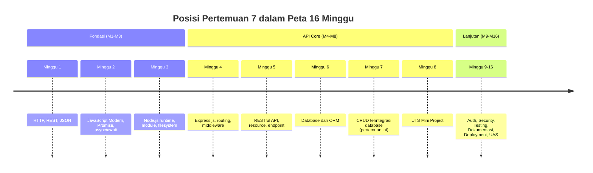
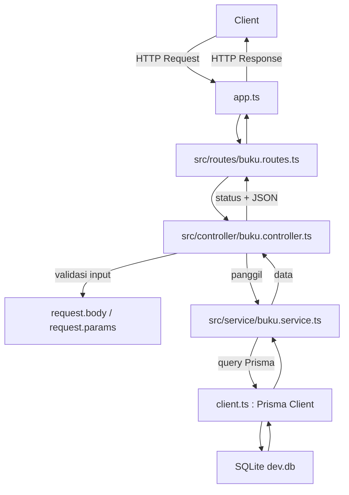

# Pertemuan 7 — CRUD REST API

| | |
|:--|:--|
| **Minggu** | 7 |
| **Tanggal** | Senin, 26 Oktober 2026 (SI-VA) / Selasa, 27 Oktober 2026 (SI-VB) |
| **CPMK** | CPMK117 |
| **Model Pembelajaran** | Case Based Learning / Problem Based Learning |
| **Stack** | Node.js 20+, Express.js 5, Prisma ORM 7, SQLite |

> **Catatan penting:** Pada Pertemuan 6, seluruh operasi CRUD resource buku masih ditulis langsung di dalam handler endpoint — validasi, query Prisma, dan pembentukan response bercampur dalam satu file. Pertemuan ini merestrukturisasi melalui refactoring agar setiap lapisan memiliki tugas tunggal: **controller** menangani validasi input dan kode status, **service** memusatkan operasi data, **route** mengelompokkan endpoint, dan **app.ts** merangkai semuanya. Selain itu, validasi input diperkuat untuk menutup celah yang pada pertemuan sebelumnya masih terbuka, seperti body yang belum di-parse atau tipe data yang tidak diverifikasi.

---

## Daftar Isi

- [Pertemuan 7 — CRUD REST API](#pertemuan-7--crud-rest-api)
  - [Daftar Isi](#daftar-isi)
  - [1. Keterkaitan Pertemuan dengan RPS OBE](#1-keterkaitan-pertemuan-dengan-rps-obe)
  - [2. Capaian Pembelajaran Pertemuan](#2-capaian-pembelajaran-pertemuan)
  - [3. Pemantik Kasus: Handler yang Membesar](#3-pemantik-kasus-handler-yang-membesar)
  - [4. Pola Service dan Controller](#4-pola-service-dan-controller)
  - [5. Refactoring Endpoint Datar ke Struktur Lapisan](#5-refactoring-endpoint-datar-ke-struktur-lapisan)
  - [6. Route sebagai Pengelompok Endpoint](#6-route-sebagai-pengelompok-endpoint)
  - [7. Penguatan Validasi Input](#7-penguatan-validasi-input)
    - [7.1 Body yang Belum Di-parse](#71-body-yang-belum-di-parse)
    - [7.2 Gerbang `typeof` untuk Query dan Parameter](#72-gerbang-typeof-untuk-query-dan-parameter)
    - [7.3 Validasi Rentang pada Body](#73-validasi-rentang-pada-body)
    - [7.4 Ekstraksi Nilai Tervalidasi](#74-ekstraksi-nilai-tervalidasi)
  - [8. Kode Status dan Responsi yang Konsisten](#8-kode-status-dan-responsi-yang-konsisten)
  - [9. Case Based Learning: Rework API Perpustakaan dengan Pola Lapis](#9-case-based-learning-rework-api-perpustakaan-dengan-pola-lapis)
  - [10. Aktivitas Kelompok](#10-aktivitas-kelompok)
  - [11. Latihan Individu](#11-latihan-individu)
  - [12. Pemanfaatan AI sebagai Coding Assistant](#12-pemanfaatan-ai-sebagai-coding-assistant)
  - [13. Kuis Formatif](#13-kuis-formatif)
  - [14. Output Pembelajaran — Tugas 5](#14-output-pembelajaran--tugas-5)
    - [Cara Pengumpulan — Push ke Repository GitHub Kelas](#cara-pengumpulan--push-ke-repository-github-kelas)
  - [15. Rubrik Tugas 5](#15-rubrik-tugas-5)
  - [16. Persiapan menuju Pertemuan 8](#16-persiapan-menuju-pertemuan-8)
  - [Lampiran: Kode Praktikum](#lampiran-kode-praktikum)

---

## 1. Keterkaitan Pertemuan dengan RPS OBE

Pertemuan 7 melanjutkan fase API Core pada **CPMK117**:

> Mahasiswa mampu membangun REST API Express.js yang terintegrasi dengan database menggunakan ORM.

Pada Pertemuan 6, Anda menghubungkan Node.js dengan database melalui Prisma ORM dan menjalankan operasi CRUD dalam satu file `app.ts`. Pada pertemuan ini, fokus bergeser dari **membuat** operasi CRUD menjadi **merapikan** operasinya agar dapat dipelihara, diuji, dan dikembangkan saat endpoint bertambah. Pola service/controller menjadi landasan sebelum fitur otentikasi dan keamanan pada fase berikutnya (Minggu 9–12).



---

## 2. Capaian Pembelajaran Pertemuan

Setelah mengikuti pertemuan ini, mahasiswa mampu:

| No. | Kemampuan | Indikator |
| :-: | --------- | --------- |
| 1 | Menjelaskan pola service/controller | Membedakan tugas controller (validasi, kode status) dan service (operasi data) |
| 2 | Merestrukturisasi endpoint datar menjadi berlapis | Memisahkan handler endpoint menjadi route, controller, dan service dalam folder terpisah |
| 3 | Mengelompokkan endpoint dalam router Express | Menggunakan `express.Router()` dan memajangnya pada aplikasi dengan `app.use` |
| 4 | Menguatkan validasi input | Menulis validasi tipe dan rentang untuk body, query, dan parameter route sebelum operasi data |
| 5 | Memilih kode status yang tepat | Menggunakan `201` untuk create, `404` untuk data tidak ditemukan, dan `204` untuk delete tanpa body |
| 6 | Mengintegrasikan CRUD dengan database | Menjalankan alur create, read, update, delete dari browser atau `curl` terhadap database SQLite |

---

## 3. Pemantik Kasus: Handler yang Membesar

Perhatikan cuplikan handler `POST /buku` dari Pertemuan 6:

```typescript
app.post("/buku", async (request, response) => {
  const { judul, penulis, tahun, stok } = request.body;
  if (judul === undefined) errors.push("Field judul wajib diisi");
  // ... empat baris validasi lagi
  if (errors.length > 0) return sendError(response, 400, "Data buku tidak valid", errors);
  const baru = await prisma.buku.create({ data: { ... } });
  return sendSuccess(response, 201, "Buku berhasil dibuat", baru);
});
```

Masalah yang muncul ketika endpoint bertambah:

- **Percabangan keputusan bercampur dengan operasi data.** Jika validasi diubah, Anda harus menelusuri semua handler.
- **Tidak ada cara menguji logika data** tanpa menjalankan server — validasi dan query Prisma berada di handler yang sama.
- **Duplikasi validasi** antar endpoint untuk resource yang sama (POST dan PATCH memvalidasi field yang serupa dengan pesan berbeda).
- **Mengganti database atau menambah resource** berarti mengulang pola handler di banyak file.

Pertanyaan untuk dibahas bersama:

1. Apa yang terjadi bila Anda ingin menambah resource `pinjaman` di samping `buku`? Apakah Anda akan menyalin seluruh handler?
2. Bagaimana cara menguji fungsi validasi tahun tanpa menjalankan server?
3. Lapisan mana yang perlu menyentuh Prisma Client, dan lapisan mana yang tidak perlu?

Pertemuan ini menjawab pertanyaan tersebut melalui pola service/controller dan penguatan validasi input.

---

## 4. Pola Service dan Controller

**Controller** dan **service** adalah dua lapisan yang memisahkan tanggung jawab HTTP dari tanggung jawab data:

| Lapisan | Nama file pada praktikum | Bertanggung jawab atas | Tidak boleh melakukan |
|:--------|:------------------------|:-----------------------|:---------------------|
| **Route** | `src/routes/buku.routes.ts` | Mengelompokkan endpoint berdasarkan path resource | Memvalidasi input atau menyentuh Prisma |
| **Controller** | `src/controller/buku.controller.ts` | Membaca `request`, memvalidasi input, memilih kode status, membentuk response | Menulis query database |
| **Service** | `src/service/buku.service.ts` | Mengoperasikan Prisma Client sesuai input yang sudah teruji | Mengetahui kode status atau format response HTTP |
| **App** | `app.ts` | Merangkai middleware, logger, route, handler 404, dan error handler | Menulis logika validasi atau operasi data |

Alasan memisahkan lapisan:

1. **Mudah diuji** — fungsi service dapat dipanggil langsung tanpa HTTP; controller dapat diuji dengan `mock` service.
2. **Ganti database dengan mudah** — bila suatu saat Anda pindah dari Prisma ke driver lain, hanya service yang berubah.
3. **Endpoint yang lebih rapi** — handler hanya memanggil service, tidak menulis query SQL/Prisma.
4. **Validasi terpusat** — satu fungsi `validasiCreate` melayani POST; `validasiPatch` melayani PATCH. Ekstraksi nilai tervalidasi dipusatkan pada `susunDataPatch` (lihat [§7.4](#74-ekstraksi-nilai-tervalidasi)).



---

## 5. Refactoring Endpoint Datar ke Struktur Lapisan

Misal Anda sudah punya `app.ts` lama (pertemuan 6) yang berisi semua handler. Refactoring dilakukan dengan tiga langkah:

**Langkah 1 — Ekstrak operasi data ke service.**
Gunakan kode di [`code/pertemuan-07/src/service/buku.service.ts`](../code/pertemuan-07/src/service/buku.service.ts) sebagai acuan. Fungsi service menerima data yang sudah divalidasi dan mengembalikan hasil Prisma.

**Langkah 2 — Pisahkan validasi dan kode status ke controller.**
Gunakan [`code/pertemuan-07/src/controller/buku.controller.ts`](../code/pertemuan-07/src/controller/buku.controller.ts). Perhatikan bahwa controller:

- Membaca `request.body` dan `request.params` melalui gerbang `typeof` sebelum konversi;
- Memanggil fungsi validasi dan mengirim `400` bila ada error;
- Memilih status yang benar (201 untuk create, 404 untuk tidak ditemukan, 204 untuk delete).

**Langkah 3 — Rakit route di router Express.**
Gunakan [`code/pertemuan-07/src/routes/buku.routes.ts`](../code/pertemuan-07/src/routes/buku.routes.ts). Seluruh endpoint resource `buku` dikelompokkan dalam satu `Router` dan dipasang di `app.ts` dengan `app.use("/buku", bukuRoutes)`.

Sebelum (Pertemuan 6, di `app.ts`):

```typescript
app.get("/buku", async (req, res) => {
  const data = await prisma.buku.findMany({ ... });
  res.status(200).json({ ... });
});
```

Sesudah (Pertemuan 7, di `buku.routes.ts`):

```typescript
import { handlerDaftarBuku } from "../controller/buku.controller.ts";
bukuRoutes.get("/", handlerDaftarBuku);
```

Controller `handlerDaftarBuku` berisi validasi query dan panggilan `bukuService.ambilDaftarBuku`. Perubahan path dari `/buku` menjadi `/api/buku` cukup menyentuh satu baris di `app.ts`.

> **Kesalahan umum:** menempatkan validasi di service. Validasi input adalah tugas lapisan yang bersentuhan dengan klien (controller). Bila Anda memvalidasi di service, Anda kehilangan kemampuan membedakan `400` dari `500` pada responsi — keduanya sama-sama `throw Error` tanpa status.

---

## 6. Route sebagai Pengelompok Endpoint

`express.Router()` membuat instance middleware yang dapat dipasang pada path tertentu. Dua alasan teknis menggunakannya:

1. **Pemisahan per resource.** Resource `buku`, `pengguna`, dan `pinjaman` masing-masing memiliki file route sendiri. Menambah resource berarti menambah satu file, bukan menambah puluhan baris di `app.ts`.
2. **Perubahan path terpusat.** Bila Anda mengubah `/buku` menjadi `/api/buku`, hanya baris `app.use("/api/buku", bukuRoutes)` yang perlu diperbarui.

Struktur folder pada praktikum:

```text
code/pertemuan-07/
├── app.ts                    # merangkai semua lapisan
├── server.ts                 # menjalankan app + shutdown
├── client.ts                 # instance Prisma Client (diwarisi dari P6)
├── prisma/
│   └── schema.prisma
├── prisma.config.ts
├── .env.example
└── src/
    ├── routes/
    │   └── buku.routes.ts
    ├── controller/
    │   └── buku.controller.ts
    └── service/
        └── buku.service.ts
```

> **Catatan:** Folder `src/` ditambahkan pada pertemuan ini karena jumlah file route, controller, dan service bertambah. Pada pertemuan sebelumnya, seluruh logika masih berada di `app.ts` — file tunggal masih dapat diurus, tetapi mulai pertemuan ini tidak lagi praktis.

---

## 7. Penguatan Validasi Input

Tiga celah validasi yang umum pada endpoint Pertemuan 6 ditutup pada pertemuan ini:

### 7.1 Body yang Belum Di-parse

Endpoint POST dan PATCH tidak akan menerima data bila `express.json()` tidak didaftarkan. Pada `app.ts`:

```typescript
app.use(express.json());
```

harus didaftarkan **sebelum** `app.use("/buku", bukuRoutes)`. Bila diletakkan setelah, `request.body` kosong untuk semua route di bawahnya.

### 7.2 Gerbang `typeof` untuk Query dan Parameter

`request.params` dan `request.query` bertipe `string | string[]` menurut type definition Express. Konversi langsung `Number(request.params.id)` dapat menghasilkan `NaN` atau error runtime bila nilai bukan string. Pola yang aman:

```typescript
const idRaw = request.params.id;
const id = typeof idRaw === "string" ? Number(idRaw) : undefined;
if (id === undefined || Number.isNaN(id)) {
  return sendError(response, 400, "Parameter id harus berupa bilangan bulat");
}
```

`typeof` menjamin argument `Number` adalah string sebelum konversi — sesuai aturan SonarQube yang dilarang memanggil `Number(obj)` pada nilai bertipe `unknown`.

### 7.3 Validasi Rentang pada Body

Contoh penguatan validasi POST pada [`buku.controller.ts`](../code/pertemuan-07/src/controller/buku.controller.ts):

| Field | Validasi |
|:------|:---------|
| `judul` | wajib, string, bukan kosong setelah `trim` |
| `penulis` | wajib, string, bukan kosong setelah `trim` |
| `tahun` | wajib, integer, rentang 1000–2100 |
| `stok` | opsional, integer ≥ 0 |

Pesan error disusun dalam array lalu dikirim sekaligus dengan status `400`. Dengan cara ini, client dapat memperbaiki semua masalah dalam satu putaran.

> **Kesalahan umum:** mengirim response `400` pada validasi pertama yang gagal dan berhenti. Bila ada tiga error, client harus mengirim ulang tiga kali. Kumpulkan seluruh error, baru kirim.

### 7.4 Ekstraksi Nilai Tervalidasi

Setelah validasi lolos, nilai masih bertipe `unknown` (dari `Record<string, unknown>`). TypeScript tidak melakukan *narrowing otomatis* terhadap variabel yang dipakai ulang setelah blok `if`, dan SonarQube menolak `String(x)`/`Number(x)` pada tipe `unknown`. Solusi: ekstrak nilai tervalidasi menjadi variabel baru dengan guard `typeof` yang terenkapsulasi.

Pada praktikum, pola ini diekstrak menjadi fungsi `susunDataPatch` di [`buku.controller.ts`](../code/pertemuan-07/src/controller/buku.controller.ts) — satu helper melayani POST dan PATCH:

```typescript
const susunDataPatch = (body: Record<string, unknown>) => {
  const { judul, penulis, tahun, stok } = body;
  const data: { judul?: string; penulis?: string; tahun?: number; stok?: number } = {};

  if (typeof judul === "string") data.judul = judul.trim();
  if (typeof penulis === "string") data.penulis = penulis.trim();
  if (typeof tahun === "number") data.tahun = tahun;
  if (typeof stok === "number") data.stok = stok;

  return data;
};
```

Handler POST dan PATCH tinggal memanggil `susunDataPatch(body)` dan hasilnya langsung diberikan ke service — tidak ada lagi konversi `String()`/`Number()` pada tipe `unknown`.

---

## 8. Kode Status dan Responsi yang Konsisten

Seluruh endpoint pada praktikum memakai struktur JSON yang sama:

```json
{ "success": true,  "message": "...", "data": { ... } }
{ "success": false, "message": "...", "details": [ ... ] }
```

Pilihan status code:

| Operasi | Status Sukses | Alasan teknis |
|:--------|:--------------|:--------------|
| `POST /buku` | `201 Created` | Resource baru berhasil dibuat |
| `GET /buku` | `200 OK` | Collection berhasil diambil |
| `GET /buku/:id` | `200 OK` / `404 Not Found` | Detail satu item; `404` bila id tidak ada di database |
| `PATCH /buku/:id` | `200 OK` / `404 Not Found` | Update sebagian; `404` bila id tidak ada |
| `DELETE /buku/:id` | `204 No Content` / `404 Not Found` | Operasi sukses tanpa body |
| Validasi gagal | `400 Bad Request` | Input tidak sesuai kontrak |
| Endpoint tidak dikenal | `404 Not Found` | Ditangkap middleware 404 di `app.ts` |
| Error database | `500 Internal Server Error` | Ditangkap middleware error handler |

Konsistensi struktur response memudahkan client: hanya perlu memeriksa `success: boolean` dan `data` bila sukses.

---

## 9. Case Based Learning: Rework API Perpustakaan dengan Pola Lapis

**Konteks (lanjutan kasus Pertemuan 4–6):** Anda memiliki `app.ts` dari Pertemuan 6 yang melayani CRUD buku dalam satu file. Perpustakaan meminta dua hal:

1. Menambah resource **peminjaman** yang merujuk buku dan pengguna — perlu dipisahkan agar tidak membebani file `app.ts` yang sudah panjang.
2. Menjalankan UTS dalam beberapa minggu lagi; dosen pengampu meminta setiap endpoint dapat diuji tanpa menjalankan server.

Rework yang dilakukan dalam praktikum:

| Tahap | Output |
|:------|:-------|
| 1 | Ekstrak operasi data buku ke `buku.service.ts` |
| 2 | Pindahkan validasi dan kode status ke `buku.controller.ts` |
| 3 | Kumpulkan endpoint dalam `buku.routes.ts` |
| 4 | Rakit di `app.ts` — baris validasi Prisma hilang, diganti `app.use("/buku", bukuRoutes)` |

```mermaid
sequenceDiagram
    C as Client
    R as buku.routes.ts
    K as buku.controller.ts
    S as buku.service.ts
    P as Prisma
    D as SQLite

    C->>R: POST /buku
    R->>K: handlerCreateBuku(req, res)
    K->>K: validasi body
    K->>S: buatBuku(data)
    S->>P: create
    P->>D: INSERT
    D-->>P: autoincrement id
    P-->>S: object buku
    S-->>K: data
    K-->>R: 201 + JSON
    R-->>C: response
```

Diskusi CBL:

1. Mengapa validasi input tidak diletakkan di `buku.service.ts`?
2. Bila Anda menambah resource `pinjaman`, apa saja yang perlu dibuat tanpa mengubah resource `buku`?
3. Bagaimana cara menguji fungsi `ambilDaftarBuku` tanpa menjalankan server?
4. Pada kasus UTS, lapisan mana yang paling penting untuk diuji dengan test case?

Kode penyelesaian tersedia di [`code/pertemuan-07/app.ts`](../code/pertemuan-07/app.ts) dan lapisan-lapisan di `src/`. Jalankan melalui [`code/pertemuan-07/server.ts`](../code/pertemuan-07/server.ts).

Perintah menyiapkan dan menjalankan:

```bash
cd code/pertemuan-07
npm install
cp .env.example .env
npx prisma migrate dev --name init
npx prisma generate
npm start
```

Uji dengan `curl`:

```bash
curl -i -X POST http://localhost:3008/buku \
  -H "Content-Type: application/json" \
  -d '{"judul":"Belajar Node.js","penulis":"Andi","tahun":2024,"stok":3}'

curl -i http://localhost:3008/buku

curl -i -X PATCH http://localhost:3008/buku/1 \
  -H "Content-Type: application/json" \
  -d '{"stok":2}'

curl -i -I -X DELETE http://localhost:3008/buku/1
```

---

## 10. Aktivitas Kelompok

Bentuk kelompok 3–4 orang:

1. **Analisis endpoint lama (10 menit)** — Ambil `app.ts` dari Pertemuan 6. Tandai baris yang harus pindah ke controller, service, atau route.
2. **Susun rencana refactoring (15 menit)** — Tentukan struktur folder, nama file, dan fungsi yang akan dibuat di setiap lapisan.
3. **Refactor bersama (20 menit)** — Salin kerangka `code/pertemuan-07` dan pindahkan endpoint Anda ke pola lapis.
4. **Presentasi (10 menit)** — Satu kelompok memaparkan cara layering mereka dan alasan teknis memilih nama file serta pembagian tanggung jawab.

---

## 11. Latihan Individu

Kerjakan dengan [`code/pertemuan-07/latihan.ts`](../code/pertemuan-07/latihan.ts):

1. **TODO 1** — Selesaikan `ambilDaftarPengguna` menggunakan `prisma.pengguna.findMany` dengan filter `nim` opsional.
2. **TODO 2** — Selesaikan `buatPengguna` dengan validasi `nim`, `nama`, `email`, dan `role` yang memisahkan tanggung jawab validasi dari operasi data.
3. **TODO 3** — Tambahkan endpoint `POST /pengguna` dengan validasi input dan status `201`.
4. **TODO 4** — Tambahkan endpoint `DELETE /pengguna/:nim` dengan response `204` dan `404` bila tidak ditemukan.

Perintah:

```bash
cd code/pertemuan-07
npx prisma migrate dev --name pengguna
node --experimental-strip-types latihan.ts
```

---

## 12. Pemanfaatan AI sebagai Coding Assistant

**Gunakan AI untuk:**

- Meminta penjelasan mengapa validasi input perlu berada di controller, bukan service.
- Menanyakan cara menguji fungsi service dengan `mock` tanpa menjalankan server.
- Membantu menyusun validasi untuk field yang belum dikuasai (mis. tanggal, URL, enum role).
- Membaca pesan error SonarQube terkait konversi `Number` dan memilih pola `typeof` yang tepat.

**Jangan gunakan AI untuk:**

- Menghasilkan seluruh refactoring tanpa memahami perbedaan tanggung jawab tiap lapisan.
- Menyalin lapisan controller/service tanpa menjalankan dan menguji tiap endpoint.
- Mengabaikan penguatan validasi dengan alasan "cukup dibiarkan di database".

**Etika di kelas:**

1. Anda wajib dapat menjelaskan perbedaan lapisan dan alasan pemilihan nama file.
2. Cantumkan bantuan AI pada refleksi atau komentar kode.
3. Anda tetap bertanggung jawab menjalankan dan menguji setiap endpoint dengan `curl` sebelum mengumpulkan tugas.

---

## 13. Kuis Formatif

1. Apa perbedaan tanggung jawab controller dan service?
2. Mengapa validasi input tidak diletakkan di service?
3. Apa fungsi `express.Router()` dan kapan Anda menggunakannya?
4. Apa yang terjadi bila `express.json()` didaftarkan setelah route yang memakai `request.body`?
5. Status code apa yang dikirim untuk `POST /buku` saat sukses, dan mengapa bukan `200`?
6. Bagaimana cara menangani parameter route yang bukan angka tanpa menyebabkan error runtime?

---

## 14. Output Pembelajaran — Tugas 5

**Tugas 5 — CRUD REST API dengan Pola Service/Controller.**

Kembangkan resource dari Tugas 4 menjadi pola berlapis. Project minimal memiliki:

1. `src/routes/`, `src/controller/`, dan `src/service/` terpisah;
2. resource utama dari domain Anda menggunakan pola service/controller;
3. penguatan validasi input (tipe, rentang, gerbang `typeof`) pada semua endpoint write;
4. penggunaan status code yang tepat: `201` untuk create, `404` untuk detail/update/delete yang tidak ditemukan, `204` untuk delete;
5. `GET`, `POST`, `PATCH` (atau `PUT`), dan `DELETE` pada resource utama;
6. middleware 404 dan error handler di `app.ts`;
7. README yang berisi alur lapisan dan contoh `curl` tiap endpoint.

### Cara Pengumpulan — Push ke Repository GitHub Kelas

| Kelas | Repository | Folder |
|:------|:-----------|:-------|
| SI-VA | `SI-VA-Backend` | `tugas-5/<nim>-<nama>/pertemuan-07/` |
| SI-VB | `SI-VB-Backend` | `tugas-5/<nim>-<nama>/pertemuan-07/` |

Langkah pengumpulan:

1. Buat branch menggunakan NIM Anda.
2. Simpan project pada folder tugas sesuai kelas Anda.
3. Jalankan `npm install`, `npx prisma migrate dev`, dan `npx prisma generate`.
4. Uji setiap endpoint dengan `curl` dan catat hasilnya pada README.
5. Commit dan push branch, lalu buat Pull Request.

Pastikan `node_modules`, `.env`, dan file `.db` tidak disertakan dalam commit.

---

## 15. Rubrik Tugas 5

| Komponen | Bobot |
|:---------|------:|
| Struktur lapisan (routes, controller, service) | 25% |
| Penguatan validasi input (tipe, rentang, gerbang `typeof`) | 20% |
| Kode status yang tepat dan konsisten | 15% |
| Implementasi CRUD lengkap dengan integrasi database | 20% |
| Middleware 404 dan error handler | 10% |
| Dokumentasi dan bukti pengujian | 10% |
| **Total** | **100%** |

Nilai akhir dihitung dengan rumus:

$$
\text{Nilai} = \frac{\sum(\text{bobot} \times \text{skor})}{16} \times 100
$$

---

## 16. Persiapan menuju Pertemuan 8

Pada Pertemuan 8, Anda akan mengevaluasi mini project backend secara menyeluruh dan mempresentasikan progres. Pastikan:

- seluruh resource dari Tugas 5 berjalan tanpa error pada `npm start`;
- struktur lapisan sudah rapi dan dapat dijelaskan baris per baris;
- validasi input sudah menutup semua endpoint write;
- skema Prisma dan migration tersimpan dengan baik;
- dokumentasi README memuat alur lapisan dan contoh `curl`.

---

## Lampiran: Kode Praktikum

- [`code/pertemuan-07/app.ts`](../code/pertemuan-07/app.ts) — merangkai middleware, logger, route, handler 404, dan error handler.
- [`code/pertemuan-07/server.ts`](../code/pertemuan-07/server.ts) — proses menjalankan server dan shutdown bersih.
- [`code/pertemuan-07/client.ts`](../code/pertemuan-07/client.ts) — instance Prisma Client tunggal.
- [`code/pertemuan-07/prisma/schema.prisma`](../code/pertemuan-07/prisma/schema.prisma) — skema SQLite dengan model `buku` dan `pengguna`.
- [`code/pertemuan-07/src/routes/buku.routes.ts`](../code/pertemuan-07/src/routes/buku.routes.ts) — pengelompok endpoint resource buku.
- [`code/pertemuan-07/src/controller/buku.controller.ts`](../code/pertemuan-07/src/controller/buku.controller.ts) — validasi input, kode status, dan bentuk responsi.
- [`code/pertemuan-07/src/service/buku.service.ts`](../code/pertemuan-07/src/service/buku.service.ts) — operasi Prisma Client untuk resource buku.
- [`code/pertemuan-07/latihan.ts`](../code/pertemuan-07/latihan.ts) — latihan resource pengguna dengan TODO terbimbing.
- [`code/pertemuan-07/.env.example`](../code/pertemuan-07/.env.example) — template konfigurasi environment.
